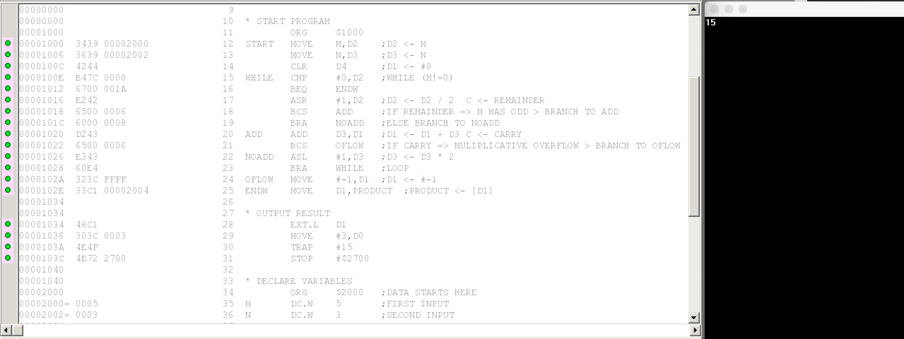
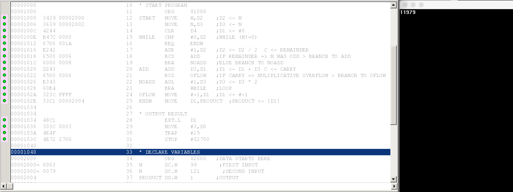
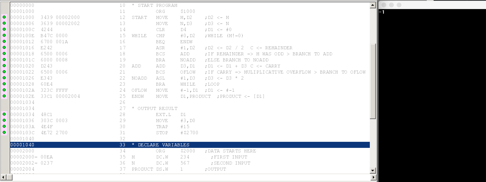
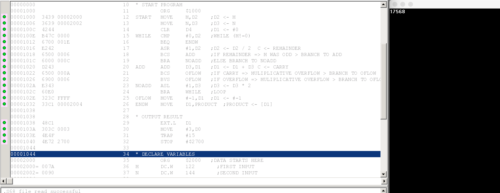

= CS375 Assignment 1
Kyle Aure <KAure09@winona.edu>
v1.0, 2018-10-06
:RepoURL: https://github.com/KyleAure/WSURochester
:AuthorURL: https://github.com/KyleAure
:DirURL: {RepoURL}/CS375

.Project Description
****
Write a program to multiply two positive integers using Egyptian multiplication by implementing the specific algorithm given below.
The data section should consists of two inputs M and N and one output PRODUCT.
All of them should be "declared" as word data.
****

== Course Details
* **Course** - CS375: Computer Systems
* **Instructor** - Dr. Chi-Cheng Lin

== Running project
X68 source code files are provided.
Use a virtualization of X68 system, such as, EASy68K to run the program on a virtual machine.
Provided below are outputs from running the code with various inputs.

== Documentation
=== Output
1. 5 x 3 = 15
+

+
2. 28 x 17 = 476
+

+
3. 99 x 121 = 11979
+

+
4. 234 x 567 = -1 (multiplicative overflow)
+

+
5. 122 x 144 = 17568
+

