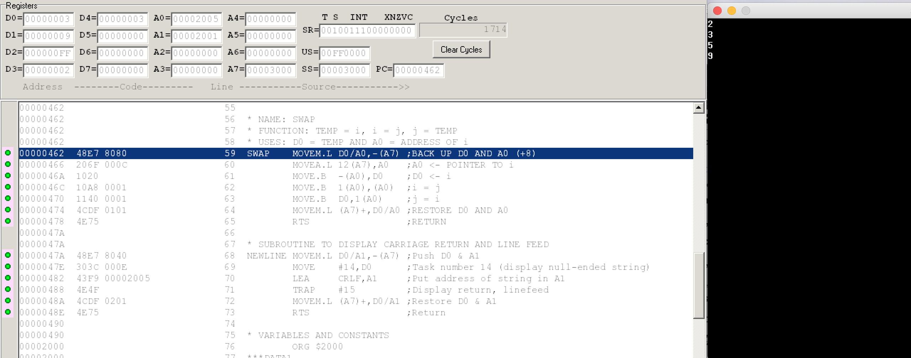
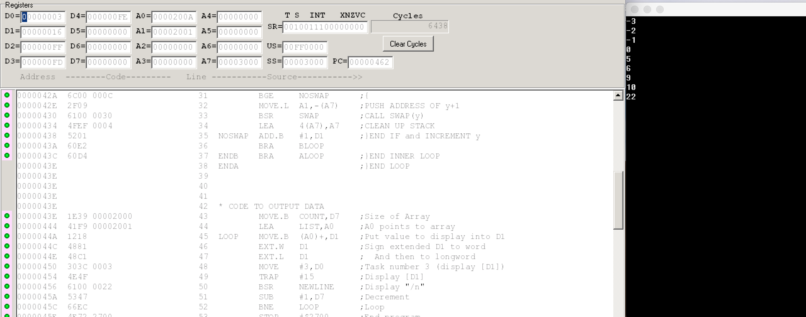
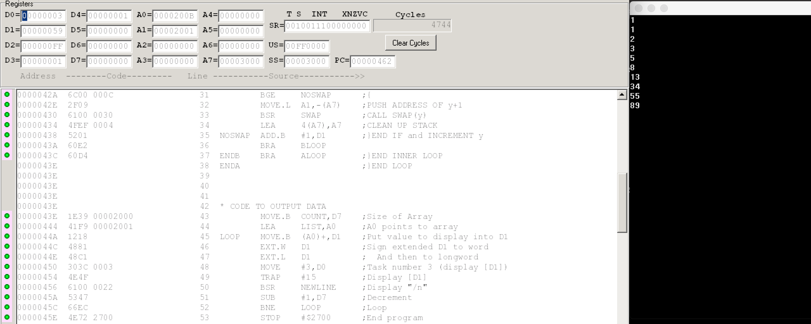

= CS375 Assignment 2
Kyle Aure <KAure09@winona.edu>
v1.0, 2018-10-28
:RepoURL: https://github.com/KyleAure/WSURochester
:AuthorURL: https://github.com/KyleAure
:DirURL: {RepoURL}/CS375

.Project Description
****
Sort an array of byte integers in place in `ascending order`.
The count of elements in an array is stored in the data section followed by the array to be stored.
****

== Course Details
* **Course** - CS375: Computer Systems
* **Instructor** - Dr. Chi-Cheng Lin

== Running project
X68 source code files are provided.
Use a virtualization of X68 system, such as, EASy68K to run the program on a virtual machine.
Provided below are outputs from running the code with various inputs.

== Documentation
=== Output
1. Data 1
** 2, 9, 5, 3
+

+
2. Data 2
** 1, 2, 5, 4, 7, 5, 4, 2
+
image::assets/Q2.png[]
+
3. Data 3
** 82, 73, 64, 55, 46, 37, 28, 4, 2
+

+
4. Data 4
** 5, 10, -3, 0, -1, 6, 9, -2, 22
+

+
5. Data 5
** 1, 1, 2, 3, 5, 8, 13, 34, 55, 89
+

