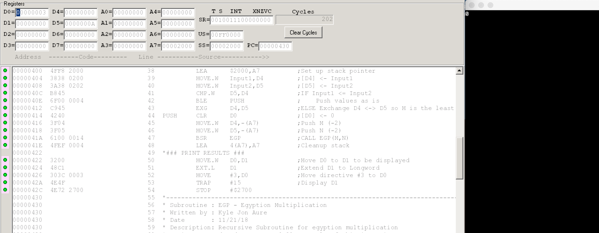

= CS375 Assignment 3
Kyle Aure <KAure09@winona.edu>
v1.0, 2018-11-21
:RepoURL: https://github.com/KyleAure/WSURochester
:AuthorURL: https://github.com/KyleAure
:DirURL: {RepoURL}/CS375

.Project Description
****
To implement a recursive, re-entrant subroutine with activation record and stack frame.
Your assignment is to implement a recursive, re-entrant subroutine to perform the Egyptian multiplication that multiplies two non-negative integers.
****

== Course Details
* **Course** - CS375: Computer Systems
* **Instructor** - Dr. Chi-Cheng Lin

== Running project
X68 source code files are provided.
Use a virtualization of X68 system, such as, EASy68K to run the program on a virtual machine.
Provided below are outputs from running the code with various inputs.

== Documentation
=== Output
1. 1 * 11 = 11
+

+
2. 0 * 10 = 0
+

+
3. 10 * 0 = 0
+

+
4. 11 * 7 = 77
+

+
5. 35 * 56 = 1,960
+

+
6. 127 * 78 = 9,906
+

+
7. 256 * 99 = 25,344
+

+
8. 200 * 438 = 87,600 (Overflow result should be -1)
+

+
9. 32000 * 2 = 64,000 (Overflow result should be -1)
+
image:assets/Test9.png[]
+
10. 2 * 16000 = 32,000
+

