= CS385 Final Project
Kyle Aure <KAure09@winona.edu>, Andrew Poss <APoss17@winona.edu>
v1.0, 2018-11-17

.Project Description
****
Create a database for Quarry Hill Nature Center's summer camp registration.
Include design decisions, normalizations,
****

== Course Details
* **Course** - CS385: Applied Database Management
* **Instructor** - Dr. Nicole Anderson

== Running project
Database file is provided but there are no special commands to run this project.
Just use a GUI database management system such as SQLite to view tables and queries.

== Designing Database

=== Design Decisions
We started by creating tables as we saw relationships in data in the brochure.
To begin with we knew we would need data on a camper, the camp, emergency contact, and fees.
As we went we made relationships for all of the attributes that we knew we wanted to track.

.General Relationships
* Camper:camperID -> fName, lName, age, email, memberStatus, emergencyContact
* Camp:campAbr -> campName, description, feeRate, ageRange, sessionNo, startDate, endDate, am_pm
* EmergencyContact:contactNo -> fName, lName, phoneNum
* Fee:feeRate -> nonMember, member, payStatus

=== Normalization
Based on the generic relationships above we then looked at creating functional relationships.
During this process we also made sure to normalize data to get rid of all partial and transitive dependencies.

.Independent Functional Relationships (No foreign keys)
* EmergencyContact:eContactID -> fName, lName, phoneNum
* AgeRange:rangeNo -> youngest, oldest
* Fee:feeRate -> nonMember, member
* DateRange:dateNo -> startDate, endDate

.Dependent Functional Relationships (With foreign keys)
* Camper:camperID -> fName, lName, age, email, memberStatus, _eContactID_
* CampInfo:campAbr -> campName, description, feeRate, _rangeNo_
* Camp:campAbr + sessionNo -> _dateNo_, am_pm
* Registration:camperID + campAbr + sessionNo -> payStatus

After reviewing every relationship no transitive dependencies exist that we could determine.

== Entity Relationship Diagram
After we made all the design decisions and normalized the database we created the following Entity Relationship (ER) diagram.
After adding the entities and attributes we created relationships between them as follows.

.Relationships with Multiplicity
* EmergencyContact(0..1) - needs - (1..\*)Camper
* Campers(1..\*) - requires - (0..\*)Registration
* Registration(0..\*) - contains - (1)Camp
* Camp(0..\*) - held during - (1)DateRange
* Camp(1..\*) - describes - (0..1)CampInfo
* CampInfo(0..\*) - has - (1)Fee
* CampInfo(0..\*) - grouped in - (1)AgeRange

.Entity Relationship Diagram
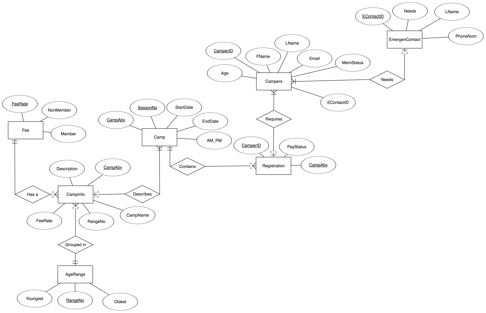

== Database Model
We decided to use a Relational model for this Database.
We choose to use a Relational model since after creating our relationships and normalization.
The resulting relationships can directly be correlated to tables of a relational database.
Additionally, the ability to use primary and foreign keys to link tables together would make for easy query writing.

== Final Schema

.EmergencyContact Table
----
CREATE TABLE EmergencyContact (
    eContactID INTEGER PRIMARY KEY
                       UNIQUE,
    fName      STRING,
    lName      STRING,
    phoneNum   STRING
);
----

.AgeRange Table
----
CREATE TABLE AgeRange (
    rangeNo  INTEGER PRIMARY KEY
                     UNIQUE,
    youngest INTEGER,
    oldest   INTEGER
);
----

.Fee Table
----
CREATE TABLE Fee (
    feeRate   INTEGER PRIMARY KEY

    feeRate   INTEGER PRIMARY KEY,

                      UNIQUE,
    nonMember DOUBLE,
    member    DOUBLE
);
----

.DateRange table
----
CREATE TABLE DateRange (
    dateNo    INTEGER PRIMARY KEY,
    startDate DATE,
    endDate   DATE
);
----
.Camper Table
----
CREATE TABLE Camper (
    camperID   INTEGER PRIMARY KEY
                       UNIQUE,
    fName      STRING,
    lName      STRING,
    age        INTEGER,
    email      STRING,
    memStatus  BOOLEAN,
    eContactID INTEGER REFERENCES EmergencyContact (eContactID)
);
----

.CampInfo Table
----
CREATE TABLE CampInfo (
    campAbr     STRING  PRIMARY KEY
                        UNIQUE,
    campName    STRING,
    description STRING,
    feeRate     INTEGER REFERENCES Fee (feeRate),
    rangeNo     INTEGER REFERENCES AgeRange (RangeNo)
);
----

.Camp Table
----
CREATE TABLE Camp (
    campAbr   STRING  REFERENCES CampInfo (campAbr),
    sessionNo INTEGER,
    dateNo    INTEGER REFERENCES DateRange (dateNo),
    am_pm     STRING,
    PRIMARY KEY (
        campAbr ASC,
        sessionNo ASC
    )
    ON CONFLICT ROLLBACK
);
----

.Registration Table
----
CREATE TABLE Registration (
    camperID  INTEGER REFERENCES Camper (camperID),
    campAbr   STRING,
    sessionNo INTEGER,
    payStatus BOOLEAN,
    PRIMARY KEY (
        camperID ASC,
        campAbr ASC,
        sessionNo ASC
    )
    ON CONFLICT ROLLBACK,
    FOREIGN KEY (
        campAbr,
        sessionNo
    )
    REFERENCES Camp (campAbr,
    sessionNo)
);
----

== Queries and Results

1. Weeks that the Teen Nature Photography camp is running.
** This query can be used to create brochures for a specific camp where dates for each session is important.
+
----
CREATE VIEW TNP AS
    SELECT startDate,
           endDate
      FROM DateRange
     WHERE dateNo IN (
               SELECT dateNo
                 FROM Camp
                WHERE campAbr = 'TNP'
           );
----
+
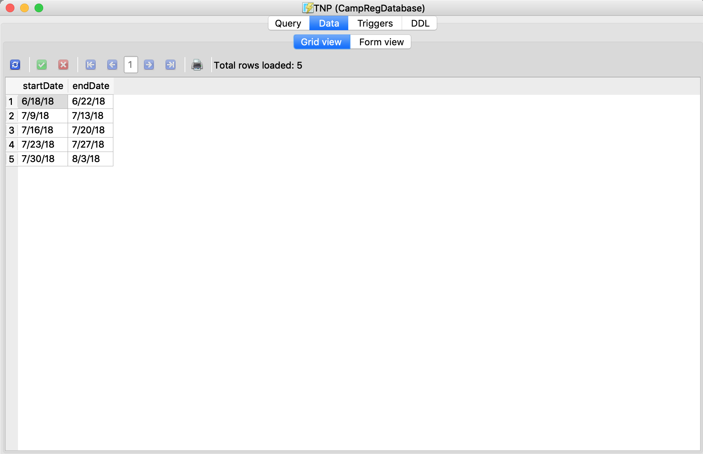
+
2. Registration list for Scales & Slime.
** This query can be used to create a checkin or registration list for a camp leader.
+
----
CREATE VIEW RegListSS AS
    SELECT fName,
           lName
      FROM Camper
     WHERE camperID IN (
               SELECT camperID
                 FROM Registration
                WHERE campAbr = 'SS'
           );
----
+
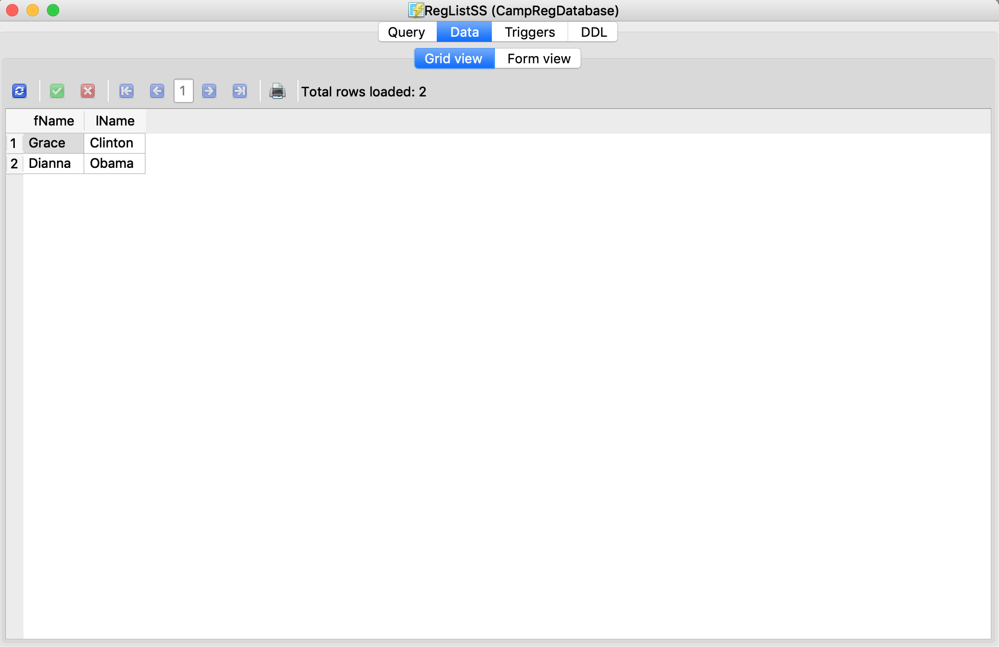
+
3. Camp sessions for students who are 10 that are held in the morning.
** This query could be used for a recruiter that is going to a middle school classroom.
+
----
CREATE VIEW [10+AMCamp] AS
    SELECT campAbr,
           sessionNo
      FROM Camp
     WHERE am_pm = 'AM' AND
           campAbr IN (
               SELECT campAbr
                 FROM CampInfo
                WHERE rangeNo IN (
                          SELECT rangeNo
                            FROM AgeRange
                           WHERE Youngest = 10 OR
                                 Oldest = 10
                      )
           );
----
+
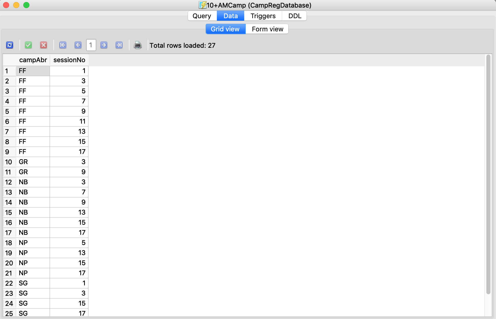
+
4. Show the emergency contact list for Geology Rocks (GR) session 9 with campers name.
** This query could be used to take onsite during this camp incase a child gets injured.
+
----
CREATE VIEW [GR-9eContacts] AS
    SELECT fName,
           lName,
           phoneNum
      FROM EmergencyContact
     WHERE eContactID IN (
               SELECT eContactID
                 FROM Camper
                WHERE camperID IN (
                          SELECT camperID
                            FROM Registration
                           WHERE campAbr = 'GR' AND
                                 sessionNo = '9'
                      )
           );
----
+
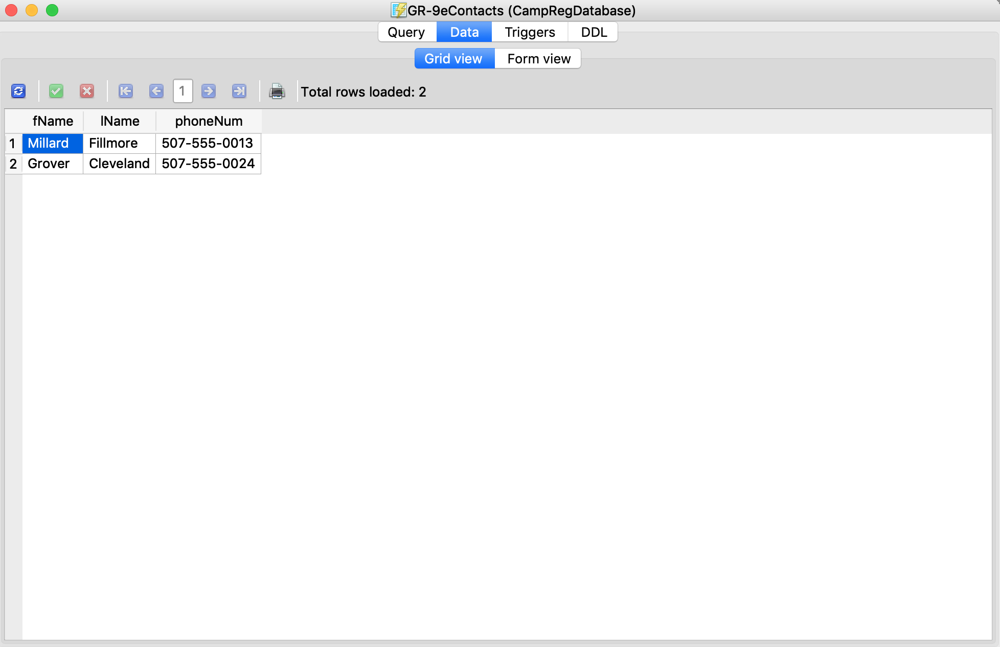
+
5. Has Astrid Cleveland paid in full?
** This query can be used by the administrative staff at Quarry Hill to determine if a child is allowed to attend this camp.
+
----
CREATE VIEW PaidAC AS
    SELECT campAbr,
           payStatus
      FROM Registration
     WHERE camperID IN (
               SELECT camperID
                 FROM Camper
                WHERE fName = 'Astrid' AND
                      lName = 'Cleveland'
           );
----
+
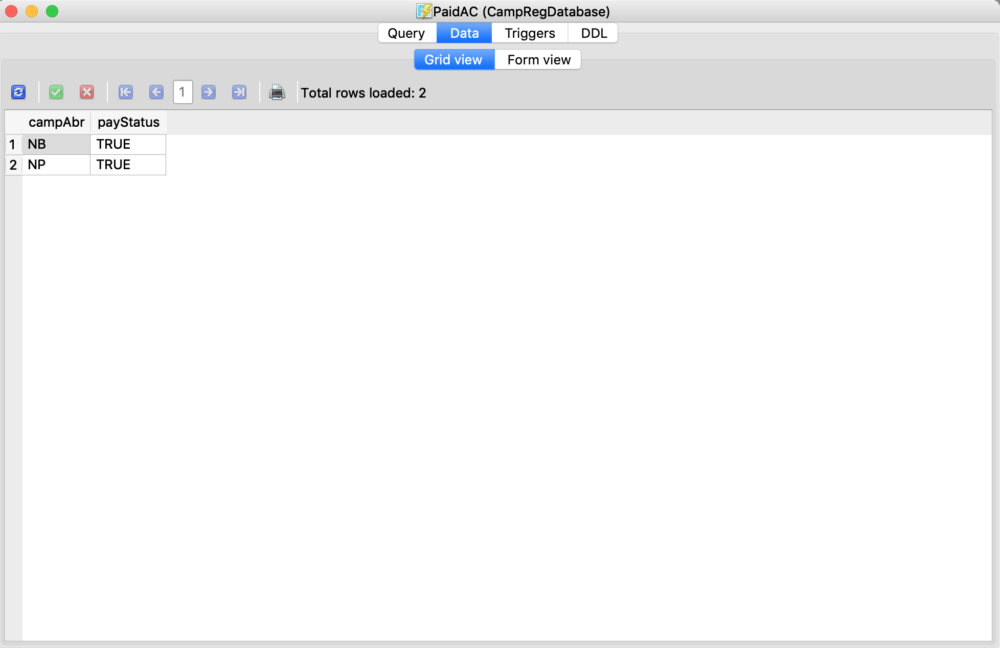
+
6. Which camps and sessions are running in June.
** This query could be used to send out a monthly email of camps that are taking session during the next month.
+
----
CREATE VIEW [June Sessions] AS
    SELECT CampInfo.campName,
           Camp.campAbr,
           Camp.sessionNo,
           DateRange.startDate,
           DateRange.endDate
      FROM Camp
           INNER JOIN
           CampInfo ON Camp.campAbr = CampInfo.campAbr
           INNER JOIN
           DateRange ON Camp.dateNo = DateRange.dateNo
     WHERE DateRange.startDate LIKE '6/%_/__';
----
+
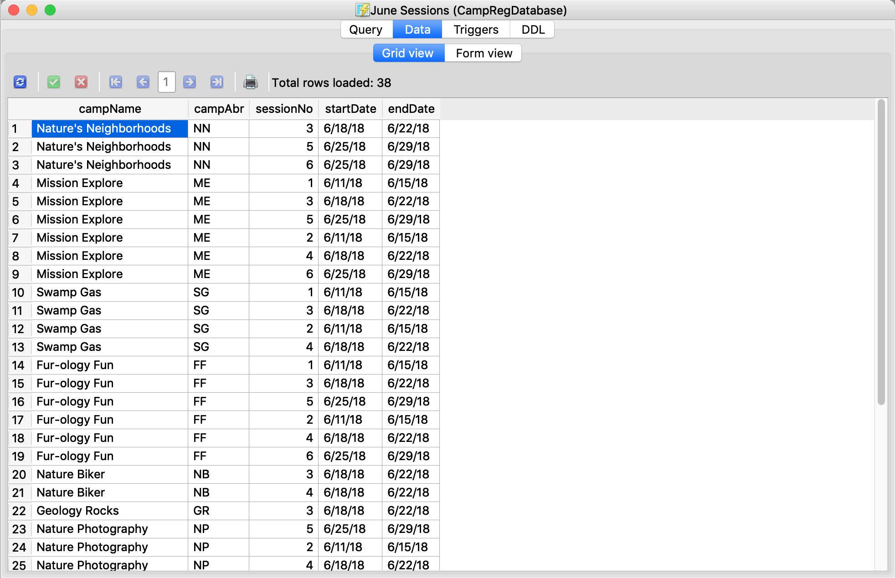
+
7. Show the emergency contact for Hilary Bush.
** This could be useful if a specific child is hurt and the emergency contact record needs to be pulled.
+
----
CREATE VIEW eContactHilary AS
    SELECT EmergencyContact.fName,
           EmergencyContact.lName,
           EmergencyContact.phoneNum
      FROM EmergencyContact
           INNER JOIN
           Camper ON EmergencyContact.eContactID = Camper.eContactID
     WHERE Upper(Camper.fName) = 'HILARY' AND
           Upper(camper.lName) = 'BUSH';
----
+
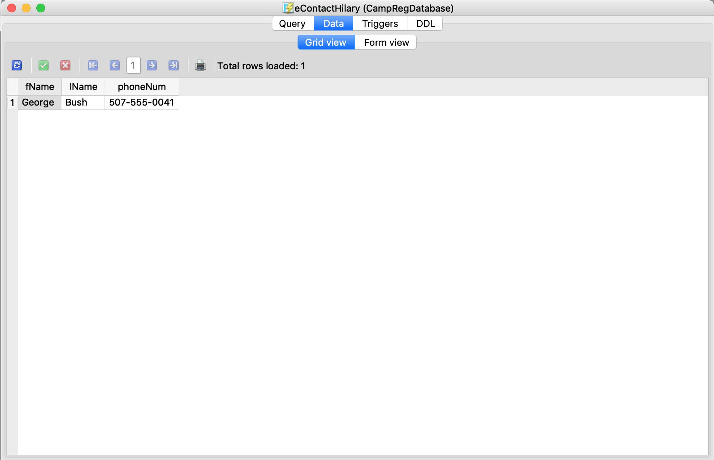
+
8. Get email addresses of all campers signed up for Fur-ology Fun.
** This could be useful for sending out a mass email for specific camp reasons.
+
----
CREATE VIEW [emailFur-Ology] AS
    SELECT Camper.email
      FROM Camper
           INNER JOIN
           Registration ON Registration.camperID = Camper.camperID
     WHERE Registration.campAbr = 'FF';
----
+
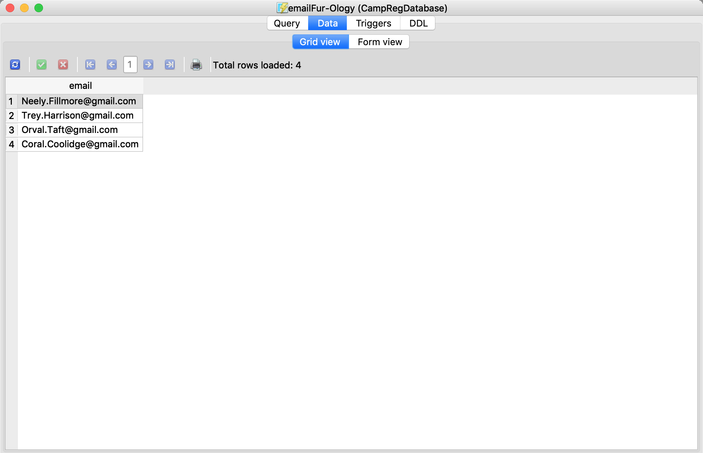
+
9. Get information together for a brochure; Camp name, Fee rates, and Age ranges.
** This would be the best way to get all the information together to create a brochure or general website for this organization.
+
----
CREATE VIEW BrocureData AS
    SELECT CampInfo.campName,
           CampInfo.campAbr,
           CampInfo.description,
           Fee.member,
           Fee.nonMember,
           DateRange.startDate,
           DateRange.endDate,
           AgeRange.youngest,
           AgeRange.oldest
      FROM Camp
           INNER JOIN
           CampInfo ON CampInfo.campAbr = Camp.campAbr
           INNER JOIN
           Fee ON Fee.feeRate = CampInfo.feeRate
           INNER JOIN
           DateRange ON DateRange.dateNo = Camp.dateNo
           INNER JOIN
           AgeRange ON AgeRange.rangeNo = CampInfo.rangeNo;
----
+
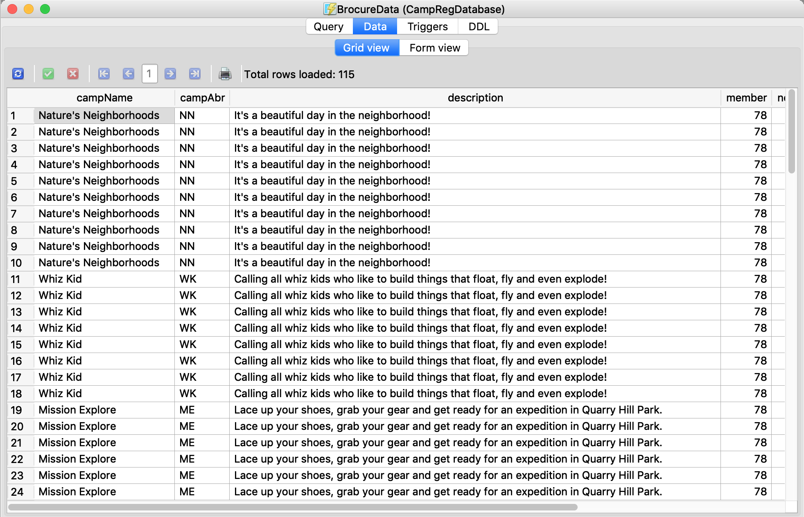
+
10. Get a list of non-members that have not paid their bills.
** This would be useful for administrative staff to be able to contact non-members who have forgotten to pay their bills.
+
----
CREATE VIEW NonMemberBills AS
    SELECT Camper.fName,
           Camper.lName,
           Camper.email,
           Fee.nonMember AS Owes
      FROM Registration
           INNER JOIN
           Camper ON Camper.camperID = Registration.camperID
           INNER JOIN
           Camp ON Camp.campAbr = Registration.campAbr AND
                   Camp.sessionNo = Registration.sessionNo
           INNER JOIN
           CampInfo ON CampInfo.campAbr = Camp.campAbr
           INNER JOIN
           Fee ON Fee.feeRate = CampInfo.feeRate
     WHERE Registration.payStatus = 'FALSE';
----
+
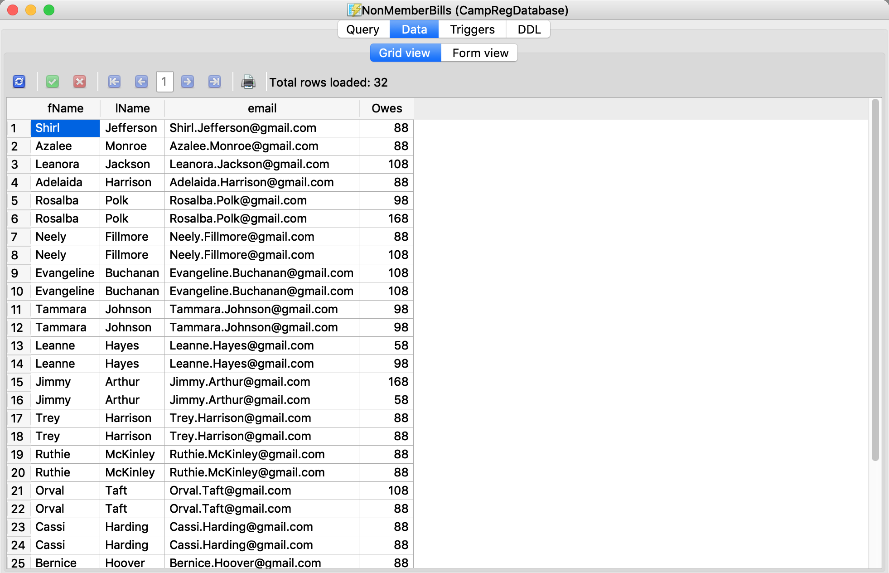

== Contributions
Project contributions were split evenly among team members.

include::CONTRIBUTION.adoc[]
