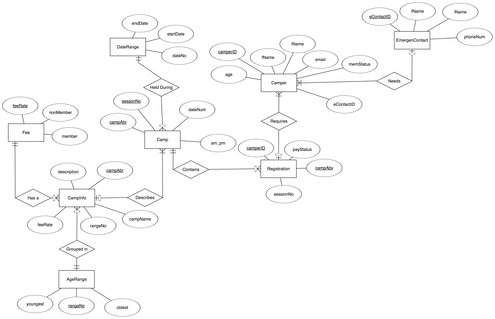

= CS385 Final Project
Kyle Aure <KAure09@winona.edu>, Andrew Poss <APoss17@winona.edu>
v1.0, 2018-11-17

.Project Description
****
Create a database for Quarry Hill Nature Center's summer camp registration.
Include design decisions, normalizations,
****

== Course Details
* **Course** - CS385: Applied Database Management
* **Instructor** - Dr. Nicole Anderson

== Running project
Database file is provided but there are no special commands to run this project.
Just use a GUI database management system such as SQLite to view tables and queries.

== Designing Database

=== Design Decisions
We started by creating tables as we saw relationships in data in the brochure.
To begin with we knew we would need data on a camper, the camp, emergency contact, and fees.
As we went we made relationships for all of the attributes that we knew we wanted to track.

.General Relationships
* Camper:camperID -> fName, lName, age, email, memberStatus, emergencyContact,
* Camp:campAbr -> campName, description, feeRate, ageRange, sessionNo, startDate, endDate, am_pm
* EmergencyContact:contactNo -> fName, lName, phoneNum
* Fee:feeRate -> nonMember, member, payStatus

=== Normalization
Based on the generic relationships above we then looked at creating functional relationships.
During this process we also made sure to normalize data to get rid of all partial and transitive dependencies.

.Independent Functional Relationships (No foreign keys)
* EmergencyContact:eContactID -> fName, lName, phoneNum
* AgeRange:rangeNo -> youngest, oldest
* Fee:feeRate -> nonMember, member
* DateRange:dateNo -> startDate, endDate

.Dependent Functional Relationships (With foreign keys)
* Camper:camperID -> fName, lName, age, email, memberStatus, _eContactID_
* CampInfo:campAbr -> campName, description, feeRate, _rangeNo_
* Camp:campAbr + sessionNo -> _dateNo_, am_pm
* Registration:camperID + campAbr + sessionNo -> payStatus

== Entity Relationship Diagram
After we made all the design decisions and normalized the database we created the following Entity Relationship (ER) diagram.
After adding the entities and attributes we created relationships between them as follows.

.Relationships with Multiplicity
* EmergencyContact(0..1) - needs - (1..\*)Camper
* Campers(1..\*) - requires - (0..\*)Registration
* Registration(0..\*) - contains - (1)Camp
* Camp(0..\*) - held during - (1)DateRange
* Camp(1..\*) - describes - (0..1)CampInfo
* CampInfo(0..\*) - has - (1)Fee
* CampInfo(0..\*) - grouped in - (1)AgeRange

.Entity Relationship Diagram

== Final Schema

.EmergencyContact Table
----
CREATE TABLE EmergencyContact (
    eContactID INTEGER PRIMARY KEY
                       UNIQUE,
    fName      STRING,
    lName      STRING,
    phoneNum   STRING
);
----

.AgeRange Table
----
CREATE TABLE AgeRange (
    rangeNo  INTEGER PRIMARY KEY
                     UNIQUE,
    youngest INTEGER,
    oldest   INTEGER
);
----

.Fee Table
----
CREATE TABLE Fee (
    feeRate   INTEGER PRIMARY KEY
                      UNIQUE,
    nonMember DOUBLE,
    member    DOUBLE
);
----

.DateRange table
----
CREATE TABLE DateRange (
    dateNo    INTEGER PRIMARY KEY,
    startDate DATE,
    endDate   DATE
);
----

.Camper Table
----
CREATE TABLE Camper (
    camperID   INTEGER PRIMARY KEY
                       UNIQUE,
    fName      STRING,
    lName      STRING,
    age        INTEGER,
    email      STRING,
    memStatus  BOOLEAN,
    eContactID INTEGER REFERENCES EmergencyContact (eContactID)
);
----

.CampInfo Table
----
CREATE TABLE CampInfo (
    campAbr     STRING  PRIMARY KEY
                        UNIQUE,
    campName    STRING,
    description STRING,
    feeRate     INTEGER REFERENCES Fee (feeRate),
    rangeNo     INTEGER REFERENCES AgeRange (RangeNo)
);
----

.Camp Table
----
CREATE TABLE Camp (
    campAbr   STRING  REFERENCES CampInfo (campAbr),
    sessionNo INTEGER,
    dateNo    INTEGER REFERENCES DateRange (dateNo),
    am_pm     STRING,
    PRIMARY KEY (
        campAbr ASC,
        sessionNo ASC
    )
    ON CONFLICT ROLLBACK
);
----

.Registration Table
----
CREATE TABLE Registration (
    camperID  INTEGER REFERENCES Camper (camperID),
    campAbr   STRING,
    sessionNo INTEGER,
    payStatus BOOLEAN,
    PRIMARY KEY (
        camperID ASC,
        campAbr ASC,
        sessionNo ASC
    )
    ON CONFLICT ROLLBACK,
    FOREIGN KEY (
        campAbr,
        sessionNo
    )
    REFERENCES Camp (campAbr,
    sessionNo)
);
----

== Queries and Results

1. What weeks is the Teen Nature Photography camp running?
2. Registration list for Scales & Slime.
3. Camp sessions for students who are 10 that are held in the morning.
4. Show the emergency contact list for GR session 9 with campers name.
5. Is Astrid Cleveland paid in full?
6. Which camps and sessions are running in June.
7. Show the emergency contact for Hilary Bush.
8. Get email addresses of all campers signed up for Fur-ology Fun.
9. Get information together for a brochure; Camp name, Fee rates, and Age ranges.
10. Get a list of non-members that have not paid their bills.

== Contributions
Project contributions were split evenly among team members.

include::CONTRIBUTION.adoc[]
