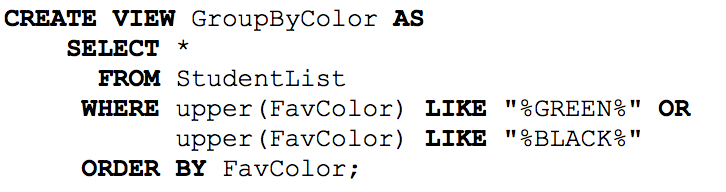
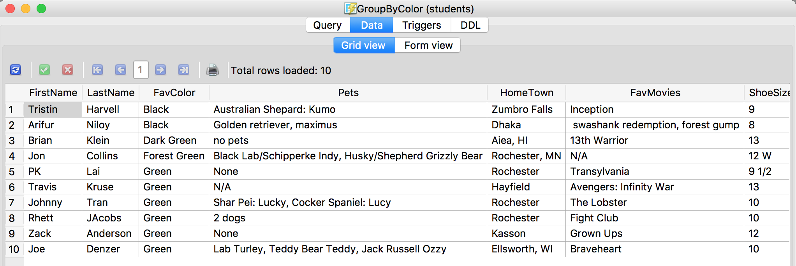

= CS385 Lab2
Kyle Aure <KAure09@winona.edu>
v1.0, 2018-09-07
:RepoURL: https://github.com/KyleAure/WSURochester
:AuthorURL: https://github.com/KyleAure
:DirURL: {RepoURL}/CS385

.Project Description
****
Continuation of lab 1 but this time we are utilizing the inherent features of a database.
With this database we will query our data using the SQL syntax.
****

== Course Details
* **Course** - CS385
* **Instructor** - Dr. Nicole Anderson

== Project Goals
1. Install SQLite
2. Create and connect to a database.  Add student data.
3. Set the column names and the column types.
4. Run a query to find the same information from lab 1.
5. Document potential data issues.
6. Modify the above query to order by first name.
7. Modify the query to group the Black fans and Green fans together.

== Running project
Database file is provided but there are no special commands to run this project.
Just use a GUI database management system such as SQLite to view tables and queries.

== Queries and Output
=== Base Query
I used the following query to replicate the program I wrote in lab1.
This query includes favorite colors that contain the words green or black, such as, `Forest Green`.

=== Order By LastName
This query was very similar to the first one I just edited the `ORDER BY` keyword to ascend by first name.

=== Group By Color
This query was hard given the specification.
I choose to use the `ORDER BY` keyword to sort the list so that `BLACK` and `GREEN` fans showed up 'in order'.
I could have used the `GROUP BY` keyword to create a table that lists the number of students whose favorite colors were `BLACK` or `GREEN`.

== Potential Issues
Some potential issues with this data is that it was collected without data integrity.
For example, not all entries in the `shoe size` category were entered as numbers.
This means that this column in our database cannot be set to `integer`.
Instead all the columns are stored as `strings`.

Additionally, some entries in the column `pets` are attempting to store extrenuous data, such as, breed, name, and species.
This data can, therefore, not be reliably searched nor sorted.
