= CS385 Lab 3
Kyle Aure <KAure09@winona.edu>
v1.0, 2018-09-11
:RepoURL: https://github.com/KyleAure/WSURochester
:AuthorURL: https://github.com/KyleAure
:DirURL: {RepoURL}/CS385

.Project Description
****
Continuation of Lab 2.
We are using a database to store student data.
Here we are implementing more robust queries.
****

== Course Details
* **Course** - CS385: Applied Database Management
* **Instructor** - Dr. Nicole Anderson

== Project Goals
* List the first name of students in the course, do not include duplicates.
* Show the count of the number of students in the course, renaming the output total Students.
* List the first name of all students that start with A or C.
* List the number of students with a hometown of “Rochester”.
* List in reverse alphabetical order all students with a favorite color with more than 4 characters.
* List the names of all the students having a favorite movie with the word “Up” anywhere in the name.
* List the names of all students that do not have a favorite color of green or black.

== Running project
Database file is provided but there are no special commands to run this project.
Just use a GUI database management system such as SQLite to view tables and queries.

== Queries and Output
=== First Names
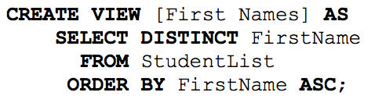
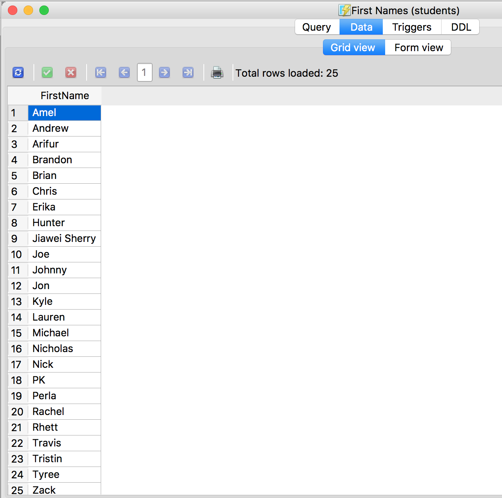

=== Count
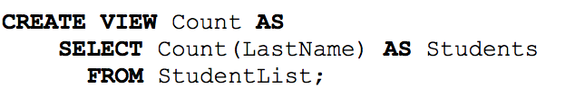
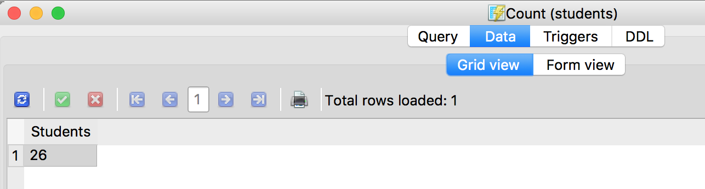

=== First Names A and C
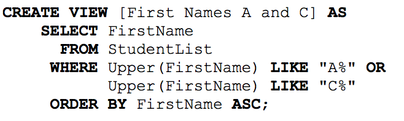
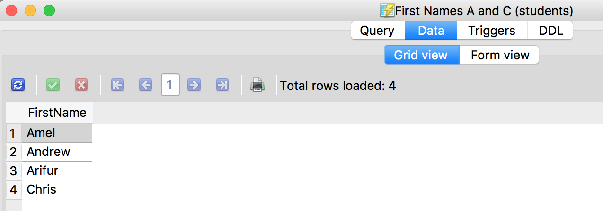

=== Hometown Rochester
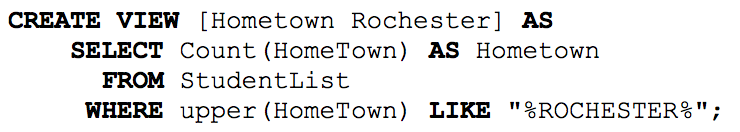
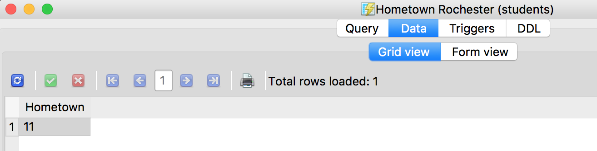

=== Descending Color
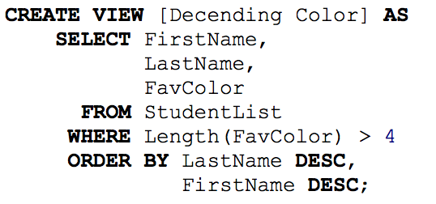
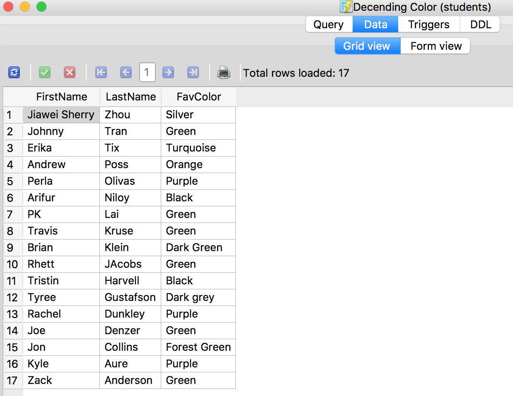

=== Favorite Movie Up
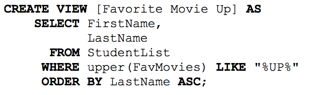
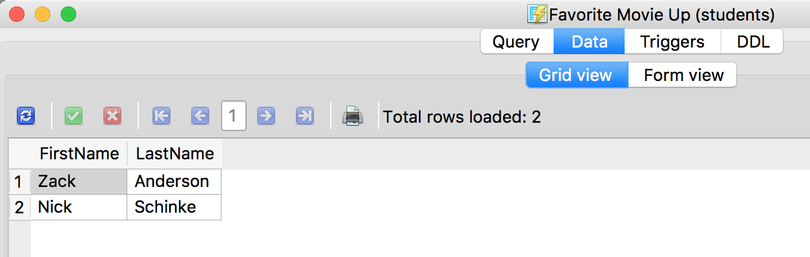

=== No Green or Black
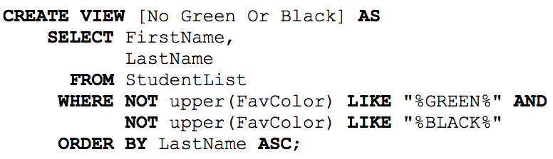
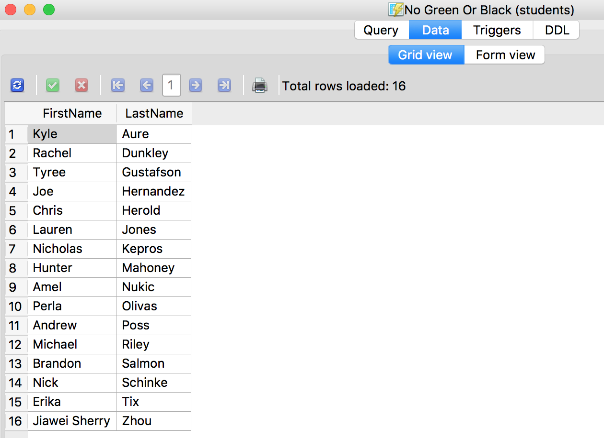
