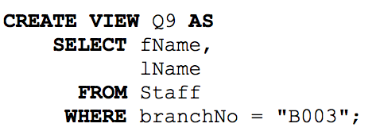
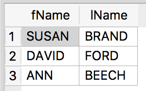
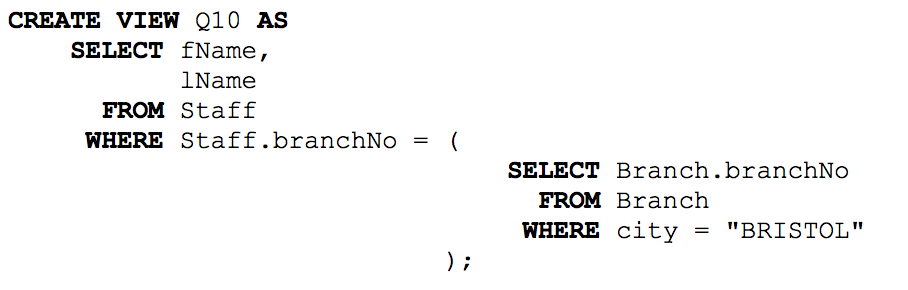
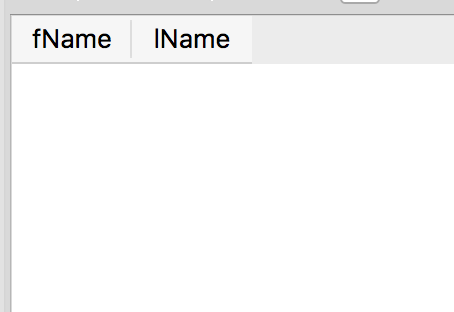
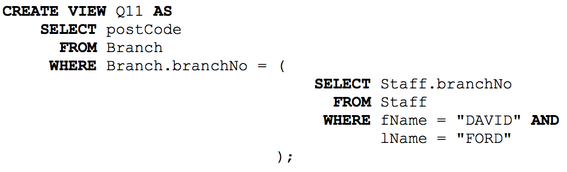
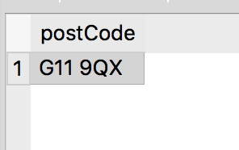

= CS385 Lab 4
Kyle Aure <KAure09@winona.edu>
v1.0, 2018-09-27
:RepoURL: https://github.com/KyleAure/WSURochester
:AuthorURL: https://github.com/KyleAure
:DirURL: {RepoURL}/CS385

.Project Description
****
Using relational algebra statements to represent
tables, relationships, and queries.
****

== Course Details
* **Course** - CS385: Applied Database Management
* **Instructor** - Dr. Nicole Anderson

== Running project
Database file is provided but there are no special commands to run this project.
Just use a GUI database management system such as SQLite to view tables and queries.

== Symbols
.Symbol Table
|===
|Syntax |Name |Meaning

|σ~conditional~R |Select |Return rows that meet condition

|π~colName1,colName2~R |Project |Returns named columns

|ρ~Name~R |Rename |Renames returned relation

|R1 ∩ R2 |Intersection |Returns rows that are the same between the two relationships

|R1 ∪ R2 |Union |Returns rows from both relationships

|R1 - R2 |Difference |Returns rows that are in R1 but not in R2

|R1 ⋈ R2 |Cross Product |Returns all rows of of R1 appended with all rows of R2

|===

== Relational Algebra Statements
1. List of first name of students in the course.
** π~firstName~Student
2. List the first and last name of students with a favorite color of green or black.
** π~firstName,lastName~(σ~favColor="green"~ ~v~ ~favColor="black"~Student)
3. List the first name of all students that start with j or k, renaming output JKnames.
** ρ~JKnames~(π~firstName~(σ~firstName~ ~like~ ~'j%'~ ~v~ ~firstName~ ~like~ ~'k%'~Student))
4. List the names of students with CS major.
** π~firstName,lastName~(σ~major='CS'~Student)
5. Modify the relational algebra to show the favorite activity of the above group, not their names.
** π~favoritActivity~(σ~major='CS'~Student)

== Relational Algebra for Pet Table
[start=6]
6. Write relational algebra to list the common last names of pets and students.
** π~lastName~Pet ∩ π~lastName~Student
7. Write relational algebra to list cities where student live but no pets.
** π~city~Student - π~city~Pet
8. Write relational algebra to list the first names of all people and pets combined.
** π~firstName~Student ∪ π~firstName~Pet

== Dream Home Database
[start=9]
9. List the names of all staff that work at branch B003
** π~fName,lName~(σ~branchNo='B003'~Staff)
+

+

10. List the names of all staff that work at a branch in Bristol.
** π~fName,lName~(σ~city='BRISTOL'~(Staff⋈~Staff.branchNo=Branch.branchNo~Branch))
+

+

11. List the post code for the branch at which David Ford works.
** π~postCode~(σ~fName='DAVID'~ ~^~ ~lName='FORD'~(Staff⋈~Staff.branchNo=Branch.branchNo~Branch))
+

+

12. Research the use of Union and Intersect operations in SQLite.  Are they supported?
** Yes both the Union and Intersect operations are supported in SQLite.
They both are placed between SQL statements on it's own line.
