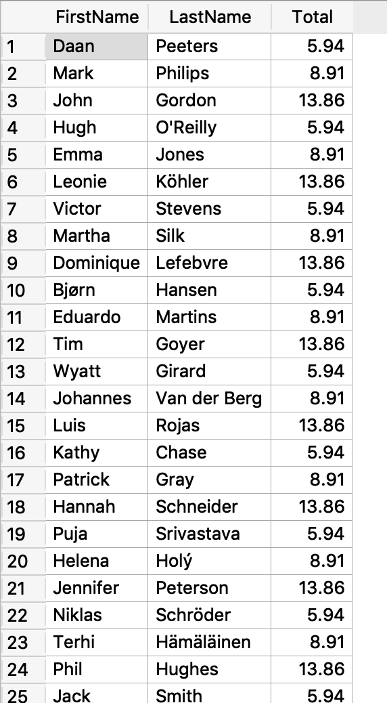
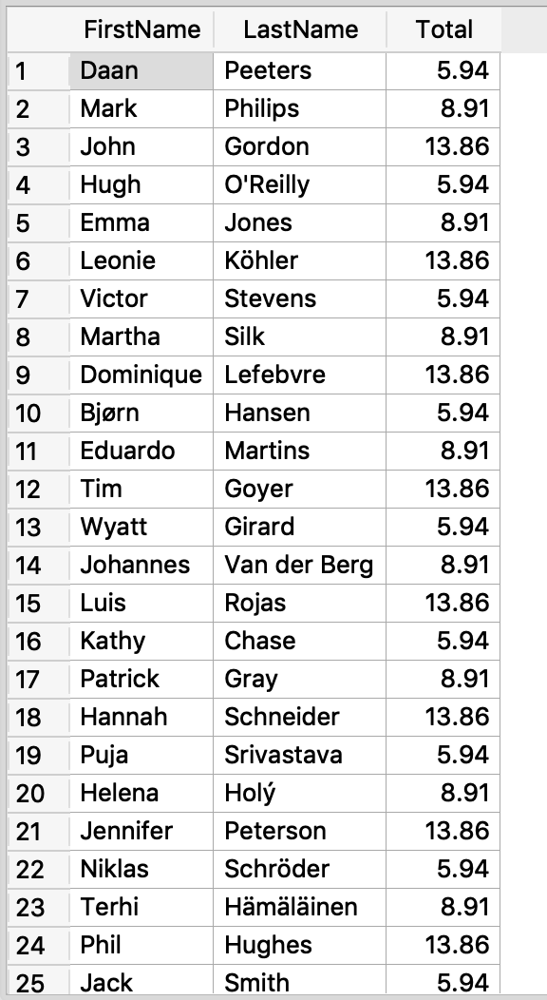

= CS385 Lab 5
Kyle Aure <KAure09@winona.edu>
v1.0, 2018-10-06
:RepoURL: https://github.com/KyleAure/WSURochester
:AuthorURL: https://github.com/KyleAure
:DirURL: {RepoURL}/CS385

.Project Description
****
Construct queries using the Chinook Database.
****

== Course Details
* **Course** - CS385: Applied Database Management
* **Instructor** - Dr. Nicole Anderson

== Running project
Database file is provided but there are no special commands to run this project.
Just use a GUI database management system such as SQLite to view tables and queries.

== Queries and Output
1. List the names of all albums that start with the letter B along with with the name of the associated artist.
+

image::assets/Q1Output.png[]
2. List all customers from Orlando that had invoices with a total over $5.00.
+

3. Find invoice values for invoices of greater value than all invoices for customers from Toronto.
+

4. Find invoice values for invoices of greater value than all invoices for customer Michelle Brooks.
+

5. Determine if there are any customers with the same last name as any employees. If yes, show the names.
+

6. For #1, it is possible to write this with either a join or a subquery? If yes, write it in a different form than before. If not, explain.
** Yes this query can be done using an Inner Join
+

7. For #2, it is possible to write this with either a join or a subquery? If yes, write it in a different form than before. If not, explain.
** Yes this query can be done using an Inner Join
+

