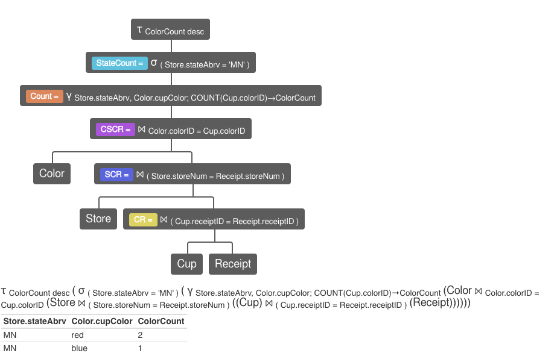
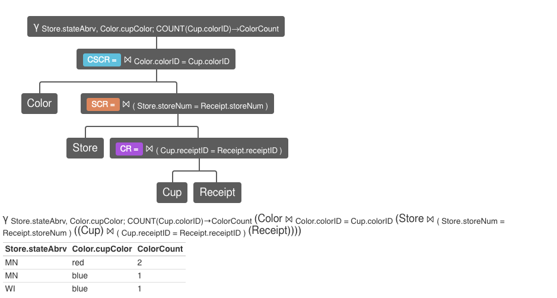
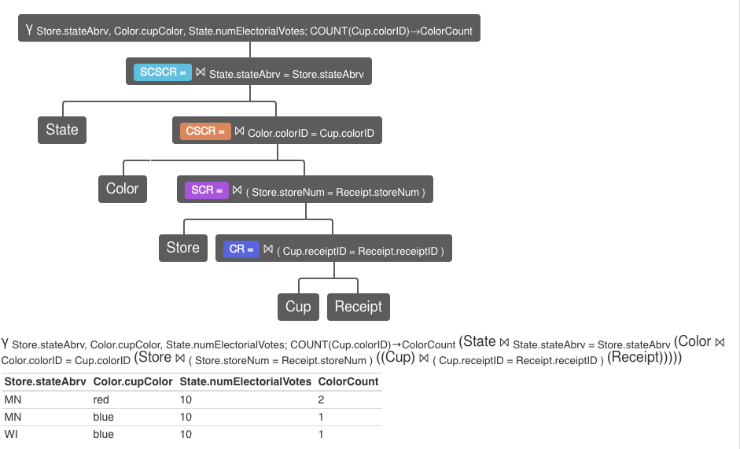

= CS385 Lab 7
Kyle Aure <KAure09@winona.edu>
v1.0, 2018-11-15
:RepoURL: https://github.com/KyleAure/WSURochester
:AuthorURL: https://github.com/KyleAure
:DirURL: {RepoURL}/CS385

.Project Description
****
Using the Cup Database Schema develop sample queries.
Then normalize the Student Database used in the first few labs to first, second, and third normal forms.
Finally, identify update anomalies and functional dependencies in a car rental table.
****

== Course Details
* **Course** - CS385: Applied Database Management
* **Instructor** - Dr. Nicole Anderson

== Running project
No database files are needed for this project.  Sample data is provided below.

== Problem 1
=== Polling schema
* Color([underline]#colorID#, cupColor)
* Store([underline]#storeNum#, stateAbrv)
* State([underline]#stateAbrv#, stateName, numElectorialVotes)
* Receipt([underline]#receiptID#, storeNum, date)
* Cup([underline]#receiptID#, [underline]#colorID#)

=== Queries

While working on these queries I decided to use Relational Algebra instead of SQL to create these queries.
I did this because it lead to an easier to think about how the tables are linked together.
Given more time I would convert these to SQL queries.

1. Which cup had the largest sales in each state?
** Goal: Create a query that lists which color had the largest sales in that state. Could not figure out a simple way to output all states.
+
----
// Cup-Reciept table
CR = (Cup) ⨝(Cup.receiptID=Receipt.receiptID) (Receipt)
// Store-Cup-Reciept table
SCR = Store ⨝(Store.storeNum=Receipt.storeNum) CR
// Color-Store-Cup-Receipt table
CSCR = Color⨝Color.colorID=Cup.colorID SCR
// Group by stateAbrv AND CupColor WHILE counting colorID as Column ColorCount from Table CSCR
Count = γ Store.stateAbrv,Color.cupColor;count(Cup.colorID)->ColorCount CSCR
// State interested in
StateCount = σ(Store.stateAbrv = 'MN') Count
// Order by counts
τ ColorCount desc StateCount
----
+

+
2. What is the distribution of cup sales in each state?
** Goal: Create a query that will list the state abbreviation and number of each cup type sold in that state.
+
----
// Cup-Reciept table
CR = (Cup) ⨝(Cup.receiptID=Receipt.receiptID) (Receipt)
// Store-Cup-Reciept table
SCR = Store ⨝(Store.storeNum=Receipt.storeNum) CR
// Color-Store-Cup-Receipt table
CSCR = Color⨝Color.colorID=Cup.colorID SCR
// Group by stateAbrv AND CupColor WHILE counting colorID as Column ColorCount from Table CSCR
γ Store.stateAbrv,Color.cupColor;count(Cup.colorID)->ColorCount CSCR
----
+

+
3. Who is currently predicted to win according to the 7-11 poll?
** Goal: We will also need the number of electoral votes each state gets.
+
----
// Cup-Reciept table
CR = (Cup) ⨝(Cup.receiptID=Receipt.receiptID) (Receipt)
// Store-Cup-Reciept table
SCR = Store ⨝(Store.storeNum=Receipt.storeNum) CR
// Color-Store-Cup-Receipt table
CSCR = Color⨝Color.colorID=Cup.colorID SCR
// State-Color-Store-Cup-Receipt table
SCSCR = State⨝State.stateAbrv=Store.stateAbrv CSCR
// Get StateAbrv, ElectorialVotes, CupColor, and ColorCount from SCSCR
γ Store.stateAbrv,Color.cupColor,State.numElectorialVotes;count(Cup.colorID)->ColorCount SCSCR
----
+

== Problem 2
Normalize student database.
Original Schema:
- Student(fName, lName, favColor, pets, hometown, favMovies, shoeSize)

=== First NF

Goals: Define primary key, and remove multivalued attributes.

First NF Schema:

- Student([underline]#studentID#, fName, lName, homeCity, homeState, shoeSize)
- StudentPet([underline]#studentID#, pet)
- StudentMovie([underline]#studentID#, favMovie)

=== Second NF

Goals: Ensure attributes rely on the whole of the candidate key

Functional Dependencies:

- Student::studentID + ZipCode -> fName, lName, shoeSize, homeCity, homeState
- StudentPet::studentID -> pet
- StudentMovie::studentID - > favMovie

Second NF Schema:

- Student([underline]#studentID#, [underline]#zipCode#, fName, lName, shoeSize, homeCity, homeState)
- StudentPet([underline]#studentID#, pet)
- StudentMovie([underline]#studentID#, favMovie)

=== Third NF

Goals: Ensure attributes rely on nothing but the primary key

Functional Dependencies:

- Student::studentID -> fName, lName, shoeSize, zipCode
- Hometown::zipCode -> homeState, homeCity
- StudentPet::studentID -> pet
- StudentMovie::studentID - > favMovie

Third NF Schema:

- Student([underline]#studentID#, fName, lName, shoeSize, zipCode)
- Hometown([underline]#zipCode#, homeState, homeCity)
- StudentPet([underline]#studentID#, pet)
- StudentMovie([underline]#studentID#, favMovie)

== Problem 3

=== Anomalies
1. Insertion - If you get a new car there is no where to store the registration, make, and model without having a customer to rent the car.
2. Deletion - If a shop location closes, then all the car and customer data from that shop is also lost.
3. Modification - If a customer changes their last name then all records for that customer need to be changed as well.

=== Functional Dependencies
- carReg -> carMake, carModel
** This is assuming that no two cars even if they are from different states will have the same registration number.
- custNo -> custName
** This is assuming that if the same customer goes to different shops they are not given separate customer numbers.
- shopNo -> shopLoc
** No assumptions here this is just logical.
- receiptNo -> carReg, custNo, shopNo, rentalDate
** The last attribute that is not functionally dependent on the rest of the schema is rentalDate. This should be functionally dependent on something outside the current schema like a receipt.
