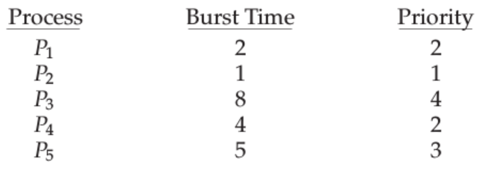

= Chapter 6 Questions
Kyle Aure <KAure09@winona.edu>
v1.0, 2019-02-06
:RepoURL: https://github.com/KyleAure/WSURochester
:AuthorURL: https://github.com/KyleAure
:DirURL: {RepoURL}/CS405

== Course Details
* **Course** - CS405
* **Instructor** - Dr. Dennis Martin

== Problem Set
[start=16]
16. Consider the following set of processes, with the length of the CPU burst time given in milliseconds:
+

+
** The processes are assumed to have arrived in the order P 1 , P 2 , P 3 , P 4 , P 5 , all at time 0.
a. Draw four Gantt charts that illustrate the execution of these processes using the following scheduling algorithms:
FCFS , SJF , nonpreemptive priority (a larger priority number implies a higher priority), and RR (quantum = 2).
b. What is the turnaround time of each process for each of the scheduling algorithms in part a?
c. What is the waiting time of each process for each of these schedul- ing algorithms?
d. Which of the algorithms results in the minimum average waiting time (over all processes)?
+
[start=19]
19. Which of the following scheduling algorithms could result in starvation?
a. First-come, first-served
b. Shortest job first
c. Round robin
d. Priority
