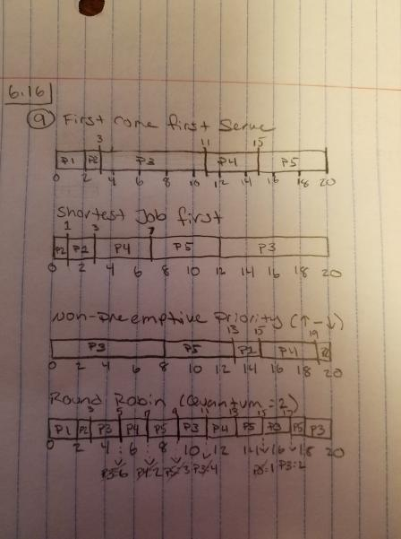

= Chapter 6 Questions
Kyle Aure <KAure09@winona.edu>
v1.0, 2019-02-08
:RepoURL: https://github.com/KyleAure/WSURochester
:AuthorURL: https://github.com/KyleAure
:DirURL: {RepoURL}/CS405

== Course Details
* **Course** - CS405
* **Instructor** - Dr. Dennis Martin

== Problem Set
[start=16]
16. Consider the following set of processes, with the length of the CPU burst time given in milliseconds:
+
image:Assets/6.16.png[]
+
** The processes are assumed to have arrived in the order P1, P2, P3, P4, P5, all at time 0.
a. Draw four Gantt charts that illustrate the execution of these processes using the following scheduling algorithms:
*** FCFS , SJF , nonpreemptive priority (a larger priority number implies a higher priority), and RR (quantum = 2)
+

+
b. What is the turnaround time of each process for each of the scheduling algorithms in part a?
+
.Turnaround Time
|===
|Method |P1 |P2 |P3 |P4 |P5

|FCFS |2 |3 |11 |15 |20

|SJF |3 |1 |20 |7 |12

|PRIORITY |15 |20 |8 |19 |13

|RR |2 |3 |20 |13 |18
|===
+
c. What is the waiting time of each process for each of these scheduling algorithms?
+
.Waiting Time
|===
|Method |P1 |P2 |P3 |P4 |P5

|FCFS |0 |2 |3 |11 |15

|SJF |1 |0 |12 |3 |7

|PRIORITY |13 |19 |0 |15 |8

|RR |0 |2 |12 |9 |13
|===
+
d. Which of the algorithms results in the minimum average waiting time (over all processes)?
+
.Overall Waiting Time
|===
|Method |tWaitTime |avgWaitTime |Shortest

|FCFS |31 |6.2 |No

|SJF |23 |4.6 |Yes

|PRIORITY |55 |11 |No

|RR |36 |7.2 |No

|===
+
[start=19]
19. Which of the following scheduling algorithms could result in starvation?
a. First-come, first-served
b. Shortest job first
c. Round robin
d. Priority

Priority and Shortest Job First can result in starvation.
This is because a higher priority or shorter job could theoretically always come in and stop a lower priority or longer job starve.
First-come, first-served and round robin do not suffer from this issue since these scheduling methods rely on time.
