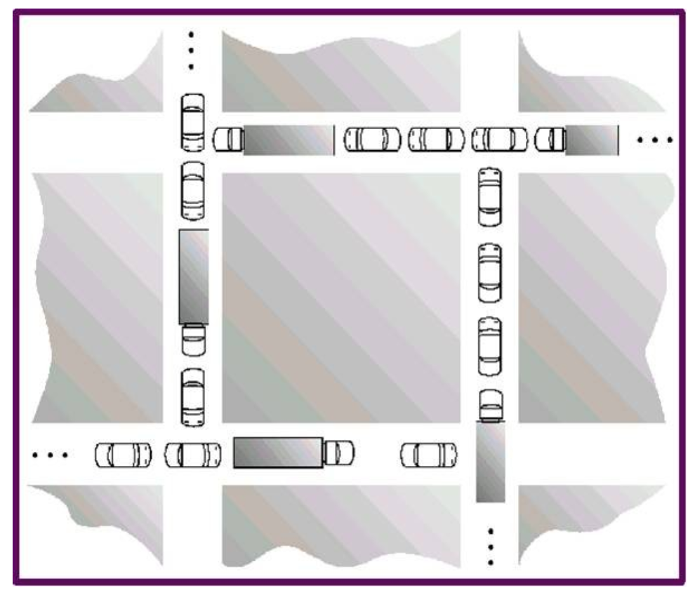

= Chapter 7 Questions
Kyle Aure <KAure09@winona.edu>
v1.0, 2019-04-10
:RepoURL: https://github.com/KyleAure/WSURochester
:AuthorURL: https://github.com/KyleAure
:DirURL: {RepoURL}/CS405

== Course Details
* **Course** - CS405
* **Instructor** - Dr. Dennis Martin

== Problem Set
Problem 11::
Question::::
Consider the traffic deadlock depicted in the figure below:
+

Answer::::
a. Show that the four necessary conditions for deadlock indeed hold in this example.
b. State a simple rule for avoiding deadlocks in this system.
Problem 23::
Qusetion::::
Consider the following snapshot of a system
+
|===
| 	|Allocation |Max 		|Available
| 	|A B C D 	|A B C D 	|A B C D
|P0 |2 0 0 1 	|4 2 1 2 	|3 3 2 1
|P1 |3 1 2 1 	|5 2 5 2 	|
|P2 |2 1 0 3 	|2 3 1 6 	|
|P3 |1 3 1 2 	|1 4 2 4 	|
|P4 |1 4 3 2 	|3 6 6 5 	|
|===
Answer the following questions using the banker's algorithm
Answer::::
a. Illustrate that the system is in a safe state by demonstrating an order in which the processesmay complete
b. If a request from process P1 arrives for (1,1,0,0), can the request be granted immediately?
c. If a request from Process P4 arrives for (0,0,2,0), can the request be granted immediately?
