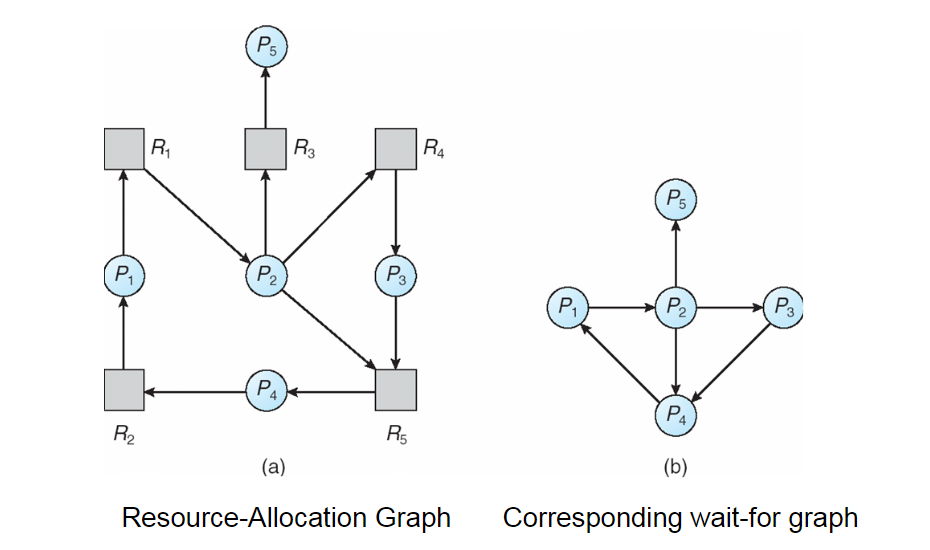

= Final Review

== Final Structure
* Coding questions
* Short answer questions
* Bonus questions: (never count against you but can only help you)

== Final Review Material

=== Chapter 7: Deadlocks
* Definition
  ** A set of *blocked processes* each holding a resource and waiting to acquire a resource
* Four conditions
  ** Mutual exclusion: Only one process at a time can use a resource.
  ** hold & wait: A process that is holding at least one resource is waiting to acquire an additional resource.
  ** No preemption: A resource can be released only voluntarily by the process holding it, after that process has completed it's task.
  ** circular wait: There exists a set of waiting processes such that their is a circular wait.
* Handling Deadlock
  ** prevention - ensure that one of the four required conditions cannot exist.
  ** avoidance - develop a protocol to ensure deadlock will never occur.  Requires system to have additional priori information available.
    *** See Banker's Algorithm
  ** detection - Allow the system to enter a deadlock state, detect the deadlock, and recover from the deadlock.
    *** See resource allocation graph
  ** recovery methods - Recovering from deadlock.
* Safe / unsafe states
  ** How to tell
  ** Resource matrices and graphs
  ** Banker's algorithm
* Resource allocation graphs
  ** asdf
  +
  

=== Memory management
* Paging the entire program
  ** Base and limit registers
  ** Swapping (if pgm won't fit)
  ** Overlays
* Memory partitioning -- contiguous memory allocation
  ** Single
  ** Two
  ** Multiple and variable
* Partition allocation
  ** First fit
  ** Best fit
  ** Worst fit
* Fragmentation
  ** Internal
  ** External
* Compaction

=== Paging
* Paging
  ** Frames
  ** Pages
  ** Page table
  ** TLB
* Address translation
  ** Logical to physical and back
* Shared pages
* Segmentation
  ** Segment table (base/limit pair)
* Virtual memory
  ** Basic concepts
  ** Only part of pgm in memory at one time
  ** Logical address space > physical address space
* Paging
  ** Lazy swapper
  ** Valid/invalid bit
* Page fault
  ** What and why?
* Page replacement algorithms
  ** FIFO, LRU, 2nd Chance, Optimal, (LFU, MFU)
  ** Implementations
    *** LRU (time stamp, stack, reference bit)
    *** 2nd Chance -- reference bit and modify (dirty) bit
* Frame allocation (to processes)
  ** Equal, proportional, priority, combination
  ** Also minimum -- all affected by multiprogramming level
* Thrashing
  ** What / why?
  ** Local / global page replacement
  ** How to detect (page fault frequency)
  ** How to handle
* Locality / working set
  ** General concept / why important
  ** What if too large or too small
* Pre-paging, pinned pages, inverted page table Files

=== Disks
* Disk structure
  ** Track, sector, cylinder, seek, latency, transfer, device directory
* Free space management -- characteristics, advantages / disadvantages
  ** Bitmap, linked lists, grouping (index), counting
* File allocation -- characteristics, advantages / disadvantages
  ** Contiguous, linked, indexed,
  ** What happens if index block is full?
* Disk scheduling -- characteristics, advantages / disadvantages
  ** FCFS, SSTF, SCAN, C-SCAN, LOOK, C-LOOK
* Disk protection
  ** Difference between RAID(5) and mirroring and striping
* Tertiary and hierarchical storage management
* I/O Systems and subsystems
  ** Hardware, polling, interrupts, interrupt-driven I/O, DMA, blocking/non-blocking I/O, synchronous/asynchronous I/O
  ** Interface, block and character devices, network devices
  ** Kernel I/O subsystem
  ** Streams
  ** Performance
