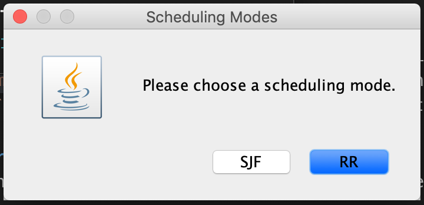
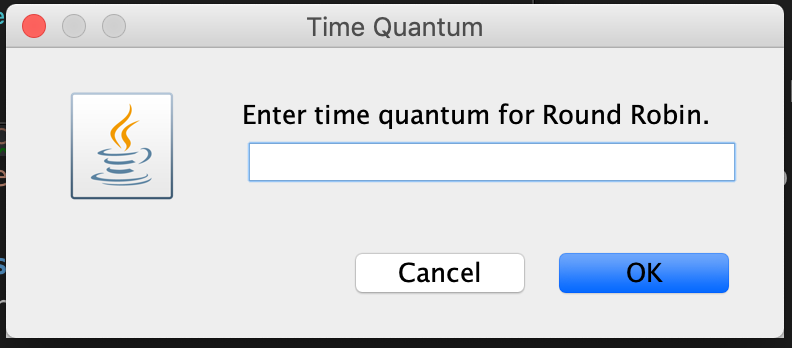
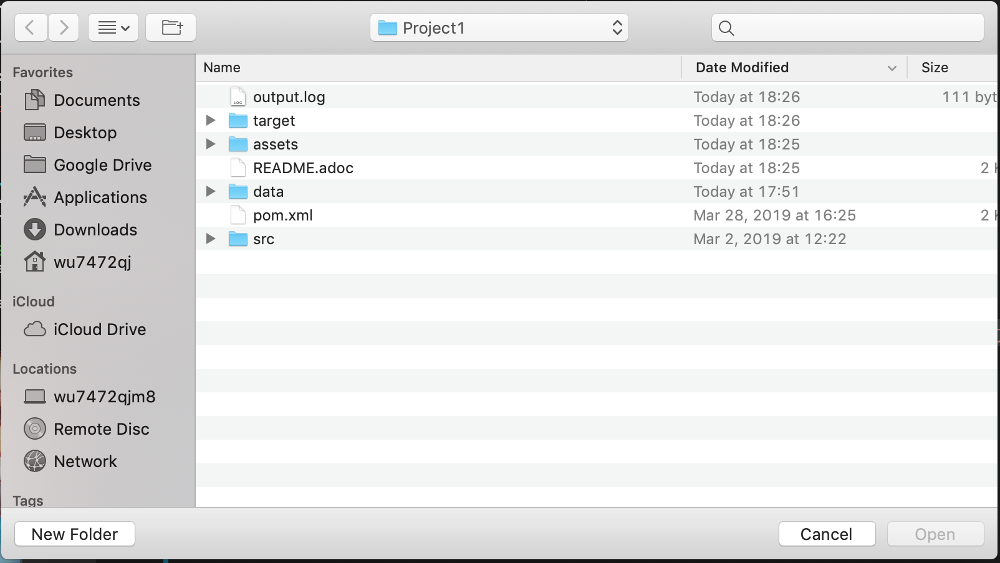

= Operating Systems Project 1
Kyle Aure <KAure09@winona.edu>
v1.0, 2019-04-01
:RepoURL: https://github.com/KyleAure/WSURochester
:AuthorURL: https://github.com/KyleAure
:DirURL: {RepoURL}/CS405

.Project Description
****
Create a project that simulates the inner workings of a CPU Scheduler.
****

== Course Details
* **Course** - CS405: Operating Systems
* **Instructor** -  Dr. Dennis Martin

== Project Goals
* Implement both Non-Preemptive Shortest Job First (SJF) and Round Robin (RR) scheduling. 
* Keep track of all scheduling queues (JobQueue, ReadyQueue, CPU, DiskQueue, IOWaitingQueue).
* Keep track of Process Control Block data.
* Print the state of all queues during a context switch.

== Getting Started
=== Prerequisites
This is a Java project that uses a Maven build architecure.
Prior to running this project you will need to download and install maven on your local system.
Instructions on how to install maven can be found here:
link:https://maven.apache.org/install.html[]

To check to see if you have Maven installed correctly run the `mvn --version` command.
You should see output similar to:

```bash
Apache Maven 3.5.4 (1edded0938998edf8bf061f1ceb3cfdeccf443fe; 2018-06-17T13:33:14-05:00)
Maven home: /Applications/maven
Java version: 1.8.0_161, vendor: Oracle Corporation, runtime: /Library/Java/JavaVirtualMachines/jdk1.8.0_161.jdk/Contents/Home/jre
Default locale: en_US, platform encoding: UTF-8
OS name: "mac os x", version: "10.14.3", arch: "x86_64", family: "mac"
```

=== Installing
Since we are using Maven, all you need to do to install this program is to run the `mvn install` command.
Running this command will do the following:

1. Download all dependencies.
2. Put dependencies on the project's build path.
3. Runs automated tests.
4. Build the project.
5. Package the project as a -jar.

=== Running the Project
Once you have installed the project you can run it by using the following command, or by opening the .jar file located in the `/target/` folder that was generated int he last step.

```bash
mvn exec:java -Dexec.mainClass="edu.winona.cs.main.App"
```

== User Interface
When running this project the user is prompted via a User-Interface (GUI) to choose the settings prior to running.  

First the user chooses the Scheduling Mode they want to use.  SJF or RR:



If the user chooses RR, they are then asked to type in a Time Quantum:



Finally, the user is asked to choose a .json file that has the job information.



== Output
Once the settings and file have been selected, the program creates a output.log file.
This file holds the output for the program; which includes, scheduling mode, quantum, job pool initialization, and queue data during context switch. 

== Results
For this project I used the sample data provided here:

```json
include::data/assignmentData.json[]
```

And the reversed sample data here:

```json
include::data/assignmentData-reverse.json[]
```

I have stored the resulting logs in the `/logs/` directory within this projects.
Links to the resulting logs file here:

1. link:logs/SJF.txt[Shortest Job First]
2. link:logs/SJF-R.txt[Shortest Job First - Reversed] 
3. link:logs/RR-2.txt[Round Robin - 2]
4. link:logs/RR-3.txt[Round Robin - 3]
5. link:logs/RR-4.txt[Round Robin - 4]
6. link:logs/RR-5.txt[Round Robin - 5]


== Built With
* link:https://maven.apache.org/[Maven] - Dependency Management
* link:https://github.com/FasterXML/jackson-core[Jackson] - JSON to POJO

== Authors
* **Kyle Aure** - *Author* - link:https://github.com/KyleAure[KyleAure]


