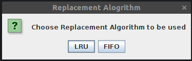
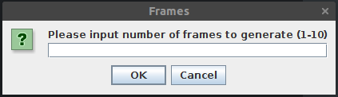
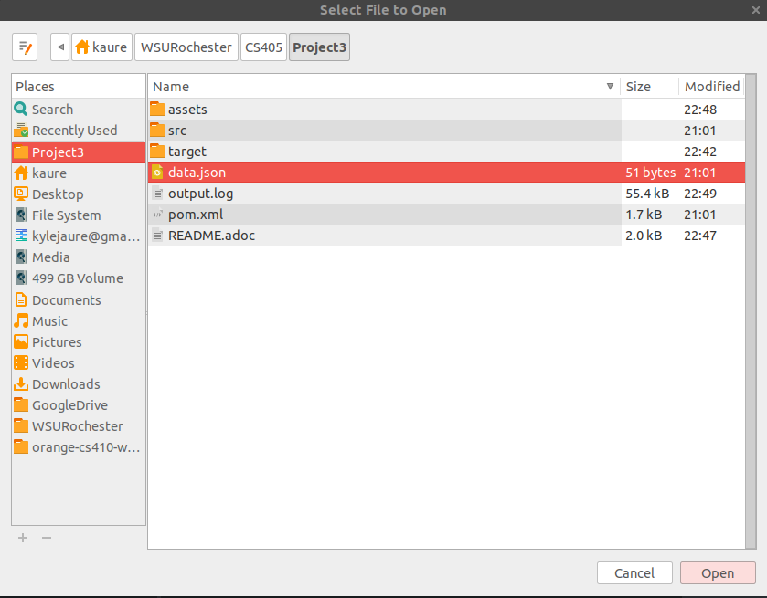

= Operating Systems Project 3
Kyle Aure <KAure09@winona.edu>
v1.0, 2019-04-19
:RepoURL: https://github.com/KyleAure/WSURochester
:AuthorURL: https://github.com/KyleAure
:DirURL: {RepoURL}/CS405

.Project Description
****
Create a project that simulates the inner workings of a page replacement.
****

== Course Details
* **Course** - CS405: Operating Systems
* **Instructor** -  Dr. Dennis Martin

== Project Goals
* Implement both Least Recently Used (LRU) and First In First Out (FIFO) replacement alogrithms.
* Keep track of all page faults.
* Print the state of mainstore after a page fault.

== Getting Started
=== Prerequisites
This is a Java project that uses a Maven build architecure.
Prior to running this project you will need to download and install maven on your local system.
Instructions on how to install maven can be found here:
link:https://maven.apache.org/install.html[]

To check to see if you have Maven installed correctly run the `mvn --version` command.
You should see output similar to:

```bash
Apache Maven 3.5.4 (1edded0938998edf8bf061f1ceb3cfdeccf443fe; 2018-06-17T13:33:14-05:00)
Maven home: /Applications/maven
Java version: 1.8.0_161, vendor: Oracle Corporation, runtime: /Library/Java/JavaVirtualMachines/jdk1.8.0_161.jdk/Contents/Home/jre
Default locale: en_US, platform encoding: UTF-8
OS name: "mac os x", version: "10.14.3", arch: "x86_64", family: "mac"
```

=== Installing
Since we are using Maven, all you need to do to install this program is to run the `mvn install` command.
Running this command will do the following:

1. Download all dependencies.
2. Put dependencies on the project's build path.
3. Runs automated tests.
4. Build the project.
5. Package the project as a -jar.

=== Running the Project
Once you have installed the project you can run it by using the following command, or by opening the .jar file located in the `/target/` folder that was generated int he last step.

```bash
mvn exec:java -Dexec.mainClass="edu.winona.cs.paging.App"
```
== User Interface
When running this project the user is prompted via a User-Interface (GUI) to choose the settings prior to running.

First the user chooses the Replacement Algorithm they want to use.  LRU or FIFO:



The user will then need to choose the number of frames in the main store:



Finally, the user is asked to choose a .json file that has the page information.



== Output
Once the settings and file have been selected, the program creates a output.log file.
This file holds the output for the program; which includes, algorithm, number of frames, and the main store after faults.

== Results
For this project I used the sample data provided here:

```json
include::data.json[]
```

I have stored the resulting logs in the `/logs/` directory within this projects.
Results and links to the resulting logs file here:

|===
|# of frames |Faults LRU |Log LRU |Faults FIFO |Log FIFO

|3
|15 |link:logs/LRU3.log[LRU - 3]
|16 |link:logs/FIFO3.log[FIFO - 3]

|4
|10 |link:logs/LRU4.log[LRU - 4]
|14 |link:logs/FIFO4.log[FIFO - 4]

|5
|8 |link:logs/LRU5.log[LRU - 5]
|10 |link:logs/FIFO5.log[FIFO - 5]

|6
|7 |link:logs/LRU6.log[LRU - 6]
|10 |link:logs/FIFO6.log[FIFO - 6]

|7
|7 |link:logs/LRU7.log[LRU - 7]
|7 |link:logs/FIFO7.log[FIFO - 7]
|===


== Built With
* link:https://maven.apache.org/[Maven] - Dependency Management
* link:https://github.com/FasterXML/jackson-core[Jackson] - JSON to POJO

== Authors
* **Kyle Aure** - *Author* - link:https://github.com/KyleAure[KyleAure]
