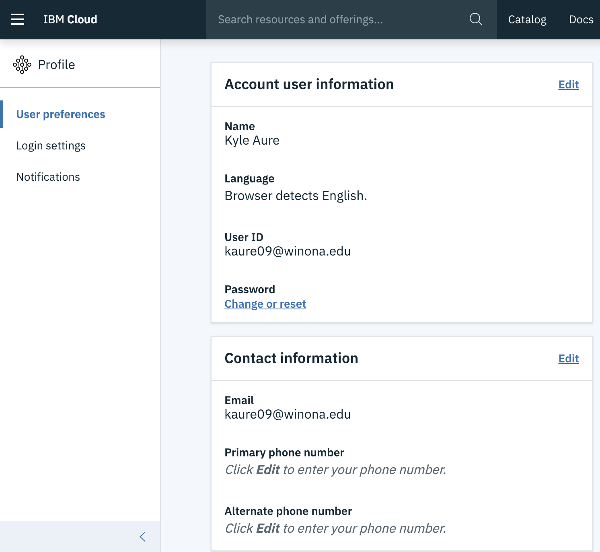
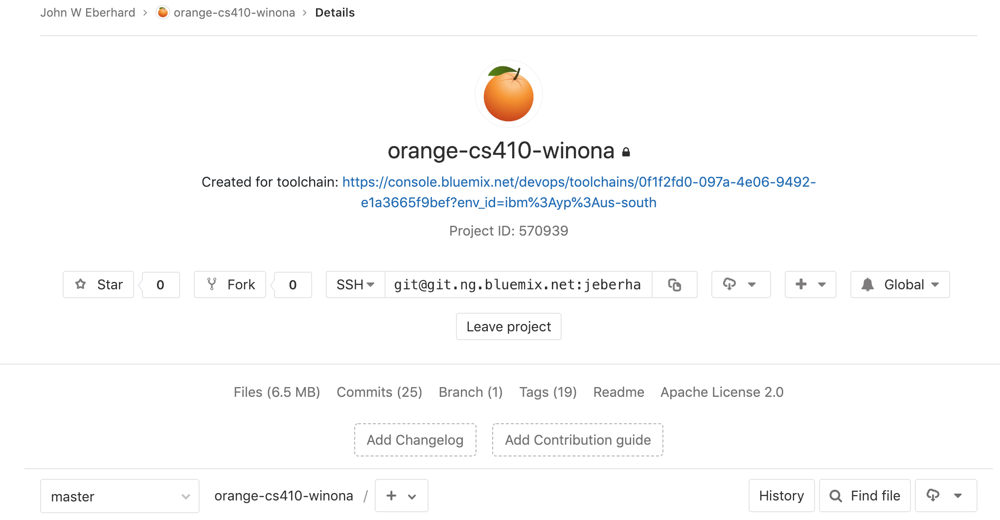
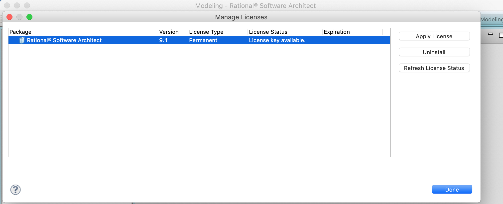
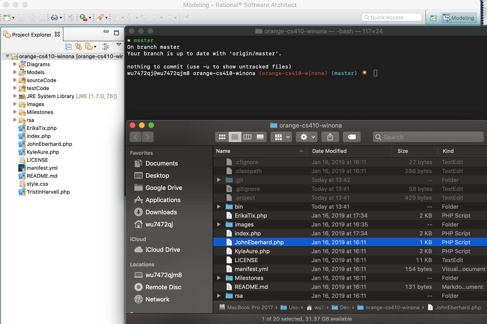
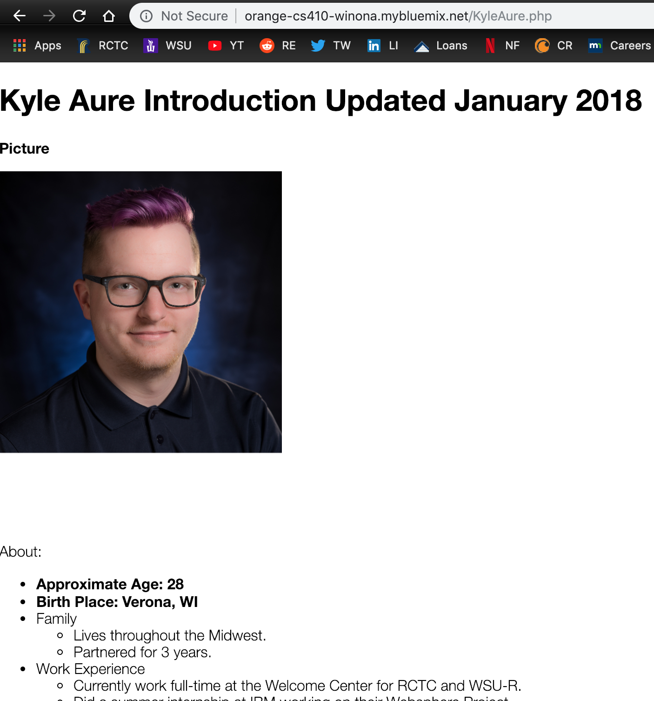

= Assignment 1
Kyle Aure <KAure09@winona.edu>
v1.0, 2019-01-20
:RepoURL: https://github.com/KyleAure/WSURochester
:AuthorURL: https://github.com/KyleAure
:DirURL: {RepoURL}/CS410

.Assignment Description
****
Complete the Introductions activity on IBM Cloud as described in class.
****

== Course Details
* **Course** - CS410
* **Instructor** - Dr. John Eberhard

== Documentation
1. Setting up IBM Cloud
** IBM cloud account created and account extended using a Student License.
** Email used: `KAure09@winona.edu`.
+

+
2. Access to Git Repository
** Orange Team git repository access granted.
+

+
3. Setting Up RSA Software
** Software installed successfully.
** License downloaded and applied.
+

+
4. Integrating Git Repo with RSA
** Cloned git repository locally and opened in RSA software.
+

+
5. Create student homepage
** Created personal homepage and pushed changes to git for integration.
** Website updated with my personal homepage.
+

