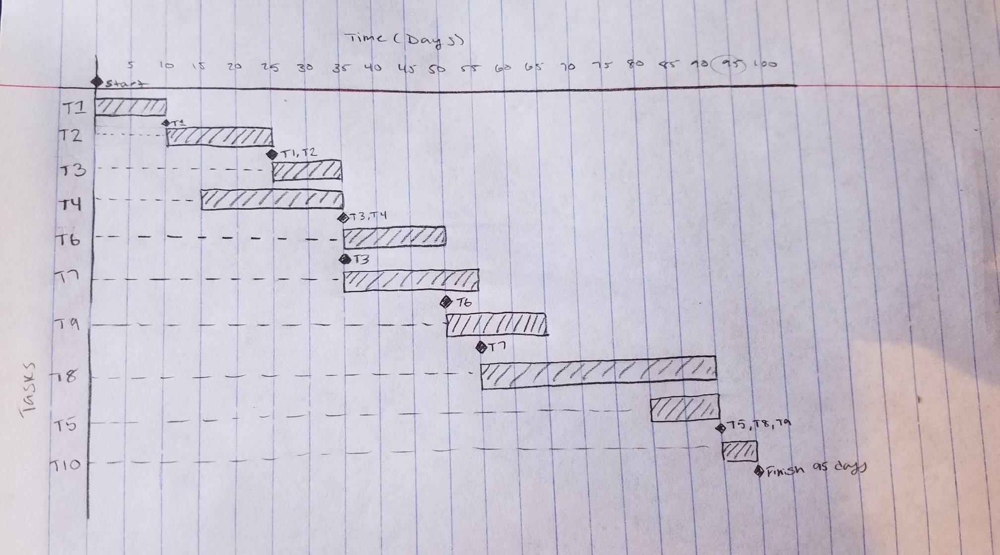
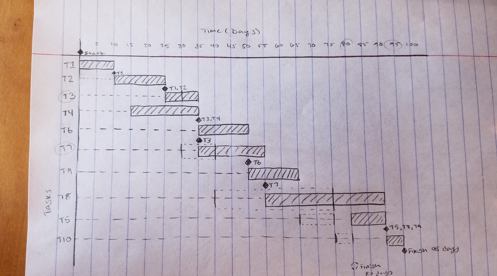

= Assignment 10
Kyle Aure <KAure09@winona.edu>
v1.0, 2019-04-08
:RepoURL: https://github.com/KyleAure/WSURochester
:AuthorURL: https://github.com/KyleAure
:DirURL: {RepoURL}/CS410

.Assignment Description
****
Chapter 22, 23, 24, and 25 review questions.
****

== Course Details
* **Course** - CS410
* **Instructor** - Dr. John Eberhard

== Problems
Problem 1::
Question::::
Name and describe the five types of activities done by software project managers.
(Hint:  One of the activities is proposal writing).
Answer::::
1. *Project Planning:* Planning projects to complete, time estimates, scheduling projects, and assigning people to tasks.
2. *Risk Management:* Assessing the risks that may affect a project, monitoring these risks, and taking action if necessary.
3. *People Management:* Managing a team of people.
4. *Reporting:* Reporting the progress of a project to customers and managers. Writing project reports.
5. *Proposal Writing:* Writing a contract proposal.  This document describes the objectives, and how they will be carried out. Also includes costs, risks, and scheduling estimates.
Problem 2::
Question::::
Name and describe the three related categories of risk.
Answer::::
1. *Project Risk:* Risks that affect the project schedule or resources. Example, staffing changes
2. *Product Risk:* Risks that affect the quality or performance of the software being developed. Example, failed third party component.
3. *Business Risk:* Risks that affect the company producing software. Example, competitor producing a similar product.
Problem 3::
Question::::
Describe at least one element of risk you encountered while working on the project.
Which category from question 2 does that risk fall under?
Answer::::
At the beginning of our project we discussed what resources our project would need to depend on.  This included things like a database, GUI development platform, and build platform.  Originally we had decided to use JavaFX for GUI development.  But soon after starting production we found that it did not offer enough flexibility for what we were trying to accomplish.  Making these decisions in the beginning was a *Product Risk* since the performance of our software would have been hindered by using JavaFX.
Problem 4::
Question::::
The following chart sets out a number of tasks, their durations, and their dependencies.  Draw a bar chart showing the project schedule.
+
|===
|Task |Duration(days) |Dependencies

|T1 |10 |
|T2 |15 |T1
|T3 |10 |T1,T2
|T4 |20 |
|T5 |10 |
|T6 |15 |T3,T4
|T7 |20 |T3
|T8 |35 |T7
|T9 |15 |T6
|T10 |5 |T5, T8, T9
|===
Answer::::

Problem 5::
Question::::
For the previous exercise, suppose that a developer is available for 15 days and is able to do 30 days worth of work.
Which work tasks would you have the developer work on?
By how many days are you able to reduce the total time required for the project?
Answer::::
Since T8 is the last task that is holding up T10 from competing at the end of the project, I would either have the developer work on T8, or T3 and T7.  Doing either one of these would reduce the project by 15 days, and therefore getting the maximum benefit from this developer.
+

Problem 6::
Question::::
Describe the most important elements of a high quality program inspection.
Include a description of the participants as well as the procedure used.
Answer::::
* Program inspections include a cross functional team.
* This team does Line-by-Line code review of the program source code.
* The team looks for defects which may be logical errors, anomalies in the code, or features that have been omitted from the code.
* The inspection team may also use a checklist of common programming errors. This checkist will often be specific to the programming language, or program type.
Problem 7::
Question::::
Name and describe the four closely related activities involved with the configuration management of a software system product.
Answer::::
1. *Version Management:* Keeping track of multiple versions of various components that make up a software system. Also ensures that changes made by one developer does not affect changes made by another developer.
2. *System Building:* Assembling program components, libraries, and data into an executable program.
3. *Change Management:* Keeping track of requests for change to the system from customers and other developers. Weighs benefits and risks to decide which changes to make.
4. *Release Management:* Preparing software for external release and keeping track of which system versions have been released to customers.
