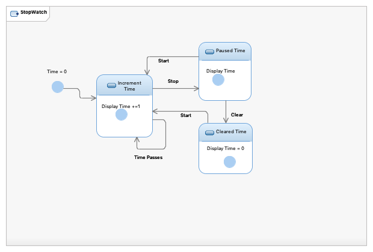

= Assignment 4
Kyle Aure <KAure09@winona.edu>
v1.0, 2019-02-03
:RepoURL: https://github.com/KyleAure/WSURochester
:AuthorURL: https://github.com/KyleAure
:DirURL: {RepoURL}/CS410

.Assignment Description
****
Chapter 5 review questions.
****

== Course Details
* **Course** - CS410
* **Instructor** - Dr. John Eberhard

== Diagrams
=== Use Case Diagram
You are developing an ATM machine.
Create a use case diagram for when a customer withdraws money from the ATM.
This use case should have at least two actors.
Be sure to provide a textual description of the use case.

.Diagram

.Textual Description
****
When accessing an ATM Machine a customer will be able to check their balance.
When making a withdraw, the machine will first check to ensure that the customers account has enough funds and the ATM have enough funds to process the withdraw.
If there are sufficient funds, the bank accounting system will debit the customers account, and allow the ATM to dispense the money.
If there are non-sufficient funds in the ATM, the customer will receive an error message and the ATM will be taken out of service.
If there are non-sufficient funds in the customers account, the bank accounting system will deny the customers request, and the ATM will display an error message.
When making a deposit, the customer will be prompted to enter the amount they are depositing, and the ATM will display a message saying, "Only up to $100.00 of their deposit will be made automatically available."
If the customer agrees, the deposit will be taken and the bank accounting system will credit the customers account whichever is smaller, $100.00 or the amount they entered.
Once the ATM is serviced and the amount deposited is processed the remaining amount will be credited to the customers account.
If the ATM is out of money, and has automatically been taken offline, a bank employee will need to restock the machine.
Since, a bank employee can also be a customer they can also use this ATM machine the same as described above.
****

=== Activity Diagram
Create an activity diagram that models the data processing involved when a customer withdraws cash from the machine.

=== Sequence Diagram
Create a sequence diagram that models the steps taken by an ATM machine when a customer attempts to withdraw money from the ATM.
Make sure the diagram includes an alternative interaction options.

image::Assets/ATMWithdrawSequenceDiagram.png[]

=== Class Diagram
Create a class diagram to represent an “account” at a bank.
Include the following types of accounts:

* checking
* savings
* certificate of deposit.

Include the following elements where appropriate:

* balance
* maturity date
* create()
* deposit()
* withdraw()
* processCheck()
* addInterest()
* renew()
* close()

Make sure the inheritance is utilized correctly in your diagram.

=== State Diagram
Create a state diagram representing a stop watch.
The stop watch has the following buttons:

* clear
* start
* stop

Be careful:  Make sure you know what the STATES are.

