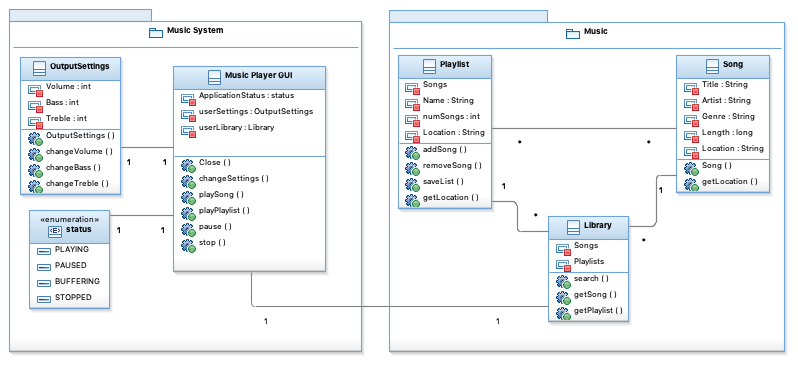

= Assignment 5
Kyle Aure <KAure09@winona.edu>
v1.0, 2019-03-02
:RepoURL: https://github.com/KyleAure/WSURochester
:AuthorURL: https://github.com/KyleAure
:DirURL: {RepoURL}/CS410

.Assignment Description
****
Chapter 6 and 7 review questions.
****

== Course Details
* **Course** - CS410
* **Instructor** - Dr. John Eberhard

== Problems
1. Name and describe the five parts of Krutchen’s 4+1 view model of software architecture.
** *Logical:* traditional logical view represented by objects, object's classes, and key abstractions.
** *Process:* is a run-time view, which breaks the system into parts and shows how those parts interact.
** *Development:* is the development time view, which shows the system broken up in the parts that will be developed independently.
** *Physical:* is the hardware view, which shows the system's hardware and how the software system will run on the processor.
** *+1:* is the addition of use cases and scenarios that put the other five parts into words that are more related to customer requirements.
2. Describe the following architecture patterns:
	A. Model-View-Controller
		** This architecture splits up a system into three logical components that interact with each other; Model, View, and Controller. The Model, manages the system's data. The View, manages how the data is presented to the user.  The Controller, manages the interaction between the user and the data.
	B. Layered Architecture
		** This architecture splits up a system into logical layers that provide services only with those layers that are above and below.
	C. Repository Architecture
		** This architecture isolates the system's data into a repository that all components of the system can access.  All direct data access needs to go through the repository system.
	D. Client-Server Architecture
		** This architecture splits up a system components into servers, that deliver data/services to clients who are the users of the system.
	E. Pipe and Filter Architecture
		** This architecture splits up a system into filters.  Each filter is an orthogonal processing component of the system.  Data from each filter flows from one filter to another along a pipe.
3.  Name and describe three ways to identify object classes in an object-oriented system.
** *Grammatical:* an approach that defines objects based on their natural language description. Example: "A user has a username and password."
** *Tangible:* an approach that defines objects based on their tangible existence within an application. Example: Users
** *Behavioral:* an approach that defines objects based on the behaviors they participate in. Example: A user can login to the system.
** *Scenario:* an approach that defines objects based on a scenario which has objects, attributes, and methods.  Example: A user is created with a username and password is entered and meet criteria.
4.  Using the UML graphical notation for object classes (i.e. UML class diagram), design the classes for a personal music system, identifying attributes and operations.  Use your own experience to decide on the attributes and operations that should be associated with the classes.
+

+
5.  Name and describe the four essential elements of design patterns.
** *Name:* needs to be picked to be concise, meaningful, and identifiable.
** *Problem Description:* this description provides an explanation of the problem, why it is significant, and why it should be solved.
** *Solution Description:* this description provides an explanation of how the problem can be solved, how implementation will work, and proof that the solution works.
** *Consequences:* are positive and negative effects that can be expected from implementing the solution.  It provides a pro-con list that will need to be considered prior to implementation.
