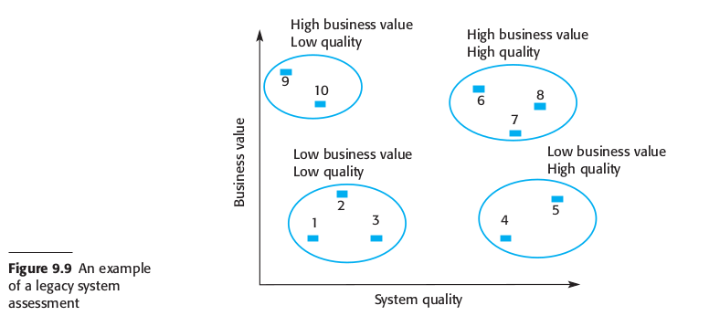
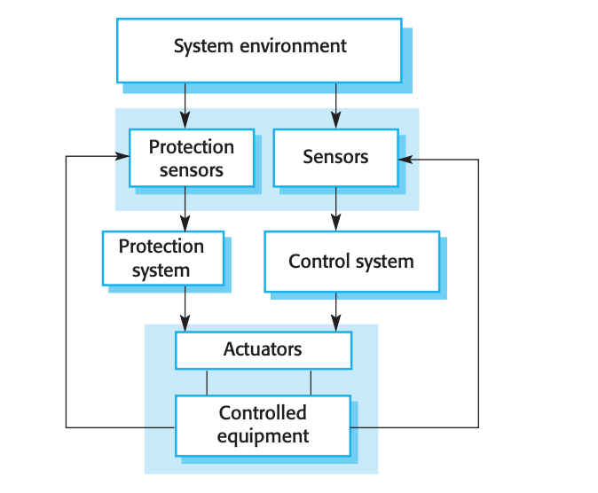
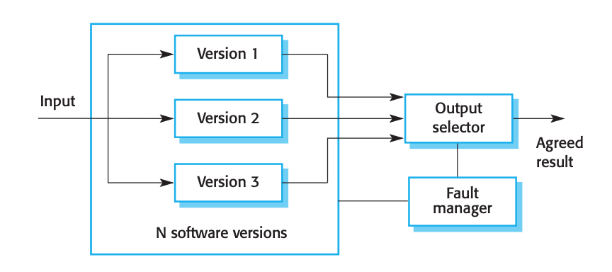
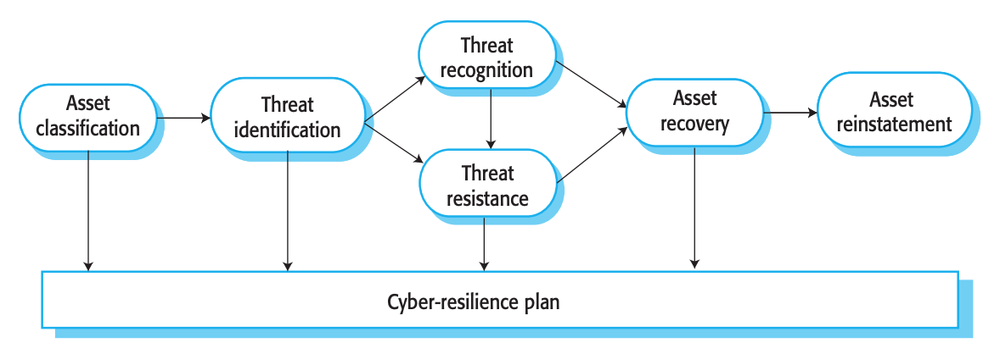
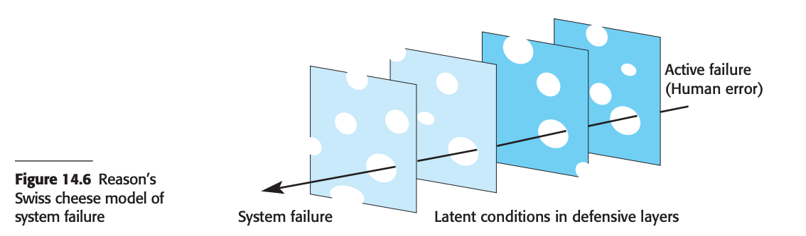
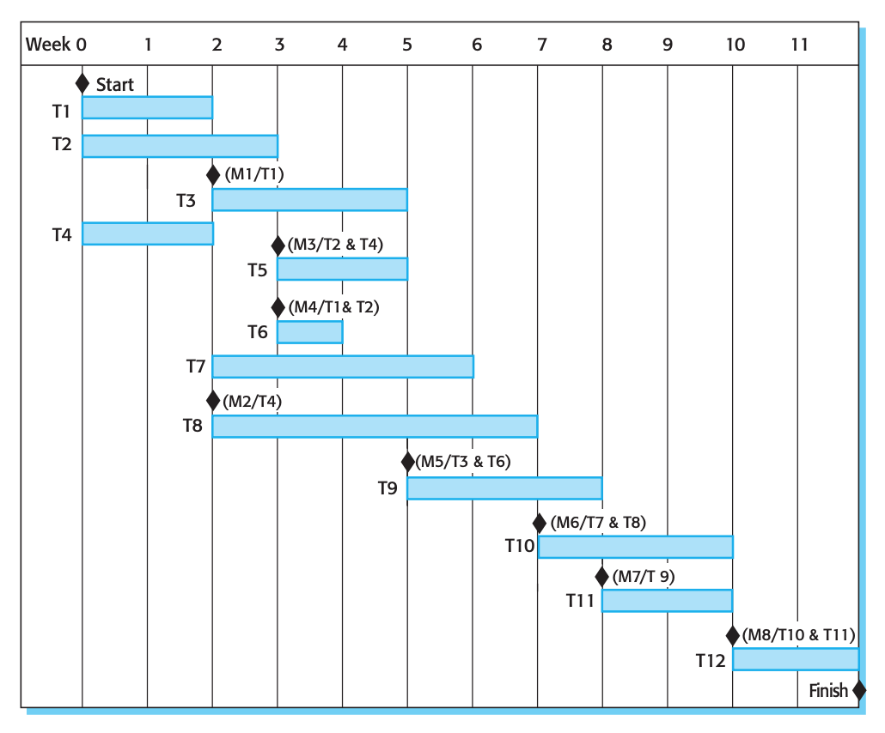
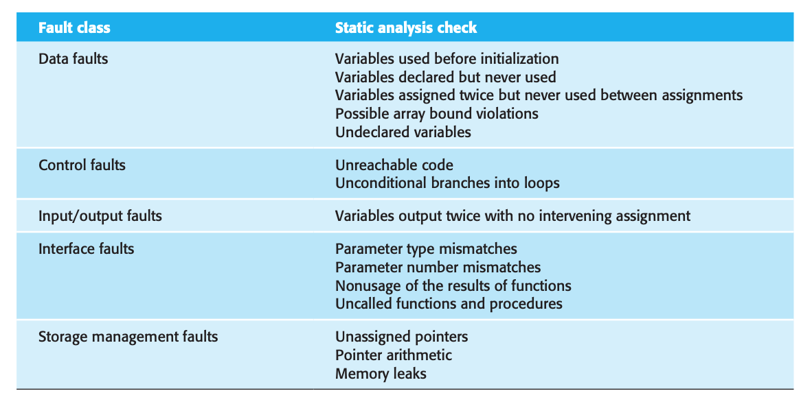
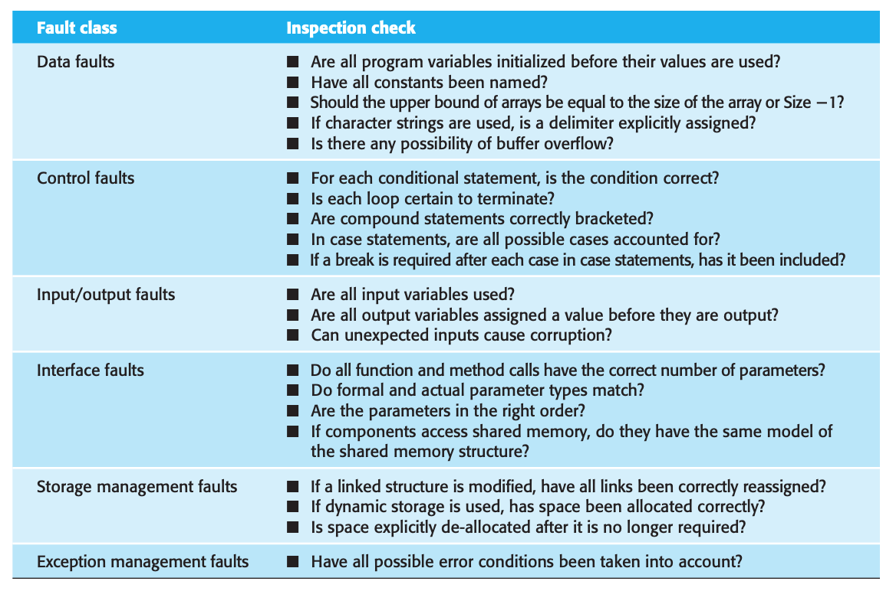
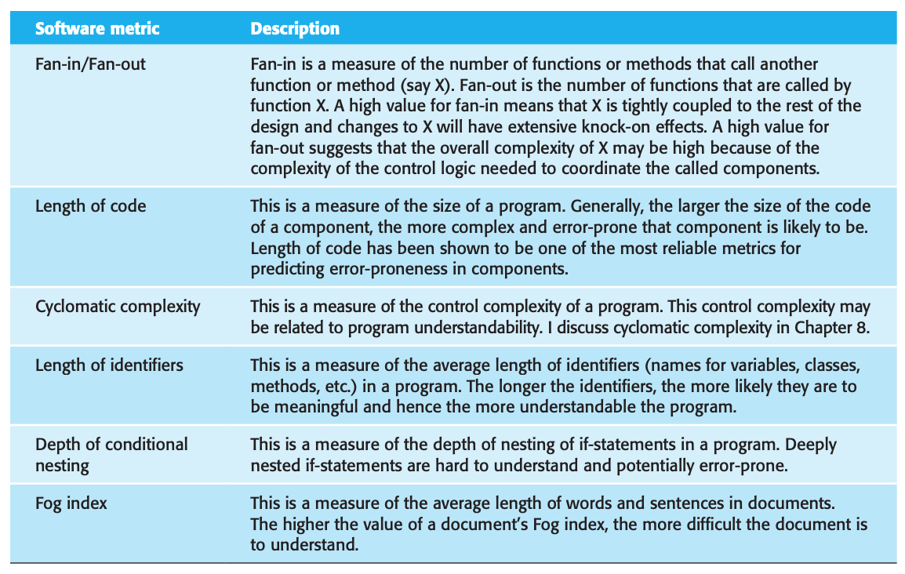

= Final Review

== Chapter 9

1. List on the board the three types of software maintenance. Verbally describe them.
** *Fault Repair:* to fix bugs and vulnerabilities.
** *Environmental Adaptation:* to adapt software to new platforms and environments. Required when hardware, the platform operating system, or other support software changes.
** *Feature Addition:* to add new features and to support new requirements.
2. List on the board the 5 “Bad smells” improvable by software refactoring. Verbally describe them.
** *Duplicate Code:* the same or very similar code can be removed and implemented as a single method that is called when required.
** *Long Methods:* Redesign long methods into a number of shorter methods. Should only do one thing.
** *Switch-Case Statements:* These often involve duplication, where the switch depends on the type of a value. In object-oriented language, you can use polymorphism to achieve the same thing.
** *Data Clumping:* Data clumps occur when the same group of data items (fields in classes, parameters in methods) reoccurs in several places in a program. Replace with an object that encapsulates all of the data.
** *Speculative Generality:* This occurs when developers include generality in a program in case it is required in the future. This can often simply be removed.
3. List on the board the four strategic options for dealing legacy systems. Verbally describe them.
** *Scrap:* get rid of it
** *Maintain:* keep using it
** *Reengineer:* rework
** *Replace:* with existing system
4. Draw a chart showing how business value / system quality guide choice of the strategic option for dealing with legacy systems. Verbally describe the chart.
+

+
** Scrap (Low business value, Low quality)
** Maintain or scrap (Low business value, High quality)
** Reengineer or replace (High business value, Low quality)
** Maintain (High business value, high quality)

== Chapter 10

1. List on the board the five principle dimensions to dependability. Verbally describe them.
** *Availability:* system is available to do something
** *Reliability:* system does what its supposed to
** *Safety:* system won’t cause damage
** *Security:* system cannot be infiltrated
** *Resistance:* system is able to come back up in case of problems
2. List on the board the two fundamental strategies for dependability. Verbally describe them.
** *Redundancy:* provide same functionality in different places
** *Diversity:* provide same functionality in different ways
3. List on the board an example of redundancy and diversity in a non-software context.  Verbally describe this example.
** *Redundancy:* Door to a house. A keyed deadbolt and knob lock.
** *Diversity:* Breaks on a car. Hydraulics and cable breaks.

== Chapter 11

1. List on the board the three complementary approaches to improve reliability. Verbally describe them.
** *Fault Avoidance:* design system so faults do not happen
** *Fault Detection and Removal:* design system to see fault and remove it.
** *Fault Tolerance:* design system to have faults, but still be in stable working order.
2. Draw a diagram representing a protection system.  Verbally discuss the diagram.
+

+
** Sensors monitor the system environment.  Detect issues and pass instructions to the control system which can get the system back into working order.
3. Draw a diagram representing a Self-monitoring system.  Verbally discuss the diagram.
+
image:assets/10.png[]
+
** Typically related to hardware failures.  Inputs are passed to identical systems.  The outputs are examined to determine if there was a hardware fault in either of the systems. If a fault is detected and status code is returned.  That output value is ignored and the redundant system is used.
4. Draw a diagram representing N-version programming.  Verbally discuss the diagram.
+

+
** Input is passed to multiple identical software versions.  The outputs of all versions are compared to ensure they match.  If they do not match a software fault is assumed to be the cause.
5.	List on the board the eight dependable programming guidelines. Verbally describe them.
** Limit the *visibility* of information. Do not crowd the name-space and ensure that data is only accessible to components that need them.
** Check all inputs for *validity*. Type checking, range checking, regular expressions, etc.
** Provide a *handler for all exceptions*. If an exception occurs it should be handled without system failure.
** Minimize the use of *Error-Prone constructs*. Language or system specific constructs that tend to fail such as the accuracy of floating point numbers.
** Provide *restart* capabilities. If system fails, provide a means to restart while loosing a minimum amount of data.
** Check *array bounds*. Ensure that when accessing an array that the index is within the bounds of the array.
** *Timeout* when calling external components.  If an external system call is made, provide a timeout period so that system function does not cease due to a faulty external system.
** Name *constants*. Meaningfully especially when they represent real-world values.
6. List on the board the key points for creating the sum method that satisfies the requirements for the Summing interface in homework 8.
** Catch all throwables. Not just exceptions.
** Validate input. Know the limitations of certain data types.

== Chapter 12

1.	List the following safety terms on the board and verbally describe them.
** *Hazard:* condition with a potential for causing an accident
** *Hazard Probability:* probability of events occurring that create a hazard
** *Hazard Severity:* assessment of a worse possible case
** *Risk:* probability that a hazard would cause an accident
** *Accident:* unplanned event that results in damage
** *Damage:* loss resulting from an accident
2.	List on the board four steps for hazard-driven safety specification. Verbally describe them.
** *Hazard Identification:* Identifies hazards that may threaten the system.
** *Hazard Assessments:* Decides which hazards are the most dangerous and/or the most likely to occur.
** *Hazard Analysis:* a root-cause analysis that identifies the events that can lead to the occurrence of a hazard.
** *Risk Reduction:* The requirements may be concerned with ensuring the hazard does not arise or lead to an accident, or to minimize the damage if an accident does occur.
3.	List on the board  the three strategies for Risk (Hazard) reduction. Verbally describe them.
** *Hazard Avoidance:* where a system is designed so that the hazard cannot occur.
** *Hazard Detection & Removal:* where a system is designed so that hazards are detected and neutralized before they result in an accident.
** *Damage Limitation:* where a system is designed so that the consequences of an accident are minimized.
4.	List on the board  the three levels of static analysis. Verbally describe them.
** *Characteristic Error Checking:* Error checker knows about common errors given the language and highlights these errors for the programmer
** *User-defined Error Checking:* Programmer defines error patters to be detected.
** *Assertion Checking:* Developers include formal assertions in their program that state relationships that must hold at the point of program execution.
5.	List on the board the five types of static analysis checks. Verbally describe them.
** *Data Faults:* variables used before initialization, variables declared but never used, possible array bound violations.
** *Control Faults:* unreachable code, unconditional branches into loops.
** *Input/Output Faults:* variables output twice with no intervening assignment
** *Interface Faults:* Parameter type mismatches, number mismatches, no usage of the results of functions uncalled functions and procedures.
** *Storage Management Faults:* unassigned pointers, pointer arithmetic, memory leaks.

== Chapter 13

1.	List on the board the three security dimensions. Verbally describe them.
** *Confidentiality:* data is only exposed to the correct users
** *Integrity:* data is not corrupt and only modified by authorized users
** *Availability:* access to the system
2.	List on the board  the four types of security threats. Verbally describe them and discuss how  they relate to security dimensions.
** *Interception:* (affects confidentiality) threats that allow an attacker to gain access to an asset.
** *Interruption:* (affects available) threat that allow an attacker to make part of the system unavailable.
** *Modification:* (affects integrity) threat that allow an attacker to tamper with a system asset.
** *Fabrication:* (affects integrity) threat that allow an attacker to insert false information into a system.
3.	List on the board  the 3 three main strategies or controls for dealing with security threats. Verbally describe them.
** *Vulnerability Avoidance:* controls that are intended to ensure that attacks are unsuccessful.
** *Attack Detection and Naturalization:* controls that are intended to detect and repel attacks. Involves functionality in a system that monitors its operation and checks for unusual patterns of activity.
** *Exposure Limitation and Recovery:* controls that support recovery from problems. Can range from automated backup strategies to insurance policies that cover the costs associated with a successful attack.
4.	List the board the following terms and verbally describe them.
** *Asset:* something of value that must be protected
** *Exposure:* possibly loss or harm to a system
** *Vulnerability:* weakness that may be exploited to cause loss or harm
** *Attack:* exploitation of system vulnerability from outside the system
** *Threats:* circumstances that have potential to cause loss or harm
** *Control:* protective measure to reduce system vulnerability
5.	List on the board the three stages of security risk assessment. Verbally describe them.
** *Preliminary risk assessment:* identify generic risks that are applicable to the system and to decide if an adequate level of security can be achieved at a reasonable cost.
** *Design risk assessment:* Takes place during the system development life cycle and is informed by the technical system design and implementation decisions.
** *Operational risk assessment:* should continue after a system has been installed to take account of how the system is used and proposals for new and changed requirements.
6.	List on the board the seven security design guidelines. Verbally describe them.
** *Explicit Security Policy:* Base security decisions on this high-level statement that sets out fundamental security conditions for an organization.
** *Defense in Depth:* to avoid a single point of failure.
** *Fail securely:* means to have fall-back procedures that are as secure as the original procedures.
** *Balance Security and Usability:* there comes a point when it is counterproductive to keep adding on new security features at the expense of usability.
** *Specify the Format of System Inputs:* Restrict names to 40 characters, addresses to 100 characters, alphabetic or numeric, etc.
** *Compartmentalization of Assets:* Users should only have access to info that they need for their work. Minimizes damage.
** *Design for Deployment:* Always provide support for deployment that reduces the chances of users and system administrators making mistakes when configuring the software.
** *Design for Recovery:* Design with the assumption that a security failure could occur. Think about how to recover from possible failures and restore the system to a secure operational state.
7. List on the board the four types of security testing. Verbally describe them.
** *Experience Based:* The system is analyzed against types of attacks that are known to the validation team.
** *Penetration Testing:* Draw on experience from outside the development team to test an application. Penetration testing teams are given the objective to breach the system’s security.
** *Tool based Testing:* Security tools such as password checkers are used to analyze the system. Static analysis checks for areas of a program that may be vulnerable.
** *Formal Verification:* Making formal mathematical arguments that demonstrate a program conforms to its specification. Not widely used because it requires and expert.

== Chapter 14

1.	List on the board  the four resilience activities. Verbally describe them.
** *Recognition:* The system or its operators should recognize early indications of system failure.
** *Resistance:* If the symptoms of a problem or cyberattack are detected early, then resistance strategies may be used to reduce the probability that the system will fail.
** *Recovery:* If a failure occurs, the recovery activity ensures that critical system services are restored quickly so that system users are not badly affected by failure.
** *Reinstatement:* In this final activity, all of the system services are restored and normal system operation can continue.
2.	List on the board the 6 stages in cyber-resilience planning. Verbally describe them.
+

+
** *Asset Classification:* The organization’ hardware, software, and human assets are examined and classified depending on how essential they are to normal operations. critical, important or useful.
** *Threat Identification:* For each of the critical and important assets, you should identify and classify threats to that asset.
** *Threat Recognition:* For each threat or sometimes threat/asset pair, you should identify how an attack based on that threat might be recognized.
** Threat Resistance: For each threat or asset/threat pair, you should identify possible resistance strategies. These either may be embedded in the system(technical) or may rely on operational procedures.
** *Asset Recovery:* for each critical asset or asset/threat pair, you should work out how that asset could be recovered in the event of a successful cyberattack.
** *Asset Reinstatement:* A general process of asset recovery where you define procedures to bring the system back into normal operation. Should be concerned with all assets and not just the assets that are critical to the operation.

3. Draw on the board a picture of the Swiss cheese model of system failure.  Verbally discuss it.
+

+
** Layers of defense each with a hole. Only when the holes line up do you have a failure.

== In-Class Activity

1.	*Maintainability:*  List on the board maintainability tips. Verbally describe them.
** Bad Smells
** Duplicate Code
** Long Methods
** Low Cohesion
** High Coupling
2.	*Efficiency:*  List on the board efficiency tips. Verbally describe them.
** Reduce object creations
** Tighten Loops
** Pool expensive objects
** Cache computed values
3.	*Acceptability:* List on the board usability tips. Verbally describe them.
** Be consistent
** Simple navigation
** Use color appropriately
** Understandable - Easy to read
** Works with customer's system
** Easy and quick to learn

== Chapter 22

1. List on the board the five activities of project managers.  Verbally describe them.
** *Project Planning:* are responsible for planning, estimating, and scheduling project, assigning people to tasks, ensure work is carried out to required standards, and that the development is on time and within budget.
** Risk Management: have to access the risks that may affect a project, monitor these risks and take action when problems arise.
** *People Management:* are responsible for managing a team of people. They have to choose people for their team and motivate them for effective team performance.
** *Reporting:* Project managers are usually responsible for reporting on progress of project to customers and to the managers of the company developing the software.
** *Proposal Writing:* the first stage of a software project may involve writing a proposal to win a contract to carry out an item of work. Critical to the success of a company.

2.	List on the board the three categories of project risk management strategies. Verbally describe them.
** *Avoidance:* following these strategies means that the probability that the risk will arise is reduced (dealing with defective components)
** *Minimization:* following these strategies means that the impact of the risk is reduced. (Strategy for staff illness)
** *Contingency:* following these strategies means that you are prepared for the worst and have a strategy in place to deal with it. (Org financial problems).

== Chapter 23

1.	List on the board the two measurements do you need for each task when putting together a schedule. Verbally describe them.
** Duration in calendar days/months
** Effort Estimate - person months, or person days
2. Draw on the board a sample project schedule chart (activity and staff allocation). Verbally describe them.
+

+
3. Draw on the board the the basic formula for algorithmic cost modeling.  Verbally discuss the meaning of  A, B, and M, and their meaningful values.
** *Effort = A•Size^B^•M*
** A: Constant - unique to company
** B: Exponent - Large projects take exponentially longer
** M: Multiplier - determined by product and process
4. List on the board story points, value points, Fibonacci numbers, BFTB, and velocity.  Verbally discuss how these are used in agile estimating.
** *Story points:* Relative points associated with a development project to estimate difficulty.
** *Value points:* Relative points associated with a development project to represent what the customer thinks is the most valuable.
** *Fibonacci numbers:* Values assigned are in the form of Fibonacci numbers to represent the inherent uncertainty in estimating larger items.
** *Bang for the buck =* Value Points / Story Points
** *Velocity:* Trend over time of how many story points a team is able to accomplish during an iteration.
5. List on the board the fault classes found on an inspection checklist. Verbally describe them.
+

+

== Chapter 24

1. List on the board the agile development quality practices. Verbally describe them.
** *Check Before Check-In:* Programmers are responsible for organizing their own code reviews with other team members before the code is checked in to the build system.
** *Never Break the Build:* It is not acceptable for team members to check in code that causes the system as a whole to fail.
** *Fix Problems When you See Them:* The code of the system belongs to the team rather than to individuals.
2.  List on the board the two types of metrics used for software measurement. Verbally describe them.
** *Dynamic:* which are collected by measurements made of a program in execution.
** *Static:*  which are collected by measurements made of representations of the system, such as the design, program, or documentation.
3.  List on the board  examples of static metrics for measuring software. Verbally describe them.
+

+
** Fan In - high coupling number of calls to a function
** Fan Out - low cohesion number of calls out of a function
** Length of Code - more complex
** Length of Identifiers - more confusing
** Depth of conditional nesting - untraceable

== Project

1.	List on the board a problem faced on your project:  Verbally discuss it.
** RSA
** People's schedules
2.	List on the board something that worked well on your project.  Verbally discuss it.
** Database Connectivity
** Building
