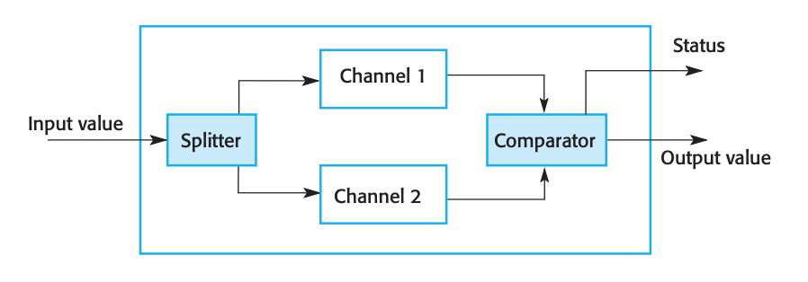

= Final Review

== Chapter 9

1. List on the board the three types of software maintenance. Verbally describe them.
** Fault Repair
** Environmental Adaptation
** Feature addition - most efforts here
2. List on the board the 5 “Bad smells” improvable by software refactoring. Verbally describe them.
** duplicate code - put into method
** long methods - break up
** switch case statements - polymorphism
** data clumping - combine into object
** speculative generality - remove unused interfaces
3. List on the board the four strategic options for dealing legacy systems. Verbally describe them.
** scrap - get rid of it
** maintain - keep using it
** re-engineer - rework
** replace - with existing system
4. Draw a chart showing how business value / system quality guide choice of the strategic option for dealing with legacy systems. Verbally describe the chart.
** scrap (1,1)
** maintain or scrap (1,2)
** Re-engineer or replace (2,1)
** Maintain (2,2)

== Chapter 10

[start=5]
1. List on the board the five principle dimensions to dependability. Verbally describe them.
** Availability - can be used
** reliability - provides accurate data
** safety - protects against harm to others
** security - protected again malicious harm
** Resistance - recovers after failure
2. List on the board the two fundamental strategies for dependability. Verbally describe them.
** Redundancy - keeps more than one system up
** diversity - provides same functionality through different components
3. List on the board an example of redundancy and diversity in a non-software context.  Verbally describe this example.
** Auto breaking system
** Example Redundancy - regular break + emergency break
** Example Diversity - regular break uses hydraulics, emergency break uses friction.

== Chapter 11

[start=8]
1. List on the board the three complementary approaches to improve reliability. Verbally describe them.
** fault avoidance
** fault detection and removal
** fault tolerance
2. Draw a diagram representing a protection system.  Verbally discuss the diagram.
+
image:assets/9.png[]
+
3. Draw a diagram representing a Self-monitoring system.  Verbally discuss the diagram.
+

+
4. Draw a diagram representing N-version programming.  Verbally discuss the diagram.
+
image:assets/11.png[]
+
5.	List on the board the first four of the eight dependable programming guidelines. Verbally describe them.
** Check all imports for validity
** provide a handler for all exceptions
** provide restart capabilities
** check array bounds
6.	List on the board the last four of the eight dependable programming guidelines. Verbally describe them.
** Provide restart capabilities
** timeout when calling external components
** Name constants
** Limit the visibility of information
7. List on the board the key points for creating the sum method that satisfies the requirements for the Summing interface in homework 8.
** Catch all throw-ables
** Use a correct data type

== Chapter 12

[start=15]
1.	List the following safety terms on the board and verbally describe them.
** Hazard - condition that will cause an error
** Hazard Probability - how likely it is to happen
** Hazard Severity - how bad it will be if it does happen
** Risk - measure of probability
** Accident -
** Damage - what resulted
2.	List on the board four steps for hazard-driven safety specification. Verbally describe them.
** Hazard Identification
** Hazard Assessments
** Hazard Analysis
** Reduction via Safety Requirements Specification
3.	List on the board  the three strategies for Risk (Hazard) reduction. Verbally describe them.
** Hazard Avoidance
** Hazard Detection & Removal
** Damage Limitation
4.	List on the board  the three levels of static analysis. Verbally describe them.
** *Characteristic Error Checking:* Error checker knows about common errors given the language and highlights these errors for the programmer
** *User-defined Error Checking:* Programmer defines error patters to be detected.
** *Assertion Checking:* Developers include formal assertions in their program that state relationships that must hold at the point of program execution.
5.	List on the board the five types of static analysis checks. Verbally describe them.
** Data Faults
** Control faults
** Input/Output faults
** Interface Faults
** Storage Management Faults

== Chapter 13

[start=20]
1.	List on the board the three security dimensions. Verbally describe them.
** Confidentiality
** Integrity
** Availability
2.	List on the board  the four types of security threats. Verbally describe them and discuss how  they relate to security dimensions.
** Interception - confidentiality
** Interruption - available
** Modification - integrity
** Fabrication - integrity
3.	List on the board  the 3 three main strategies or controls for dealing with security threats. Verbally describe them.
** Vulnerability avoidance
** attack detection and naturalization
** exposure limitation and recovery
4.	List the board the following terms and verbally describe them.
** Asset - something of value
** Exposure - possible loss
** Vulnerability - weakness in computer based system
** Attack - exploitation of vulnerability
** Threats - circumstances to cause loss or harm
** Control - protective measure to lessen vulnerability
5.	List on the board the three stages of security risk assessment. Verbally describe them.
** preliminary risk assessment - what are the risks
** design risk assessment - extra requirements
** operational risk assessment - human behavior
6.	List on the board the first four security design guidelines. Verbally describe them.
** Base security designs on a security policy
** Use defense in depth
** Fail securely
** Balance security and usability
7.	List on the board the last four security design guidelines. Verbally describe them.
** Specify the format of all inputs
** Compartmentalization of assets
** design for defense
** design for recoverability
8. List on the board the four types of security testing. Verbally describe them.
** experience based
** penetration testing
** tool based testing
** formal verification

== Chapter 14

[start=28]
1.	List on the board  the four resilience activities. Verbally describe them.
** Recognition
** Resistance
** Recovery
** Reinstatement
2.	List on the board the 6 stages in cyber-resilience planning. Verbally describe them.
+

+
3. Draw on the board a picture of the Swiss cheese model of system failure.  Verbally discuss it.
** Layers of defense each with a hole. Only when the holes line up do you have a failure.

== In-Class Activity

[start=31]
1.	Maintainability:  List on the board 4 maintainability tips. Verbally describe them.
** Bad Smells
** Duplicate Code
** Long Methods
** Low Cohesion
** High Coupling
2.	Maintainability:  List on the board 4 maintainability tips. Verbally describe them.
** See 31
3.	Efficiency:  List on the board 4 efficiency tips. Verbally describe them.
** Reduce object creations
** Tighten Loops
** Pool expensive objects
** Cache computed values
4.	Efficiency: List on the board 4 efficiency tips. Verbally describe them.
** see 33
5.	Acceptability: List on the board 4 usability tips. Verbally describe them.
** Be consistent
** Button placement
** Simple navigation
** Use color appropriately
** Contract font color
6.	Acceptability:  List on the board usability tips. Verbally describe them.
** Easy to read language
** Works with their system
** Easy and quick to learn

== Chapter 22

[start=37]
1.	Chapter 22:  List on the board the five activities of project managers.  Verbally describe them.
** Project Planning
** Risk Management
** People Management
** Reporting
** Proposal Writing
2.	Chapter 22:  List on the board the three categories of project risk management strategies. Verbally describe them.
** Avoidance
** Minimization
** Contingency

== Chapter 23

[start=39]
1.	List on the board  the two measurements do you need for each task when putting together a schedule. Verbally describe them.
** Duration and calendar days or months
** Effort Estimate - person months / person days
** Prerequisites
2. Draw on the board a sample project schedule chart (activity and staff allocation). Verbally describe them.
+
image:assets/40.png[]
+
3. Draw on the board the the basic formula for algorithmic cost modeling.  Verbally discuss the meaning of  A, B, and M, and their meaningful values.
** Effort = A * Size \^ B * M
** A: Constant - unique to company
** B: Exponent - Large project take exponentially longer
** M: Multiplier - determined by product and process
4. List on the board story points, value points, Fibonacci numbers, BFTB, and velocity.  Verbally discuss how these are used in agile estimating.
** During agile estimate we use stories to describe user needs, value points are assigned to stories when they are being sized.  Values that are assigned are typically Fibonacci numbers as they represent the inherent uncertainty in estimating larger items. After a while velocity is used to
** BFTB - Bang for the buck - value / story
** Value points - what the customer thinks is most valuable
5. List on the board the fault classes found on an inspection checklist. Verbally describe them.
** Data Faults
** Control Faults
** Input/Output Faults
** Interface Fault
** Storage Management Fault
** Exception Management Fault

== Chapter 24

[start=44]
1. List on the board the agile development quality practices. Verbally describe them.
** Check before check-in
** Never break the build
** Fix problems when you see them
2.  List on the board the two types of metrics used for software measurement. Verbally describe them.
** Dynamic - time resources
** Static - see 46
3.  List on the board  examples of static metrics for measuring software. Verbally describe them.
** Fan In - high coupling number of calls to a function
** Fan Out - low cohesion number of calls out of a function
** Length of Code - more complex
** Length of Identifiers - more confusing
** Depth of conditional nesting - untraceable

== Project

[start=47]
1.	List on the board a problem faced on your project:  Verbally discuss it.
** RSA
** People's schedules
2.	List on the board something that worked well on your project.  Verbally discuss it.
** Database Connectivity
** Building
