= Midterm Review

== Chapter 1

1. Essential Attributes of Good Software
+
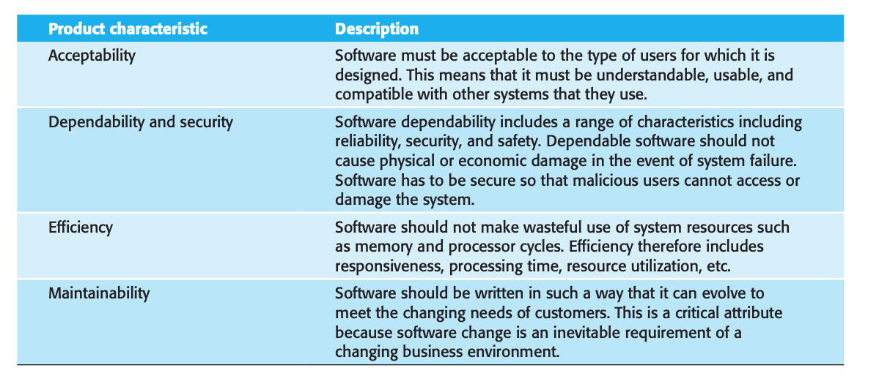
+
2. Software Process and four common fundamental activities:
** _Mnemonic:_ Shiney Dictators Vaccinate Elephants
** *Software specification:*, where customers and engineers define the software that is to be produced and the constraints on its operation.
** *Software development:*, where the software is designed and programmed.
** *Software validation:*, where the software is checked to ensure that it is what the customer requires.
** *Software evolution:*, where the software is modified to reflect changing customer and market requirements.
3. Software Engineering Ethics:
** _Mnemonic:_ Careless Cyborgs Investigated Cruelly
** *Confidentiality:* You should normally respect the confidentiality of your employers or clients regardless of whether or not a formal confidentiality agreement has been signed.
** *Competence:* You should not misrepresent your level of competence. You should not knowingly accept work that is outside your competence.
** *Intellectual property rights:* You should be aware of local laws governing the use of intellectual property such as patents and copyright. You should be careful to ensure that the intellectual property of employers and clients is protected.
** *Computer misuse:* You should not use your technical skills to misuse other people’s computers. Computer misuse ranges from relatively trivial (game playing on an employer’s machine) to extremely serious (dissemination of viruses or other malware).

== Chapter 2

1. Stages of Waterfall Model
** _Mnemonic:_ Required Snakes-Designed Units of Integrated-Systems to be Maintained
** *Requirements analysis and definition* The system’s services, constraints, and goals are established by consultation with system users. They are then defined in detail and serve as a system specification.
** *System and software design:* The systems design process allocates the requirements to either hardware or software systems. It establishes an overall system
architecture. Software design involves identifying and describing the fundamental software system abstractions and their relationships.
** *Implementation and unit testing:* During this stage, the software design is realized as a set of programs or program units. Unit testing involves verifying that
each unit meets its specification.
** *Integration and system testing:* The individual program units or programs are integrated and tested as a complete system to ensure that the software requirements have been met. After testing, the software system is delivered to the customer.
** *Operation and maintenance:* Normally, this is the longest life-cycle phase. The system is installed and put into practical use. Maintenance involves correcting errors that were not discovered in earlier stages of the life cycle, improving the implementation of system units, and enhancing the system’s services as new requirements are discovered.
2. Incremental Development:
** *Definition:* This approach interleaves the activities of specification, development, and validation. The system is developed as a series of versions (increments), with each version adding functionality to the previous version.
** *Concurrent SDV (Specification/Development/Validation):* Incremental development is based on the idea of developing an initial implementation, getting feedback from users and others, and evolving the software through several versions until the required system has been developed (Figure 2.2). Specification, development, and validation activities are interleaved rather than separate, with rapid feedback across activities.
+
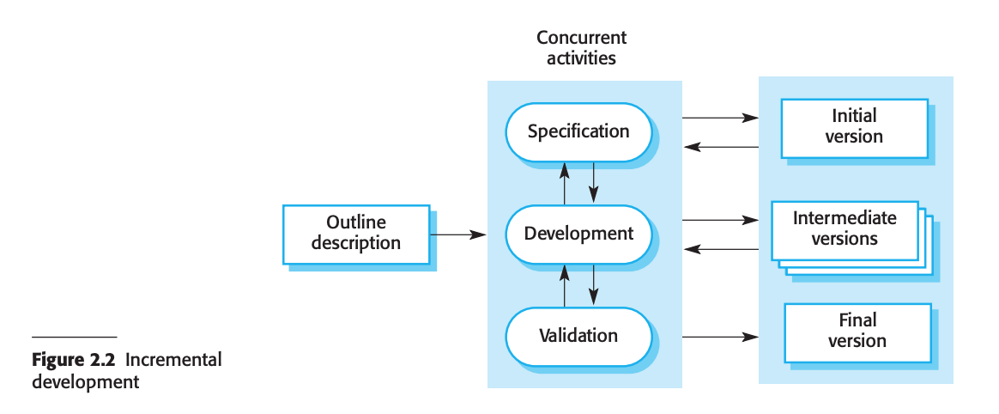
+
3. Software Design activities:
** _Mnemonic:_ ACID Degrades Internal Components
** *Architectural design:* Where you identify the overall structure of the system, the principal components (sometimes called subsystems or modules), their relationships, and how they are distributed.
** *Database design:* Where you design the system data structures and how these are to be represented in a database. Again, the work here depends on whether an existing database is to be reused or a new database is to be created.
** *Interface design:* Where you define the interfaces between system components. This interface specification must be unambiguous. With a precise interface, a component may be used by other components without them having to know how it is implemented. Once interface specifications are agreed, the components can be separately designed and developed.
** *Component selection and design:* Where you search for reusable components and, if no suitable components are available, design new software components. The design at this stage may be a simple component description with the implementation details left to the programmer. Alternatively, it may be a list of changes to be made to a reusable component or a detailed design model expressed in the UML. The design model may then be used to automatically generate an implementation
4. Phases in Unified Process:
** _Mnemonic:_ Impatient Elves Collapsed Tearfully
** *Inception:* During the inception phase, you establish the business case for the system and delimit the project scope. To accomplish this you must identify all external entities with which the system will interact (actors) and define the nature of this interaction at a high-level.
** *Elaboration:* The purpose of the elaboration phase is to analyze the problem domain, establish a sound architectural foundation, develop the project plan, and eliminate the highest risk elements of the project. To accomplish these objectives, you must have the “mile wide and inch deep” view of the system. Architectural decisions have to be made with an understanding of the whole system: its scope, major functionality and nonfunctional requirements such as performance requirements.
** *Construction:* During the construction phase, all remaining components and application features are developed and integrated into the product, and all features are thoroughly tested. The construction phase is, in one sense, a manufacturing process where emphasis is placed on managing resources and controlling operations to optimize costs, schedules, and quality. In this sense, the management mindset undergoes a transition from the development of intellectual property during inception and elaboration, to the development of deployable products during construction and transition.
** *Transition:* The purpose of the transition phase is to transition the software product to the user community. Once the product has been given to the end user, issues usually arise that require you to develop new releases, correct some problems, or finish the features that were postponed.
5. Core Workflows of Unified Process:
** *Business Modeling:* Creating UML diagrams.
** *Requirements:* Describe _what_ the system should do.
** *Analysis and Design:* _How_ the system will be _realized_ during implementation.
** *Implementation:* Organization of system, and implmeentation of design.
** *Test:* Verification of system correctness.
** *Deployment:* Sets to release product to customers.
** *Project Management:* Managing timeline, requirements, and minimizing risk.
** *Configuration and Change Management:* Manage and coordinate the collaboration process.
** *Environment:* Processes and tools for development.

== Chapter 3

1. Things valued in *Agile Manifesto*:
+
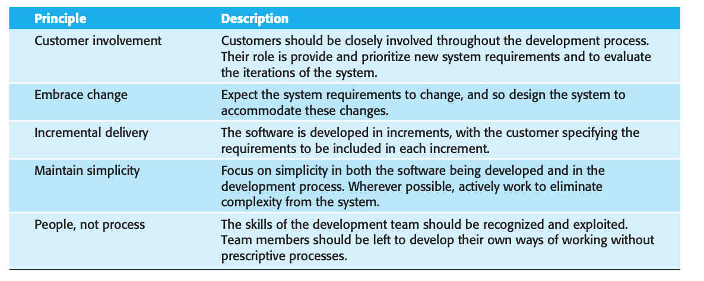
+
2. Pair Programming
** It supports the idea of collective ownership and responsibility for the system. This reflects Weinberg’s idea of egoless programming (Weinberg 1971) where the software is owned by the team as a whole and individuals are not held responsible for problems with the code. Instead, the team has collective responsibility for resolving these problems.
** It acts as an informal review process because each line of code is looked at by at least two people. Code inspections and reviews (Chapter 24) are effective in discovering a high percentage of software errors. However, they are time consuming to organize and, typically, introduce delays into the development process. Pair programming is a less formal process that probably doesn’t find as many errors as code inspections. However, it is cheaper and easier to organize than formal program inspections.
** It encourages refactoring to improve the software structure. The problem with asking programmers to refactor in a normal development environment is that effort  involved is expended for long-term benefit. An developer who spends time refactoring may be judged to be less efficient than one who simply carries on developing code. Where pair programming and collective ownership are used, others benefit immediately from the refactoring so they are likely to support the process.
3. Scrum approach
** Scrum agile method was developed to provide a framework for organizing agile projects and, to some extent at least, provide external visibility of what is going on. The developers of Scrum wished to make clear that Scrum was not a method for project management in the conventional sense, so they deliberately invented new terminology, such as ScrumMaster, which replaced names such as project manager.
4. Scrum sprint cycle
+
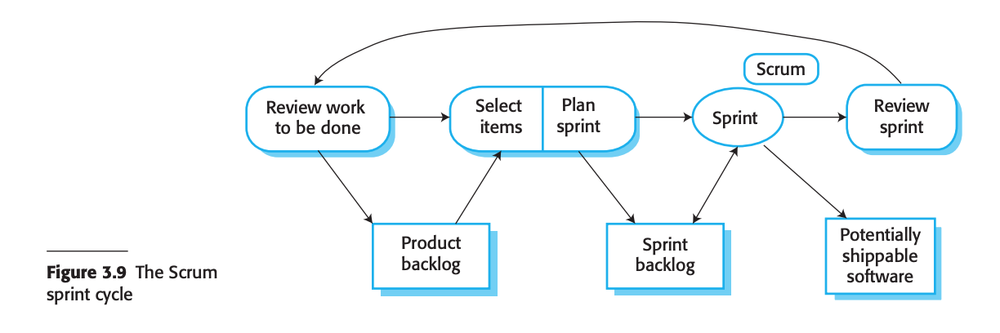

== Chapter 4

1. Requirements Specification
** *Functional:* The functional requirements for a system describe what the system should do. These requirements depend on the type of software being developed, the expected users of the software, and the general approach taken by the organization when writing requirements.
** *Non-Functional:* Non-functional requirements, as the name suggests, are requirements that are not directly concerned with the specific services delivered by the system to its users. These non-functional requirements usually specify or constrain characteristics of the system as a whole. They may relate to emergent system properties such as reliability, response time, and memory use. Alternatively, they may define constraints on the system implementation, such as the capabilities of I/O devices or the data representations used in interfaces with other systems.
2. SRS (Software Requirements Specification) Document
** official statement of what the system developers should implement. It may include both the user requirements for a system and a detailed specification of the system requirements.
3. Five Ways of Writing SRS
** _Mnemonic_ Nature Laughs Sarcastically at Green Mammals
+
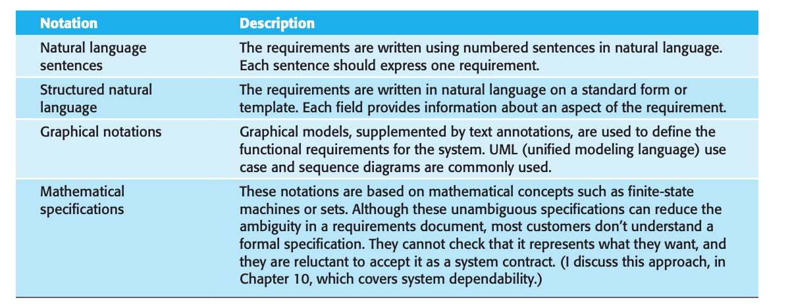
+
4. Requirements elicitation and analysis
** *Requirements discovery and understanding:* This is the process of interacting with stakeholders of the system to discover their requirements. Domain requirements from stakeholders and documentation are also discovered during this activity.
** *Requirements classification and organization:* This activity takes the unstructured collection of requirements, groups related requirements and organizes them into coherent clusters.
** *Requirements prioritization and negotiation:* Inevitably, when multiple stakeholders are involved, requirements will conflict. This activity is concerned with prioritizing requirements and finding and resolving requirements conflicts through negotiation. Usually, stakeholders have to meet to resolve differences and agree on compromise requirements.
** *Requirements documentation (Specification):* The requirements are documented and input into the next round of the spiral. An early draft of the software requirements documents may be produced at this stage, or the requirements may simply be maintained informally on whiteboards, wikis, or other shared spaces.
5. Use case Diagram
** The set of use cases represents all of the possible interactions that will be described in the system requirements. Actors in the process, who may be human or other systems, are represented as stick figures. Each class of interaction is represented as a named ellipse. Lines link the actors with the interaction.
+
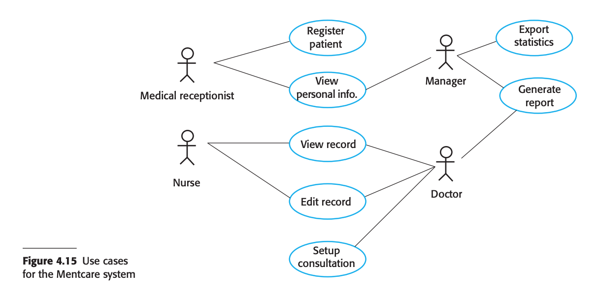

== Chapter 5

1. Activity Diagram
+
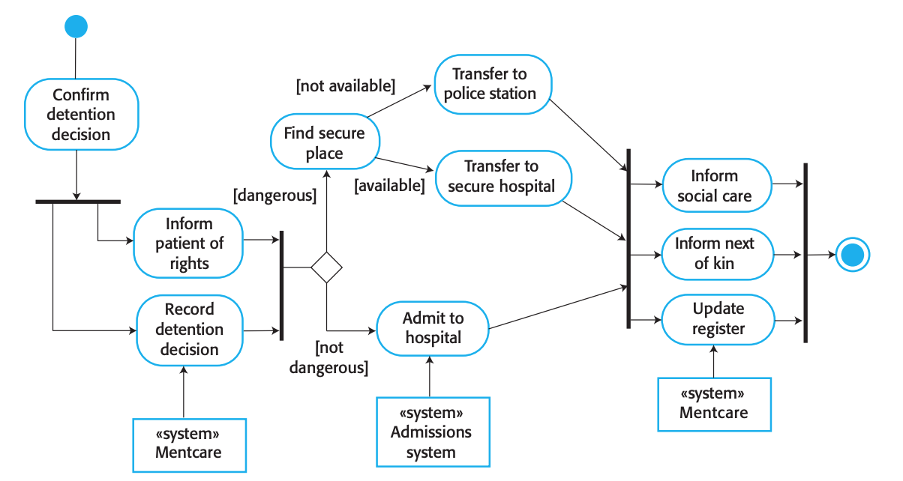
+
2. Sequence Diagram
+
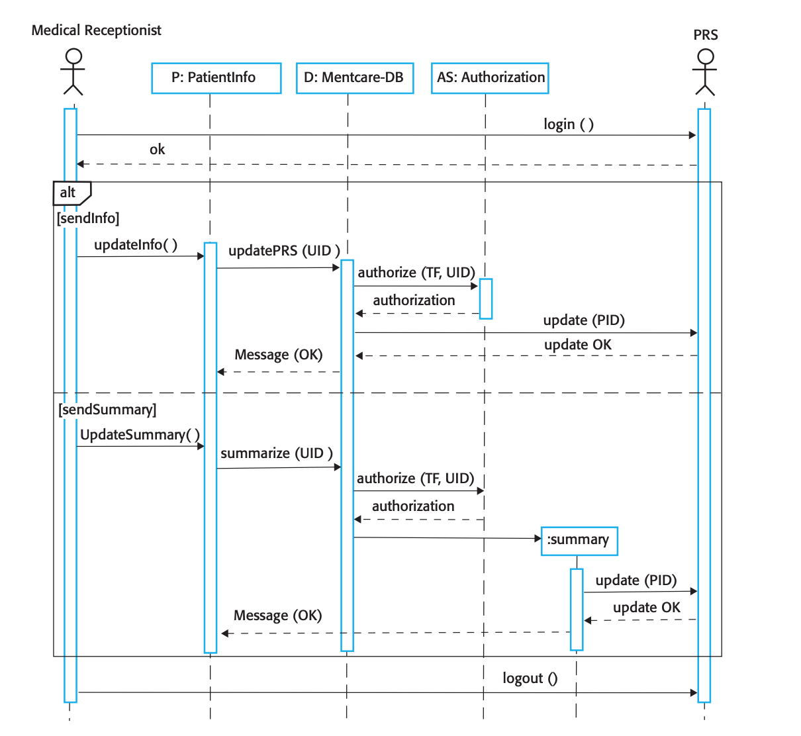
+
3. Class Diagram
** *Association:* An association is a link between classes indicating that some relationship exists between these classes.
+
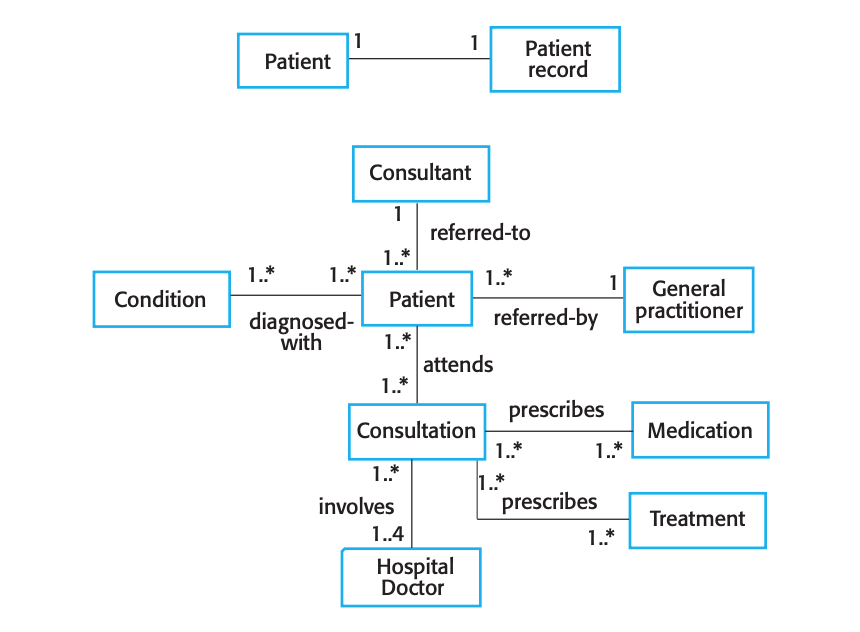
+
** *Attribute and Method:* Defines attributes and methods of each class.
+
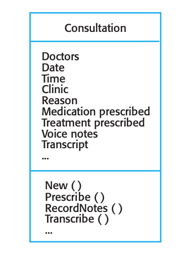
+
** *Generalization:* _is-a_ or _implementation_ relationship
+
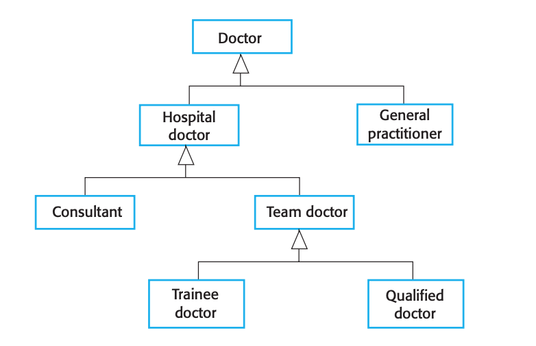
+
** *Aggregation:* _has-a_ or _extends_ relationship
+
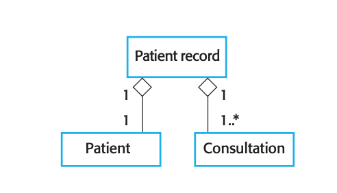
+
4. State Diagram
+
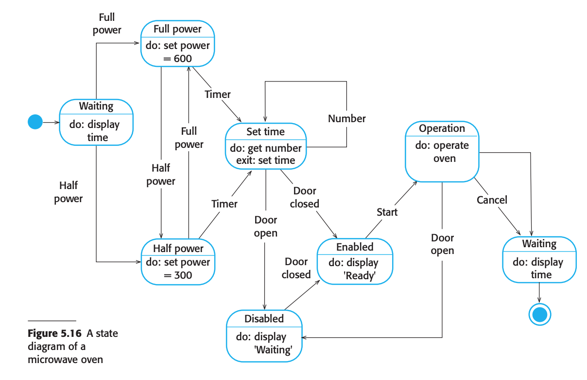

== Chapter 6

1. Krutchen 4+1 view model of software architecture:
** Logical
** Physical
** Process
** Development
2. Architectural Patterns:
** MVC
** Layered
** Repository
** Client – Server
** Pipe and Filter
** Combinations

== Chapter 7

1. Three ways to identify classes in OO system.
** Gramatical analysis
** tangible entities
** scenario-based analysis
2. 4 essential elements of design patterns
** Name
** Problem Description
** Problem Solution
** Consequences
3. Design Pattern Types:
** Creational
** Structural
** Behavioral
4. Design Patterns:
** Observer
** Façade
** Iterator
** Decorator
** Singleton
** Proxy
** Factory Method
5. Open source licenses:
** GPL
** LGPL
** BSD.

== Chapter 8

1. Advantages of software inspections
** infrequent bugs
** incomplete versions
** broader quality
2. Three stages of testing for commercial systems software
** Development
** Release
** User
3. Three levels of development testing granularity.
** Unit
** Component
** System.
4. Details of each approach.
** Black box
** White box testing
5. Test driven development and benefits
** code coverage
** regression testing
** simplified debugging
** system documentation

== Chapter 25

1. Change Management Terminology
** version
** release
** workspace
** branching
** merging
2. codeline
3. baseline
4. mainlin
