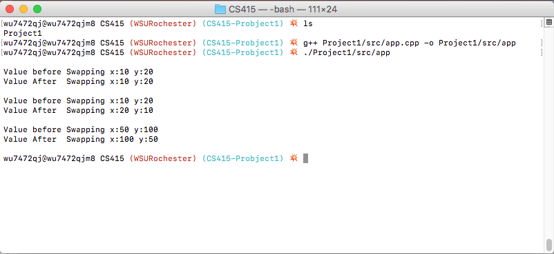

= CS415 Project 1
Kyle Aure <KAure09@winona.edu>
v1.0, 2018-09-02
:RepoURL: https://github.com/KyleAure/WSURochester
:AuthorURL: https://github.com/KyleAure
:DirURL: {RepoURL}/CSXXX

.Project Description
****
Introduction project to C++ for CS415: Principles of Programming Languages
****

== Project Details
* **Course** - CS415: Principles of Programming Languages
* **Instructor** - Daniel Nash
* **Date** - 2018/09/02

== Project Goals
* Install C++ IDE
* Get program to run
* Documentation explaining issues, learning outcomes, and screenshot showing program output.
* Add name to comment and submit the code to D2l

== Running project
Create a local copy of this project by running the following command:

```bash
git clone git@github.com:KyleAure/WSURochester.git
```

Then navigate to this project directory:
```bash
cd WSURochester/CS415/Project1
```

Then run the following goals to build and run this program:
```bash
g++ Project1/src/app.cpp -o Project1/src/app
./Project1/src/app
```

== Documentation
=== Issues
This project was pretty straightforward.
Deciding which IDE to use took the longest.
In the end, I choose to use Eclipse for C/C++ since I was familiar with the platform from java development.

Setting up the project was difficult since Eclipse can be so fine tuned and being unfamiliar with the language meant that I did not know what many of the settings meant.

Once the project was set up running it within Eclipse was as simple as building and running.
I wanted to learn how to build and run the program using terminal and this was a bit more complicated, but I was successful in finding a guide.

=== Learning Outcomes
* I learned how to use Eclipse for C/C++
* I learned how to build and run C++ programs both via the Eclipse IDE and also via command line
* When writing functions passing variables by `value` does not affect the variables in the mainline code.
* When writing functions you can pass variables by `reference` using the `&` symbol.
This will pass the variable `reference` and you are able to edit the mainline variable inside a function.
* Alternatively, you can can pass variables by `address` using the `*` symbol.
This will pass the variable's `address` and you are also able to edit the mainline variable inside a function.
* I am unsure when it would be better to reference a variable by `address` vs `reference`.

=== Output

