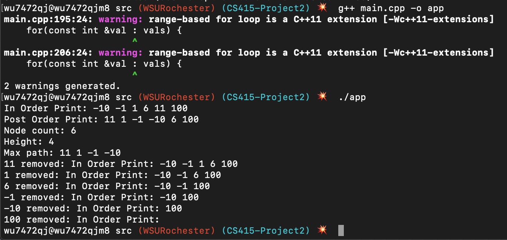

= CS415 Project 2
Kyle Aure <KAure09@winona.edu>
v1.0, 2018-10-06
:RepoURL: https://github.com/KyleAure/WSURochester
:AuthorURL: https://github.com/KyleAure
:DirURL: {RepoURL}/CS415

.Project Description
****
Create a pointer based binary search tree in C++.
Create a method to print the binary search tree in a pre-order fashion.
****

== Course Details
* **Course** - CS415: Principles of Programming Languages
* **Instructor** - Daniel Nash

== Project Goals
* Create a node structure.
* Create a binary search tree class of nodes.
* Create helper methods to print tree contents in a pre-order fashion.

== Running project
Create a local copy of this project by running the following command:

```bash
git clone git@github.com:KyleAure/WSURochester.git
```

Then navigate to this project directory:
```bash
cd WSURochester/CS415/Project2/src
```

Then run the following goals to build and run this program:
```bash
g++ main.cpp -o app
./app
```

== Documentation
=== Output
Output from running the program can be found below:


