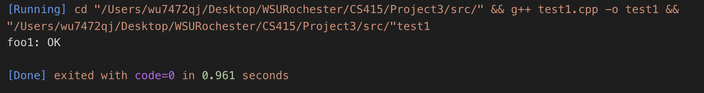
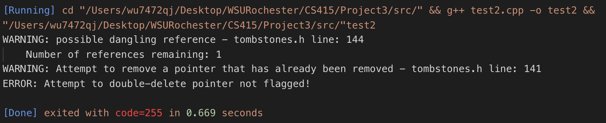
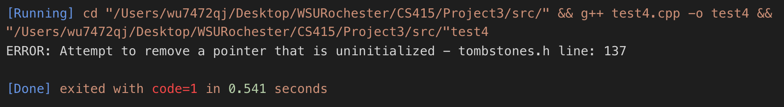
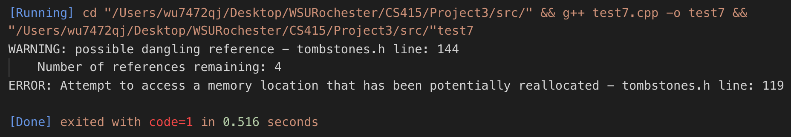

= CS415 Project 3
Kyle Aure <KAure09@winona.edu>
v1.0, 2018-11-14
:RepoURL: https://github.com/KyleAure/WSURochester
:AuthorURL: https://github.com/KyleAure
:DirURL: {RepoURL}/CS415

.Project Description
****
Implement a Tombstone class in C++ to be an intermediary between pointers and addresses.
The Tombstone class will then allow easier garbage collection, while checking for dangling pointers, memory leaks, and deallocated memory access.
****

== Course Details
* **Course** - CS415: Principles of Programming Languages
* **Instructor** - Daniel Nash

== Project Goals
* Create a tombstones.h file that can be imported using the `#include "tombstones.h"` directive.
* Create a `Ptr` class which will be used to replace the generic `T*` pointers.
* Check for dangling pointers, memory leaks, and deallocated memory access errors.
* Use the included test classes to ensure the `Ptr` class is working as expected.

== Running project
Create a local copy of this project by running the following command:

```bash
git clone git@github.com:KyleAure/WSURochester.git
```

Then navigate to this project directory:
```bash
cd WSURochester/CS415/Project3/src
```

Then run the following goals to build and run the test files :
```bash
g++ test1.cpp -o test1 && ./test1
```
Replace `test1` with whichever test you want to run.

== Documentation
=== Output
Output from running the tests can be found below:

1. Test 1: Ensures assignment and re-assignment works correctly.
+

+
2. Test 2: Ensures two pointers to the same tombstone cannot be released multiple times.
+

+
3. Test 3: Ensure non-primitive times are assigned correctly and released correctly.
+

+
4. Test 4: Ensures tombstones that do not actually point to any data cannot be released.
+

+
5. Test 5: Ensures basic memory leak scenario is handled correctly.
+

+
6. Test 6: Recursively define pointers and ensure that data integrity is maintained and check again for leaked memory.
+

+
7. Test 7: Copy pointers repeatedly to check that they all point to the same place and ensure dangling references cannot be accessed.
+

+
8. Test 8: Recursively redefine pointers to check that data is persevered and check dangling reference.
+

+
