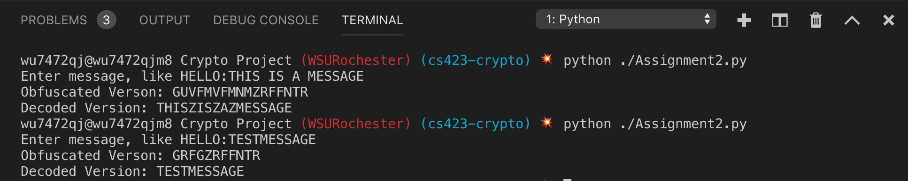
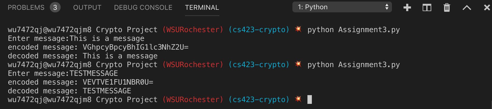
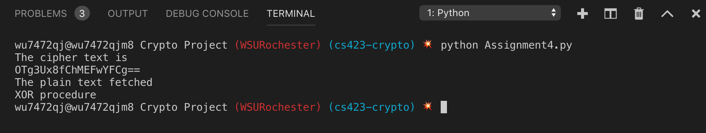
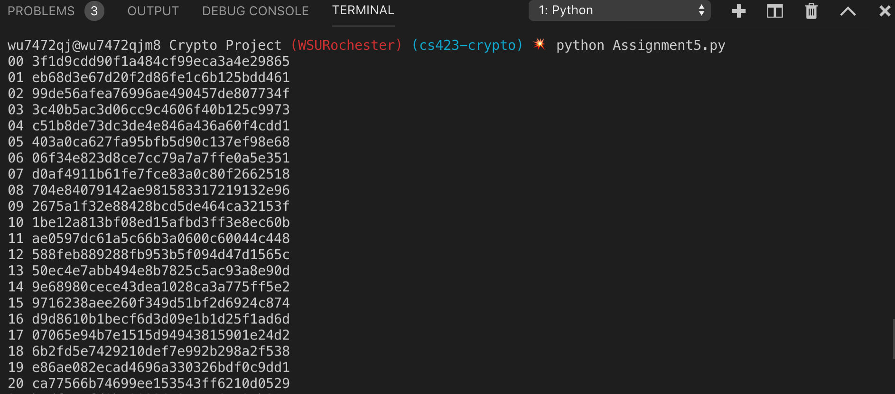
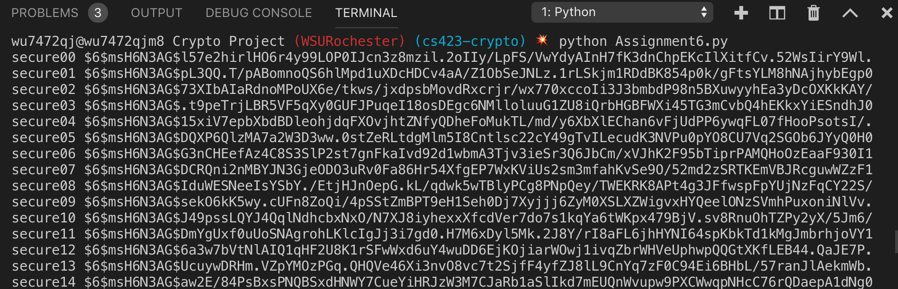

= Cryptography Project
Kyle Aure <KAure09@winona.edu>
v1.0, 2019-01-23
:RepoURL: https://github.com/KyleAure/WSURochester
:AuthorURL: https://github.com/KyleAure
:DirURL: {RepoURL}/CS423

.Project Description
****
Practice assignments in Cryptography
****

== Course Details
* **Course** - CS423
* **Instructor** - Dr. Daniel Nash

== Assignment1
=== Results
image:Assets/Assignment1.png[]

=== Questions
What does the use of the mod function solve?

* Using the mod function saves us from having to compare and adjust the new location based on the number of characters in the alphabet.  Instead, we can mathematically make this adjustment if needed by using the modulus function.

== Assignment2
=== Results

=== Conclusions
The reasons this works is becuase when we are determining our new location both for encrypting and decrypting the same way.
Therefore, we are adding 13 and performing modulus twice.

Let x be the location of the character we are trying to encode.
During the encode and decode process we perform the following on x :
`( ( (x + 13) % 26 ) + 13 ) % 26`
Since modulus is a distributive function this can be re-written as :
`x % 26 + (13 + 13) % 26`
Since 13 + 13 is 26 the end of this function is 0 and we end up with our original location x.

== Assignment3
=== Results

== Assignment4
=== Results

== Assignment5
=== Results
By creating a directory of PASSWORD -> HASHED_PASSWORD I was able to do a reverse-lookup to determine every person's password.
The list of passwords is saved below:

include:Assets/namepasswordlist.adoc[]

=== Output
The PASSWORD -> HASHED_PASSWORD directory was created from the output of the python program.
Output:

A link to this file can be found here:
link:Assets/passwords.txt[]

== Assignment6
=== Results
By creating a directory of PASSWORD -> HASHED_PASSWORD I was able to do a reverse-lookup to determine every person's password.
The list of passwords is saved below:

include:Assets/namepasswordlist2.adoc[]

=== Output
The PASSWORD -> HASHED_PASSWORD directory was created from the output of the python program.
Output:

A link to this file can be found here:
link:Assets/passwords2.txt[]
