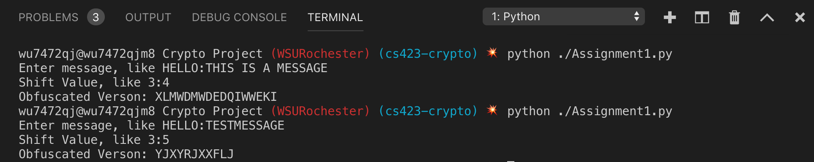
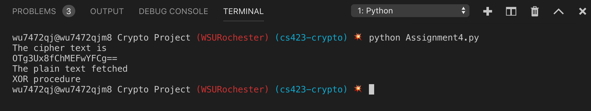
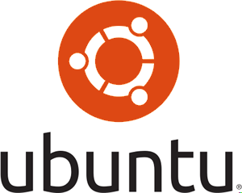

= Cryptography Project
Kyle Aure <KAure09@winona.edu>
v1.0, 2019-01-23
:RepoURL: https://github.com/KyleAure/WSURochester
:AuthorURL: https://github.com/KyleAure
:DirURL: {RepoURL}/CS423

.Project Description
****
Practice assignments in Cryptography.
Assignments 1-6 done individually.
Assignments 7-10 done with Joe Denzer.
****

== Course Details
* **Course** - CS423
* **Instructor** - Dr. Daniel Nash

== Assignment1
=== Results

=== Questions
What does the use of the mod function solve?

* Using the mod function saves us from having to compare and adjust the new location based on the number of characters in the alphabet.  Instead, we can mathematically make this adjustment if needed by using the modulus function.

== Assignment2
=== Results
image:Assets/Assignment2.png[]

=== Conclusions
The reasons this works is becuase when we are determining our new location both for encrypting and decrypting the same way.
Therefore, we are adding 13 and performing modulus twice.

Let x be the location of the character we are trying to encode.
During the encode and decode process we perform the following on x :
`( ( (x + 13) % 26 ) + 13 ) % 26`
Since modulus is a distributive function this can be re-written as :
`x % 26 + (13 + 13) % 26`
Since 13 + 13 is 26 the end of this function is 0 and we end up with our original location x.

== Assignment3
=== Results
image:Assets/Assignment3.png[]

== Assignment4
=== Results

== Assignment5
=== Results
By creating a directory of PASSWORD -> HASHED_PASSWORD I was able to do a reverse-lookup to determine every person's password.
The list of passwords is saved below:

include::Assets/namepasswordlist.adoc[]

=== Output
The PASSWORD -> HASHED_PASSWORD directory was created from the output of the python program.
Output:
image:Assets/Assignment5.png[]

A link to this file can be found here:
link:Assets/passwords.txt[]

== Assignment6
=== Results
By creating a directory of PASSWORD -> HASHED_PASSWORD I was able to do a reverse-lookup to determine every person's password.
The list of passwords is saved below:

include::Assets/namepasswordlist2.adoc[]

=== Output
The PASSWORD -> HASHED_PASSWORD directory was created from the output of the python program.
Output:
image:Assets/Assignment6.png[]

A link to this file can be found here:
link:Assets/passwords2.txt[]

== Team Assignment 7
I decided to use a password type key for this assignment instead of an auto generated key.
I sent my encryped string along with my key to my teammate via Discord by using the program output below:

== Team Assignment 8
I wanted to encrypt an image using AES_CBC and AEC_ECB so I looked around and found a good resource here: 

link:https://www.quora.com/How-do-I-encrypt-and-decrypt-an-image-file-using-ECB-CBC-AES-encryption-or-something-like-this-in-python-using-a-program[]

Below is a table that shows my original image, encryption, and decryption attempts:

.Image AES Encryption
|===
|Description |Encrypted |Decrypted

|Original Image 
2+|image:Assets/Unencrypted.png[]

|AES_ECB Encryption
|image:Assets/Encrypted1.png[]
|

|AES_CBC Decryption
|
|
|===

Encrypting and decrypting took minimal time. 
The hardest part of this problem was figuring out how to get pixel data from the image and convert that to byte data that can then be encrypted.
However, once that was figured out decrypting was the image was a nominal problem since we just had to do everything in reverse. 

== Assignment 9
1. Beyond this exercise: what are issues around public key distribution?
** When a public/private key pair are generated we need to distribute our public key to a certain recipient. 
However, this introduces an issue of authencitity. 
If we are distributing our public key via email, how can the recipient ensure that it was us that sent the email?
2. What about aging keys (expiration dates) and issues around that?
** Say you are in a situation where your computer's harddrive became corrupted.
You have now lost your private key and need to generate a new private/public key pair. 
This can be problematic, since you might recieve encrypted messages in the interm that you cannot decrypt.
Additionally, as mentioned in the last question how do you alert others that your old public key should no longer be used in an authentic way?
3. How about key management?
** Implementing a Key Management System to store public keys and ensure they are authentic could be a solution to some of these problems.

== Team Assignment 10
I modified the provided code to allow me to generate a pair of keys and save them as text files similar to how SSH keys work.
I then created a way to import the public and private keys for encryption and decryption.
This meant that I was able to test my code using the same keys multiple times without having to generate new keys each time.

Below is a link to my public RSA key:
link:Keys/id_rsa.pub[]

