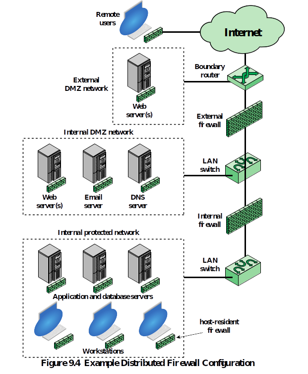

= Midterm Review

== Multiple Choice
50 questions
Questions are from the chapter quizzes on D2L

include::../Quizzes/README.adoc[]

== Short Answer
1. Describe and differentiate the difference between asymmetric and symmetric encryption.
** In *symmetric encryption*, the same key is used to encrypt and decrypt a message. This requires a string encryption algorithm.  The sender and receiver must have obtained a copy of the secret key in a secure fashion.
	** Examples: DES (Data Encryption Standard), Triple DES, AES (Advanced Encryption Standard)
** In *asymmetric encryption*, also known as public-key encryption, two keys are used to encrypt a message.  The sender uses the receiver's public key to encrypt the message.  The receiver's private key is used to decrypt the message.
	** RSA (Rivest, Shamir, and Adelman), Diffie-Hellman, DSS (Digital Signature Standard), Elliptic Curve.
2. What is a hash value used for?
** A *hash value* is a numeric value of a fixed length that uniquely identifies data. Hash values represent large amounts of data as much smaller numeric values, so they are used with digital signatures or as the hashed value of passwords for validation.
3. Potential vulnerabilities about smaller hashes (for example MD5)
** Since a hash maps a large set of data to a smaller numeric value, the vulnerability of a smaller hash is the chance of encountering a collision.  Brute force methods could be used to discover a "message" that produces the correct hash.
4. Draw and label on and around a DMZ (email, firewall), firewall, HID(Host intrusion detection), NID(Network intrusion detection — in-between dmzs), where things reside. Where are servers gonna be? Where are local hosts?
** NID (network intrusion detection): on servers that interface between the outside environment and the network.
** HID (host intrusion detection): on network computers.
+

+
5. What does ROT13 and XOR have in common?
** Because there are 26 letters in the alphabet, ROT13 (Rotate 13) is its own inverse. ROT13 shifts a given letter 13 spaces and outputs the result. Ex: ROT13(M) = Z and ROT13(Z) = M
** XOR works the same way. 11000111 XORed with 00001111 becomes 11001000. If you XOR this result with the same 00001111 you get the original 11000111.
6. What is the difference between safety and security?
** The difference is intent.
** Security: Protects against intentional malicious actions.
** Safety: Protects assets form unintentional actions.
7. At the foundation there is a security system protecting ---- from ----.
** Assets from attackers
8. How can hackers be categorized:
** *Black Hat:* Develop malicious software and infiltrate systems for malicious reasons.
** *White Hat:* Ethical hackers that help companies find vulnerabilities in their systems.
** *Grey Hat:* Hackers that look for vulnerabilities in a system without the owner's permission or knowledge.
9. What is privacy and why is it important
** *Privacy:* Assures that individuals control or influence what information related to them may be collected and stored and by whom and to whom that information may be disclosed.
** This is important because without the assurance of an individuals control over their data a consumer can be exploited without their knowledge. Privacy looks different depending on the country you reside in.
10. What is defense in depth? layering.
** *Defense in Depth*: is protecting assets with more than one countermeasure to ensure that no single vulnerability can compromise security.
** *Layering*: Multiple overlapping protection approaches. The failure of one will not leave the system unprotected.
11. Bad security is ---, whereas good security systems are ---.
** Bad security systems are brittle. All security systems fail sooner or later. Brittle systems fail badly.
** Good security systems are resilient. Can withstand failures and recover. A single failure does not cause a cascade of failures.
12. What is the CIA triad and compare it to DAD?
** If one CIA principle is absent, then a DAD principle is present.
** CIA and DAD are opposites of each other:
** CIA (Confidentiality, Integrity, and Availability):
	** *Confidentiality:* Assures that private or confidential information is not made available to unauthorized individuals.
	** *Integrity:* Assures that information and programs are changed only in a specified and authorized manner. Assures that a system performs its intended function in an unimpaired manner.
	** *Availability:* Assures that systems works promptly, and service is not denied to authorized users.
** DAD (Disclosure, Alteration, and Denial):
	** *Disclosure:* This is the opposite of Confidentiality.
	** *Alteration:* This is the opposite of Integrity.
	** *Denial:* This is the opposite of Availability.
13. What is the hardest aspect of security and why is it so expensive?
** The ideal of any security system is to prevent an attack, but prevention is the hardest aspect of security to implement, and often the most expensive. To be practical as well as effective, almost all modern security systems combine prevention with detection and response, forming a triad that operates as an integrated system to provide dynamic security, resilient failure, and defense in depth.
14. Describe separation of duties.
** It is the concept of having more than one person to complete a task. If one person is allowed to perform a whole process, they could manipulate the system and avoid detection or have errors without detection.
