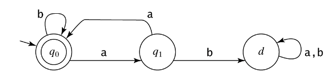
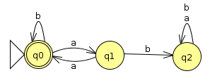
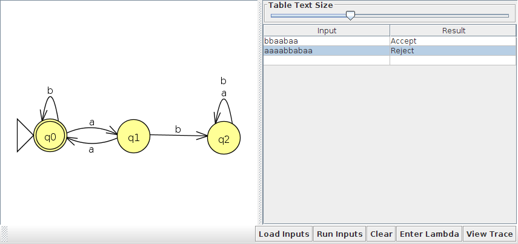
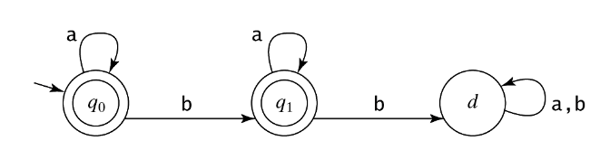

= Homework 1
Kyle Aure <KAure09@winona.edu>
v1.0, 2019-03-09
:RepoURL: https://github.com/KyleAure/WSURochester
:AuthorURL: https://github.com/KyleAure
:DirURL: {RepoURL}/CS435
:stem: asciimath

.Homework Description
****
Introduction assignment to languages, grammar, and finite state machines.
****

== Course Details
* **Course** - CS435
* **Instructor** - Dr. Chi-Cheng Lin

== Homework Results

Question 1::
Let asciimath:[L_1 = {a^n b^n: n >= 0}]. Let asciimath:[L_2 = {c^n : n>0}]. For each of the following strings state whether or not it is an element of asciimath:[L_1 L_2].
Answer::
By definition of concatenation, asciimath:[L_1 L_2 = {a^n b^n c^m : n >= 0, m>0} ]
a. asciimath:[epsilon]: No, if asciimath:[epsilon in L_1 L_2] then asciimath:[a^0 b^0 c^0 in L_1 L_2] but by definition of asciimath:[L_1 L_2], m must be greater than 0.
b. aabbcc: Yes, asciimath:[text(aabbcc) in L_1 L_2] when n and m are 2.
c. aabbcccc: Yes, asciimath:[text(aabbcccc) in L_1 L_2] when n is 2 and m is 4.
d. aabcc: No, asciimath:[text(aabcc) notin L_1 L_2] since by definition of asciimath:[L_1 L_2] both a and b must have the same number of instances n, but in this a has 2 and b has 1.

Question 2::
Let asciimath:[L_1 = {a^n b^n: n >= 0}]. Let asciimath:[L_2 = {c^n : n>0}]. For each of the following strings state whether or not it is an element of asciimath:[L_1 uu L_2].
Answer::
By definition of union, for each element asciimath:[w] if asciimath:[w in L_1 or w in L_2] then asciimath:[w in L_1 uu L_2]
a. asciimath:[epsilon]: Yes, asciimath:[epsilon in L_1] when n is 0, therefore asciimath:[epsilon in L_1 uu L_2]
b. aabbcc: No, asciimath:[text(aabbcc) notin L_1] since asciimath:[L_1] does not have a definition for c, and asciimath:[text(aabbcc) notin L_2] since asciimath:[L_2] does not have a definition for a or b.
c. cccc: Yes, asciimath:[text(cccc) in L_2] when n is 4, therefore asciimath:[text(cccc) in L_1 uu L_2]
d. aabb: Yes, asciimath:[text(aabb) in L_1] when n is 2, therefore asciimath:[text(aabb) in L_1 uu L_2]

Question 3::
Let asciimath:[L = {w in {a,b}^*** : abs(w) -=_3 0}]. List the first six elements in the lexicographic enumeration of L.
Answer::
By definition of asciimath:[abs(w) -=_3 0] we know that any element asciimath:[x in L] will need to have a length of a multiple of 3.
To start we need to consider asciimath:[epsilon in {a,b}^***] which has a length of 0 which, and asciimath:[0 mod 3 = 0].
Then, lets consider strings of length 3, listing them in lexicographic enumeration order we have: {aaa, aab, aba, abb, baa, bab, bbb}.
Therefore, the first six will be: {asciimath:[epsilon], aaa, aab, aba, abb, baa}.

Question 4::
asciimath:[L = {w in {a,b}^*** : x in {a,b}** (w=ax)}].
Answer::
a. Give a simple, precise English description for the language _L_.
** "A string composed of characters a and b, where the string starts with a."
b. List the first six element in the lexicographic enumeration of _L_.
** {a, aa, ab, aaa, aab, aba}

Question 5::
Construct the following finite state machine (FSM) in JFLAP:
+

+
And test it using strings {bbaabaa, aaaabbabaa}

Answer::
Link to JFLAP file:
+
link:assets/problem5.jff[]
+
Image:
+

+
Test Results
+

Question 6::
Describe the following DFSN M formally as asciimath:[M = (K, Sigma, delta, s, A)]
+

+
- asciimath:[K] - finite set of states
- asciimath:[Sigma] - is an alphabet
- asciimath:[delta] - is the transition function from asciimath:[(K x Sigma to K)]
- asciimath:[s in K] - is the initial state
- asciimath:[A sube K] - is the set of accepting states

Answer::
asciimath:[M = (K, Sigma, delta, s, A) = ({q_0, q_1, d}, {a, b}, delta, {q_0}, {q_0, q_1})]
+
where asciimath:[delta = {((q_0,a), q_0), ((q_0, b), q_1), ((q_1, a), q_1), ((q_1, b), d), ((d, a), d), ((d, b), d)}]
