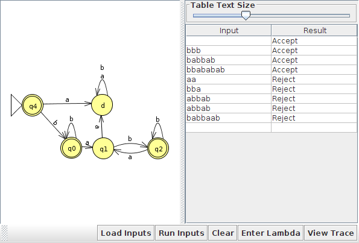
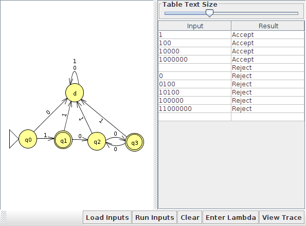
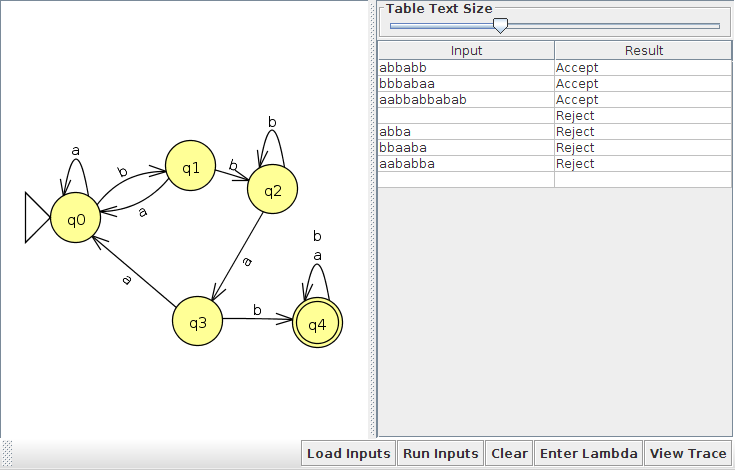
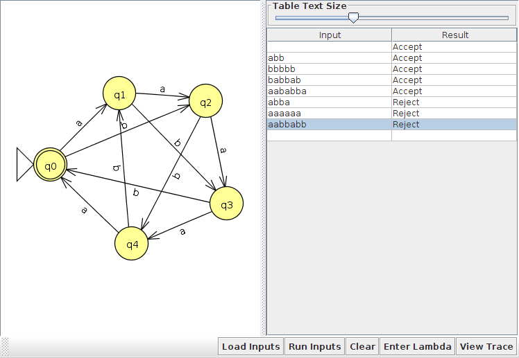
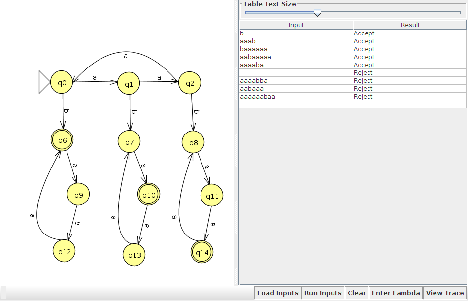
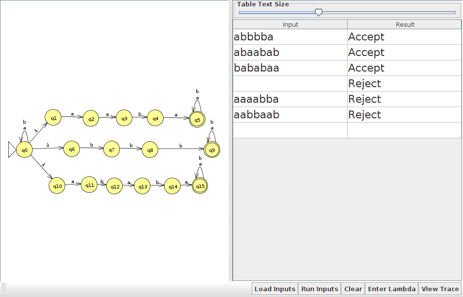

= Homework 2
Kyle Aure <KAure09@winona.edu>
v1.0, 2019-09-18
:RepoURL: https://github.com/KyleAure/WSURochester
:AuthorURL: https://github.com/KyleAure
:DirURL: {RepoURL}/CS435
:stem: asciimath

.Homework Description
****
Introduction assignment to languages, grammar, and finite state machines.
****

== Course Details
* **Course** - CS435
* **Instructor** - Dr. Chi-Cheng Lin

== Homework Results

Problem Set 1::
Exercises from Chapter 5.
- JFLAP file for DFSM
- A picture of diagram and accepting/rejecting runs

Problem 2a:::
{asciimath:[w in {a, b}^***] : every _a_ in _w_ is immediately preceded and followed by _b_}

JFLAP file:::: 
link:jflap/2a.jff[]

Results::::

Problem 2d:::
{asciimath:[w in {0, 1}^***] : _w_ corresponds to the binary encoding, without leading 0’s, of natural numbers that are powers of 4}

JFLAP file::::
link:jflap/2d.jff[]

Results::::

Problem 2h:::
{asciimath:[w in {a, b}^***] : _w_ has _bbab_ as a substring}

JFLAP file:::: 
link:jflap/2h.jff[]

Results::::

Problem 2n:::
{asciimath:[w in {a, b}^*** : ( text(#)_a (w) + 2 text(#)_b (w) ) -=_5 0}]}.

JFLAP file:::: 
link:jflap/2n.jff[]

Results::::

Problem Set 2::
Exercises from Chapter 5
- JFLAP file for the NDFSM
- A picture of diagram and accepting/rejecting runs

Problem 6a:::
{asciimath:[a^n b a^m : n, m >= 0, n -=_3 m]}.

JFLAP file:::: 
link:jflap/6a.jff[]

Results::::

Problem 6b:::
{asciimath:[w in {a, b}^***] : _w_ contains at least one instance of _aaba_, _bbb_ or _ababa_}.

JFLAP file:::: 
link:jflap/6b.jff[]

Results::::
