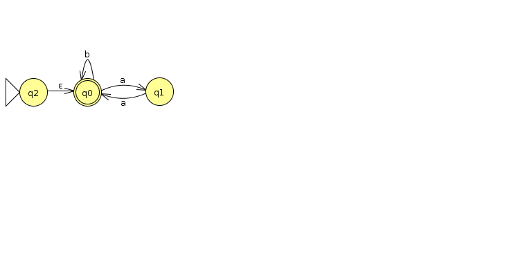
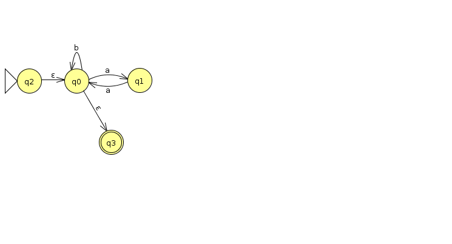

= Homework 3
Kyle Aure <KAure09@winona.edu>
v1.0, 2019-10-09
:RepoURL: https://github.com/KyleAure/WSURochester
:AuthorURL: https://github.com/KyleAure
:DirURL: {RepoURL}/CS435
:stem: asciimath

.Homework Description
****
Regular Expressions
****

== Course Details
* **Course** - CS435
* **Instructor** - Dr. Chi-Cheng Lin

== Homework Results

Problem Set 1::
Exercises from Chapter 6.
- Provide answer.
- Explanation of how regular expression was constructed.

Problem 2b:::
asciimath:[{w in {a,b}^*** : text(w does not end in ba) }]

Answer::::
asciimath:[epsilon uu a uu (a uu b)^*** (b uu aa)]

Explanation::::
+
Strings Accepted: asciimath:[epsilon], a, b, **aa**, a**b**, b**b**, ...
+
General Rule: Anything that ends with **aa** or **b** -> asciimath:[(b uu aa)]
+
Other considerations: asciimath:[epsilon], and a string can end with a single a when a is by itself.

Problem 2d:::
asciimath:[{w in {0,1}^*** : text(w corresponds to the binary encoding, without leading 0's, of natural numbers that are evenly divisible by 4)}]

Answer::::
asciimath:[1 (1 uu 0)^*** 00]

Explanation::::
+ 
Strings Accepted: 100 (4), 1000 (8), 1100 (12), 10000 (16), 10100 (20), 11000 (24), 11100 (28)...
+
General Rule: Anything that ends with 00
+
Other considerations: Cannot start with 0, and 0 is divisible by 4 but 0 is not in the set of natural numbers.

Problem 2e:::
asciimath:[{w in {0,1}^*** : text(w corresponds to the binary encoding, without leading 0's, of natural numbers that are powers of 4)}]

Answer::::
asciimath:[1(00)^***]

Explanation::::
+
Strings Accepted: 1 (1), 100 (4), 10000 (16), 1000000 (64)
+
General Rule: Starts with 1 and is followed by pairs of zeros
*
Other Considerations: 1 is accepted since asciimath:[4^0 = 1] and 1 is a natural number.

Problem 2k:::
asciimath:[{w in {a,b}^*** : text{w has both aa and aba as substrings}}]

Answer::::
asciimath:[{(a uu b)^*** aaba (a uu b)^***} uu {(a uu b)^*** abaa (a uu b)^***} uu {(a uu b)^*** aa (a uu b)^*** aba (a uu b)^***} uu {(a uu b)^*** aba (a uu b)^*** aa (a uu b)^***}]

Explanation::::
+ 
Strings Accepted: aaba, abaa, aaaba, abaaa, ...
+ 
Considerations: There are 4 different accepting states here, where aa and aba are combined (front or back), or they happen in sequence (aa before or after) with anything else in between them.

Problem 2o:::
asciimath:[{w in {a,b}^*** : #_a(w) -=_3 0}]

Answer::::
asciimath:[epsilon uu (b^*** a b^*** a b^*** a b^***)^*** b^***]

Explanation::::
+
Strings Accepted: aaa, baaa, aaab, abaa, aaba, aaabaaa, ...
+ 
General Rule: Any a can be preceded by a b. Any a can be followed by a b. If there is an a, it must be accompanied by at least 2 more a's.
+
Other considerations: asciimath:[epsilon] will be accepted since asciimath:[#_a(epsilon) -=_3 0], and string with all b's will also be accepted. 

Problem 2::
Exercise 7a from textbook. Follow Kline Theory algorithm in textbook step by step to construct FSM.

Regular Expression:::
asciimath:[(b(b uu epsilon)b)^***]

Result:::

Problem 3::
Exercise 10 from text book. Use _fsmtoregexheuristic_ to construct regular expression that describes L(M) from example 5.3.

DFSM:::
image:img/3prob.png[]

Steps:::

Step 1::::
Remove any states that are unreachable from the start state.
+

Step 2::::
If M has no accepting states then halt and return asciimath:[O/]
+

Step 3::::
If the state state is part of a loop, add in an extra state 
+

Step 4::::
If there is more than 1 accepting state, or there are transitions to the accepting state.  Create a new accepting state.
+ 

Step 5::::
If at this point there is only one state then return asciimath:[epsilon].
+

Step 6::::
Rip out states until only a starting state and final state remain.

RIP q1:::::

RIP q0:::::

Step 7::::
Return regular expression
+ 
asciimath:[epsilon uu (b uu aa)^***]

Problem 4::

Standardized State:::

RIP Q2:::

RIP Q1:::

Final Answer:::
asciimath:[epsilon uu b(b uu ab)^***]

