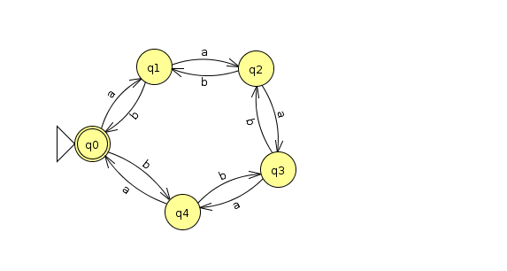

= Homework 4
Kyle Aure <KAure09@winona.edu>
v1.0, 2019-11-01
:RepoURL: https://github.com/KyleAure/WSURochester
:AuthorURL: https://github.com/KyleAure
:DirURL: {RepoURL}/CS435
:stem: asciimath

.Homework Description
****
Regular Languages and Pumping Theorem
****

== Course Details
* **Course** - CS435
* **Instructor** - Dr. Chi-Cheng Lin

== Homework Results

=== Problem Set 1
Show that the following languages are regular, and provide a proof.

Exercise 1a::
Language: asciimath:[{a^i b^j : i, j >= 0 and i + j = 5}]
+
Proof Approach: Show that the language is finite
+
Proof by exhaustion: 
Assume asciimath:[i, j in NN], then the set of all values asciimath:[(i,j) : i, j >= 0 and i + j = 5] are asciimath:[{(0,5)(1,4)(2,3)(3,2)(4,1)(5,0)}]. This set is finite, therefore this language is also finite. 

Exercise 1c::
Language: asciimath:[{a^i b^j : i, j >= 0 and |i - j| -=_5 0}]
+
Proof Approach: Show a FSM that accepts the language correctly
+
Proof by asset:
+

+
This finite state machine correctly accepts this language by incrementing (mod 5) for each a, then decrements (mod 5) for each b.

Exercise 1e::
Language: asciimath:[{a^i b^j : 0 <= i < j < 2000}]
+
Proof Approach: Show that the language is finite
+
Proof by quantification:
+
Assume asciimath:[i, j in NN].  Let S be the set of all values asciimath:[(i,j) : 0 <= i < j < 2000].
To show that the language is finite we must prove that S is finite.  In order to that we can calculate the size of S. 
+
By mathematical principles we can safely say the range of i is (0, 1998) and the range of j is (1,1999).  Therefore, when i = 0, j can be anything between 1 - 1999.  Below is a table of the values of i, and how many options there are for j:
+
|===
|i |#(j)
|0 |(1999 - 1) - 0 = 1998
|1 |(1999 - 1) - 1 = 1997
|2 |(1999 - 1) - 2 = 1996
...
|===
+ 
From this we can write an equation for the size of S. asciimath:[|S| = sum_(x=0)^1998 1998-x = 1997001]

Exercise 1p::
Language: asciimath:[{w : w in {a-z}^*** text(and the letters of w appear in reserve alphabetical order) }]
+
Proof Approach: Show a regular expression that describes language
+
Proof by RegEx:
Since this language has a strict ordering we can develope a regular expression to represent accepted expressions.  For this we can accept zero or more of any letter as long as they are in reverse order so the regular expression would be:
asciimath:[z^*** y^*** x^*** w^*** v^*** u^*** t^*** s^*** r^*** q^*** p^*** o^*** n^*** m^*** l^*** k^*** j^*** i^*** h^*** g^*** f^*** e^*** d^*** c^*** b^*** a^*** ]

=== Problem Set 2
Show that the following languages are not regular, by using the pumping theorem.

Exercise 1b::
Language: asciimath:[L = {a^i b^j : i, j >= 0 and i-j = 5}]
+
1. Let asciimath:[w = a^(k+5) b^k], w is in L since asciimath:[(k + 5) - k = 5 ] and asciimath:[|w| = 2k+5 >= k]
2. Let asciimath:[w = xyz : |xy| <= k].  Therefore, y contains all a's.  Let asciimath:[y = a^p, p>= 1].
3. Let asciimath:[w' = w y^2 z = a^(k+5+p) b^(k)]
4. We have, asciimath:[i-j = (k+5+p)-(k) = 5+p != 5].  Therefore w' is not in L and L is not regular. 

Exercise 1n::
Language: asciimath:[L = {w in {a,b}^*** : text(w contains exactly two more b's than a's)}]
+
1. Let asciimath:[w = a^(k+2) b^(k+4)], w is in L since asciimath:[(k+4)-(k+2)=2] and asciimath:[|w|=2k+6 > k]
2. Let asciimath:[w = xyz : |xy| <= k].  Therefore, y contains all a's.  Let asciimath:[y = a^p, p>= 1].
3. Let asciimath:[w' = w y^2 z = a^(k+2+p) b^(k+4)]
4. We have, asciimath:[j-i = (k+4)-(k+2+p) = 2-p != 2].  Therefore w' is not in L and L is not regular. 

Exercise 3::
Language: asciimath:[{aba^nb^n: n>=0}]
+ 
1. By the Closure Theorem for Concatenation we know that for any regular language asciimath:[L=L_1 L_2].  If L is regular then asciimath:[L_1 and L_2] must also be regular.
2. Let asciimath:[L_1 = {ab} and L_2 = {a^nb^n:n>=0}]
3. Show that asciimath:[L_2] is not regular using the pumping theorem.
4. Let asciimath:[w = a^kb^k], w is in asciimath:[L_2] since asciimath:[k >= 0] and asciimath:[|w|=2k>k]
5. Let asciimath:[w = xyz : |xy|<=k].  Therefore, y contains all a's.  Let asciimath:[y = a^p, p>= 1].
6. Let asciimath:[w'= wy^2z = a^(k+p)b^k]
7. We have, asciimath:[k+p != k].  Therefore, w' is not in asciimath:[L_2] and asciimath:[L_2] is not regular.  Therefore, L is not regular.