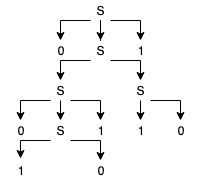

= Homework 5
Kyle Aure <KAure09@winona.edu>
v1.0, 2019-11-07
:RepoURL: https://github.com/KyleAure/WSURochester
:AuthorURL: https://github.com/KyleAure
:DirURL: {RepoURL}/CS435
:stem: asciimath

.Homework Description
****
Context free grammars and parse trees.
****

== Course Details
* **Course** - CS435
* **Instructor** - Dr. Chi-Cheng Lin

== Homework Results

=== Problem Set 1
Complete exercise 1b from Chapter 11

asciimath:[Sigma = {a,b}]

asciimath:[G = {S -> aSa | bSb | a | b}]

Part I::
List 5 strings that are in L: asciimath:[{a, b, aaa, aba, bab}]

Part II::
List 5 strings that are not in L: asciimath:[{epsilon, aa, b b, ab, ba}]

Part III::
Describe L concisely.  You can use regular expressions, expressions using variables, etc: This language contains a set of palindromes, where there is a central character.  This can be represented by the the language: asciimath:[L = { w = z(a uu b)z : z text( is a sequence of characters) in (a,b)^***}]

=== Problem Set 2
Exercise 3b of Chapter 11

Problem::
Consider grammar asciimath:[G = { S -> 0S1 | SS | 10}]
+
Show a parse tree produced by G for string `00101101`
+



=== Problem Set 3
The context free language asciimath:[L = {a^i b^j c^k, k >= 0 and (k <= i or k<= j)}] can be defined by the context free grammar asciimath:[G = (V, Sigma, R, S)], where:

```
R = {
S -> A | B,
A -> aAc | aA | M, 
B -> aB | F, 
F -> bFc | bF | ε, 
M -> bM | ε}
```

Part A::
What is the value of V?
+
V is the rule alphabet: asciimath:[{A,B,F,M,S,a,b,c}]

Part B::
What is the value of asciimath:[Sigma]?
+
asciimath:[Sigma] is the language alphabet: asciimath:[{a,b,c}]

=== Problem Set 4
Show context free grammar for each of the following languages.  You only need to show the rule part ( R ) of the grammar.

Part A::
asciimath:[{a^i b^j: i,j >= 0, 3i = 5j+1}]

Analysis:::
|===
|i |j

|7  |4
|12 |7
|17 |10
|22 |13
2+|Every time we add 5 a's we need to add 3 b's. 
|===

Solution:::
```
R = {
    T -> aaaaaTbbb | I,
    I -> aaaaaaabbbb
}
```

Part B::
asciimath:[{a^m b^n c^k: n,k >= 0, m = n+k}]

Analysis::: 
|===
|m  |n  |k

|0  |0  |0
|1  |1  |0
|2  |1  |1
2+|Every time we add a b or c we need to add an a.
|===

Solution:::
```
R = {
    T -> aSc,
    S -> aSb | ε
}
```

Part C::
asciimath:[{a^m b^n: m,n > 0, m - n text( is even if ) m >= n, n - m text( is odd if ) m < n}]
+
Did not have time to finish the problem :(

Part D::
asciimath:[{w in {a,b}^***: #_a(w)=#_b(w)+2}]

Analysis:::
Always two more b's than a's but in any order

Solution:::
```
R = {
    S -> aSb | bSa | I,
    I -> bb
}
```