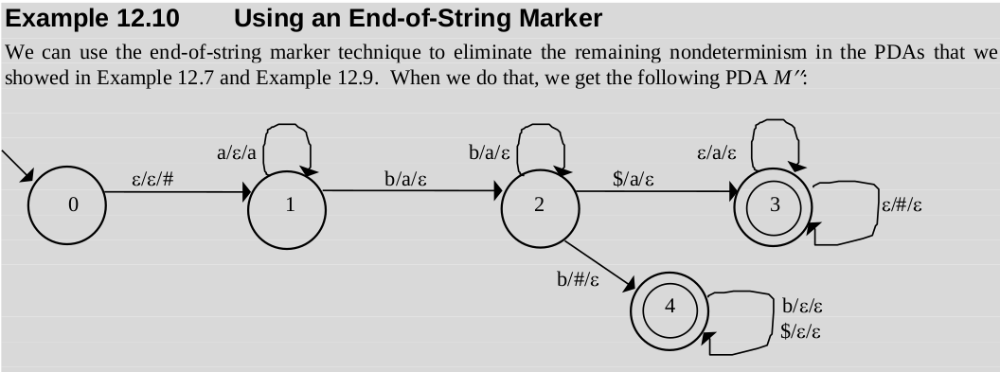
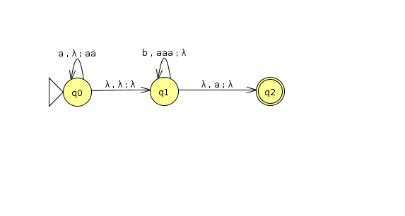
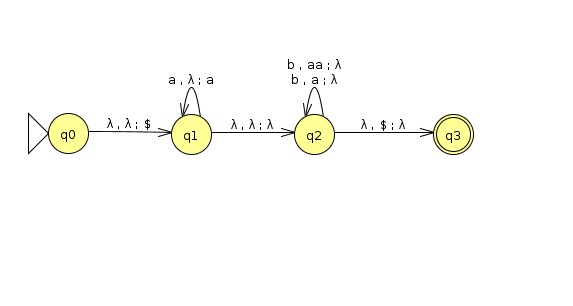
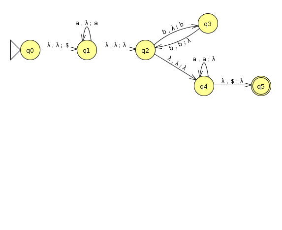

= Homework 6
Kyle Aure <KAure09@winona.edu>
v1.0, 2019-11-24
:RepoURL: https://github.com/KyleAure/WSURochester
:AuthorURL: https://github.com/KyleAure
:DirURL: {RepoURL}/CS435
:stem: asciimath

.Homework Description
****
Push down automata.
****

== Course Details
* **Course** - CS435
* **Instructor** - Dr. Chi-Cheng Lin

== Homework Results

=== Problem Set 1
Formal Description of PDA 12.10.

asciimath:[M=(K, Sigma, Gamma, Delta, s, A)]

asciimath:[K = {0, 1, 2, 3, 4}]

asciimath:[Sigma = {a, b, $}]

asciimath:[Gamma = {a, #}]

asciimath:[Delta = {((0, epsilon, a),(1, #)),]

asciimath:[((1, a, epsilon),(1, a)),((1, b, a),(2, epsilon)),]

asciimath:[((2, b, a),(2, epsilon)),((2, b, #),(4, epsilon)),((2, $, a),(3, epsilon)),]

asciimath:[((3, epsilon, a),(3, epsilon)),((3, epsilon, #),(3, epsilon)),]

asciimath:[((4, b, epsilon),(4, epsilon)),((4, $, epsilon),(4, epsilon))}]

asciimath:[s = 0]

asciimath:[A = {3, 4}]

=== Problem Set 2
Exercise 1b and 1d from Chapter 12

Exercise 1b::
asciimath:[{a^i b^j : 2i = 3j + 1}]

Exercise 1d::
asciimath:[{a^n b^m : m <= n <= 2m}]

=== Problem Set 3
Exercise 4a, 4b, and 4c from Chapter 12

Prompt::
Consider the language asciimath:[L = L_1 nn L_2], where asciimath:[L_1 = {ww^R : w in {a,b}^***}] and asciimath:[L_2 = {a^n b^*** a^n : n >= 0}]

Description::
Even length palindromes of a's and b's, such that a's are on the outside, and b's are on the inside.

Exercise 4a::
List the first four strings in the lexicographic enumeration of L: 

Answer::::
asciimath:[{epsilon, aa, b b, aaaa}]

Exercise 4b::
Write a context-free grammar to generate L

Answer::::
asciimath:[S -> aSa]
+
asciimath:[S -> B]
+
asciimath:[B -> bBb]
+
asciimath:[B -> epsilon]

Exercise 4c::
Show a natural PDA for L

Answer::::
